# Architecture — pmmlruntime `0.1.0`

> Single crate. `base -> xml -> ir -> engine -> session -> ffi/python`. Cold path builds `Ir`; hot path scores `Value` slices.

This doc is the contributor-facing internals. API contracts are in `cargo doc --open -p pmmlruntime`.

## 1. Crate topology

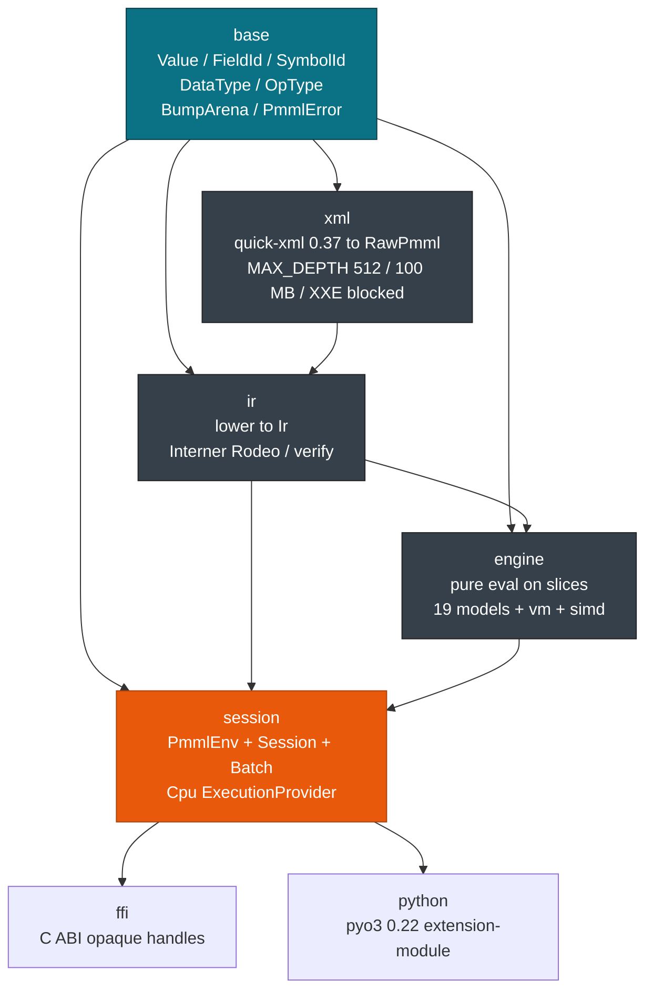

Single crate `pmmlruntime` (`Cargo.toml` `resolver=2`, `edition=2021`, `rust-version=1.78`, `Apache-2.0`):

```
crates/pmmlruntime/src/
├─ base/         # zero-cost types, arena, errors — no XML, no IR
│  ├─ value.rs   # Value / FieldId / SymbolId
│  ├─ field.rs   # DataType / OpType / MiningFunction / ResultFeature
│  ├─ arena.rs   # BumpArena
│  └─ error.rs   # PmmlError
├─ xml/          # cold only
│  ├─ reader.rs  # PmmlReader — hardened quick-xml
│  └─ unmarshal.rs # -> RawPmml (304 PMML elements, 1:1 with pmml.xsd)
├─ ir/           # lower + verify + Interner
│  ├─ ir.rs      # Ir, FieldMeta, Op, ModelIr (19 variants)
│  ├─ lower.rs   # RawPmml -> Ir (topo sort DerivedField, FieldId/SymbolId)
│  ├─ verify.rs  # verify_raw / verify_ir
│  └─ intern.rs  # Rodeo interner (cold only)
├─ engine/       # pure evaluation
│  ├─ predicate.rs, mining_schema.rs, output.rs, targets.rs, simd.rs
│  ├─ models/    # 19 evaluators (tree, regression, mining, ...)
│  └─ transform/ # vm.rs, builtin.rs, mapvalues.rs, discretize.rs
├─ session/      # primary API
│  ├─ env.rs     # PmmlEnv (Arc inner)
│  ├─ options.rs # SessionOptions
│  ├─ session.rs # Session (+ with_value_buffer)
│  ├─ batch.rs   # Batch / BatchCtx / BatchResult
│  ├─ arrow.rs   # RecordBatch helpers
│  ├─ input.rs   # string_to_value
│  └─ providers/ # cpu.rs — unified Cpu provider
├─ ffi/          # C ABI
└─ python/       # pyo3 placeholder (feature-gated)
```

## 2. Data & control flow — cold vs hot

```mermaid
flowchart LR
    subgraph Cold["Cold path - once per model"]
        A["bytes: slice u8"] --> B["xml::unmarshal<br>quick-xml 0.37<br>depth 512 / 100 MB / DTD blocked"]
        B --> C["RawPmml<br>owned Strings/Vecs<br>304 elements"]
        C --> D["ir::verify_raw"]
        D --> E["ir::lower<br>Rodeo FieldId/SymbolId<br>topo sort DerivedField<br>flat Vec NodeIr"]
        E --> F["ir::verify_ir"]
        F --> G["Arc Ir<br>immutable"]
    end
    subgraph Hot["Hot path - per row / per batch"]
        G --> H["Session::run dyn Batch"]
        H --> I["with_value_buffer<br>64 stack 1KB<br>large thread_local Vec"]
        I --> J["Value FieldId<br>Missing-initialized"]
        J --> K["Batch::materialize_row<br>HashMap get or Arrow col_map"]
        K --> L["ExecutionProvider::eval_row<br>eval_derived_fields VM<br>evaluate_model"]
        L --> M["output + targets<br>predictedValue / probability"]
        M --> N["HashMap String Value"]
    end
```

Key split: `RawPmml` is dropped after `lower`. `Ir` is `Arc` and never mutated. `Session` is `Send+Sync` and holds only `Arc<Ir>` + lookup caches.

### End-to-end timeline

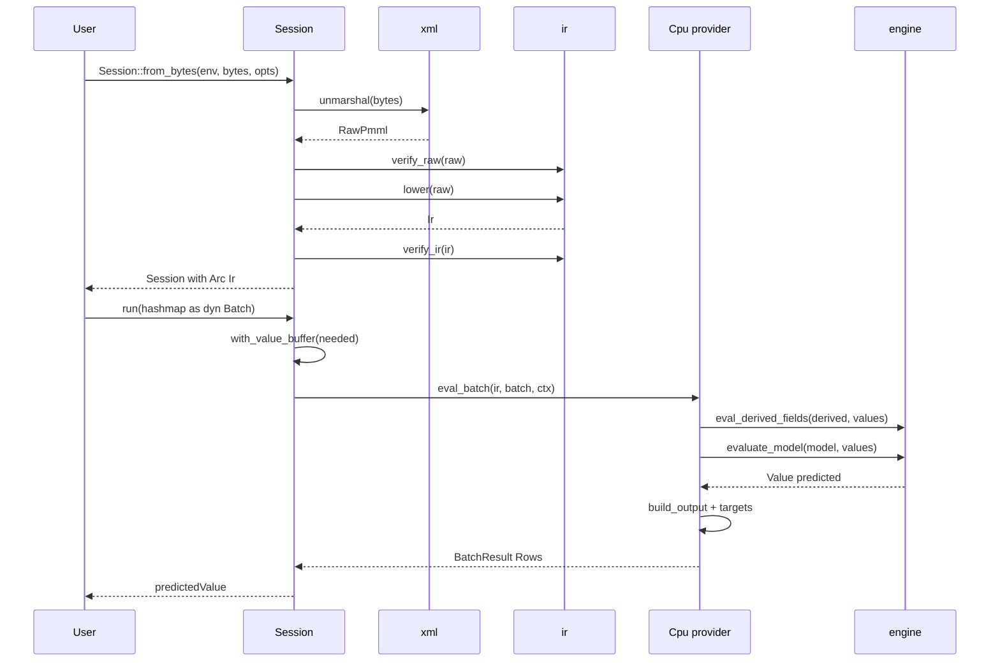

## 3. Value representation — why `Value` slices

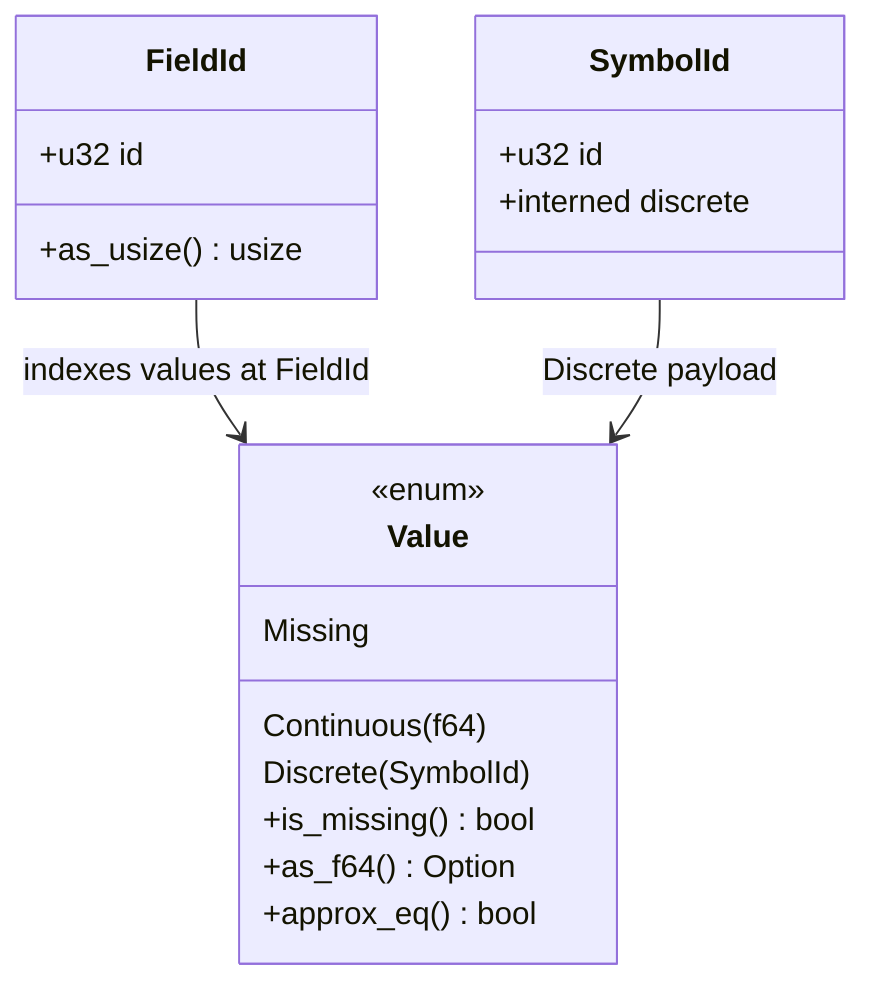

* `FieldId(u32)` assigned by `Interner` cold — dense `0..num_fields`. Hot path is `values[fid.as_usize()]` single bounds check.
* `SymbolId(u32)` for every discrete string. Forward map `String -> SymbolId` cold; dense `Vec<String>` for reverse (cache-line friendly).
* `Value::Missing` is explicit, not `Option<Value>` — avoids double wrap, keeps `Copy`, keeps branchless `Missing` propagation (`Op::JumpIfMissing`).

## 4. Session construction

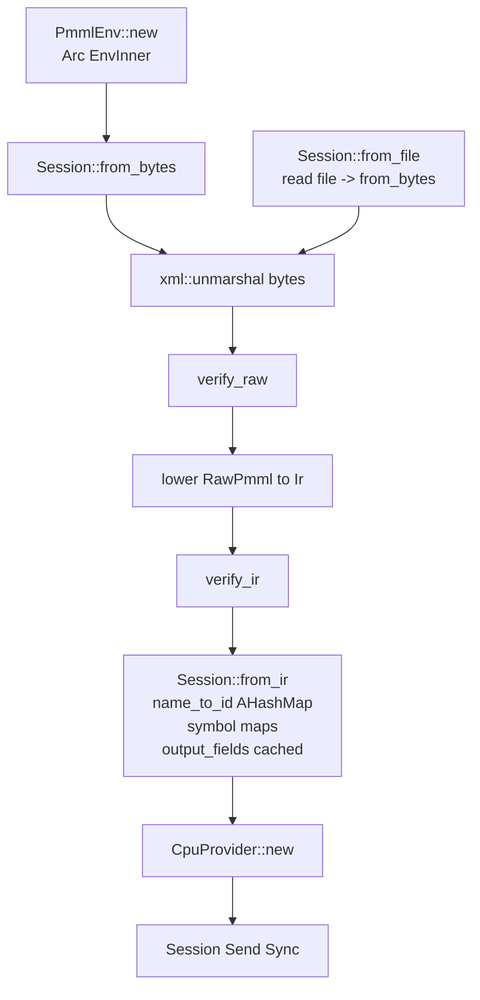

`max_field_id = max(FieldId)+1 max(16)`. `needed = max(max_field_id, num_fields+4).max(16)` passed to `with_value_buffer`.

## 5. Batch abstraction — one method, two layouts

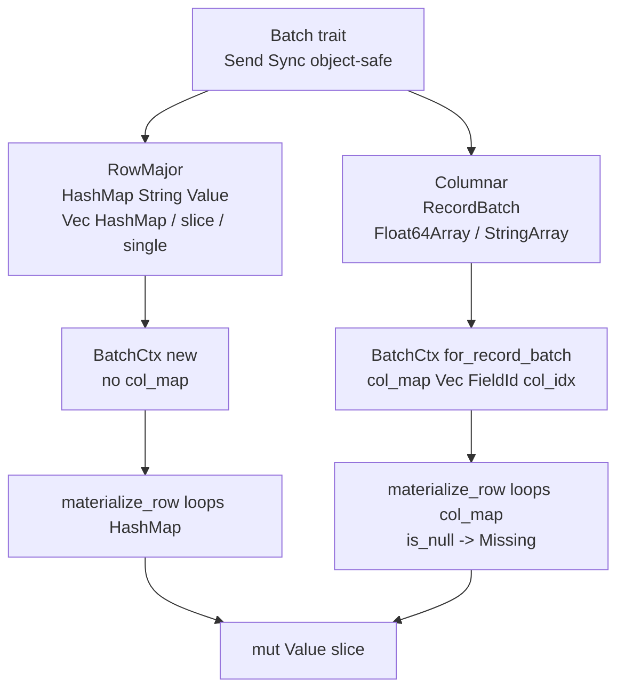

Why both? Arrow wins at `100k` (61 ns/row) but loses for single row (schema + conversion >1 µs) and needs schema agreement. RowMajor is ergonomic for `HashMap`/`dict` and required for `Association` `Collection`. Provider picks; `Session::run` accepts either.

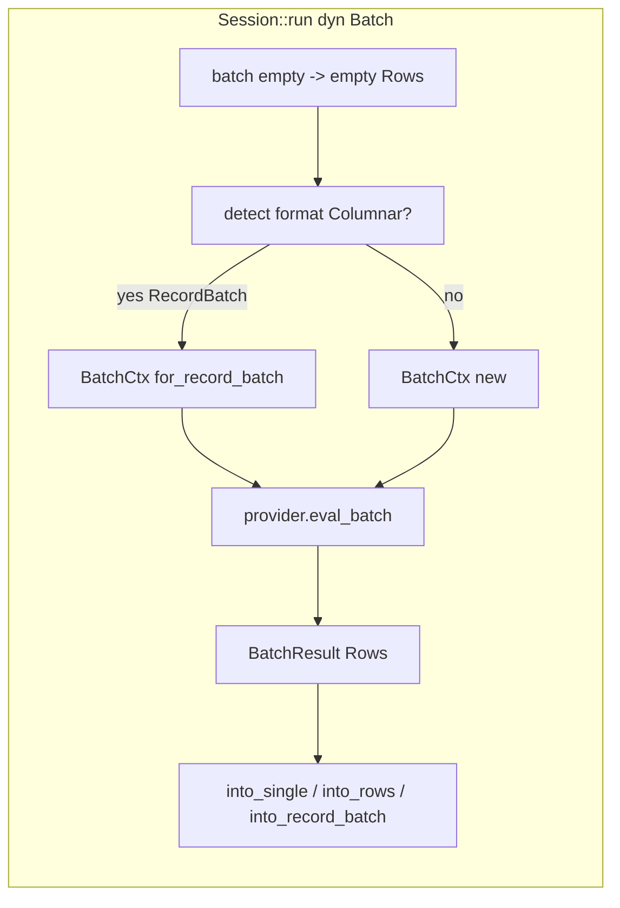

### `BatchResult`

* `Rows(Vec<HashMap<String,Value>>)` — always for `Session::run`, regardless of input layout. Most callers use `into_single` / `into_rows`.
* `Columnar(RecordBatch)` — only when explicitly converting via `into_record_batch(schema)`.

## 6. Execution provider — unified `Cpu`

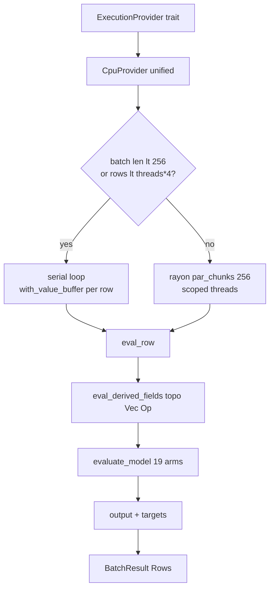

* `CpuProvider` is the only provider today; `preferred_format = Columnar` hint but handles both.
* `eval_row` is single-row VM: derived fields → model → output/targets.
* `eval_batch` auto-shards. Threshold `lt 256` avoids `rayon` spawn cost (~100 µs > 400 ns × 256 rows). Previously split `cpu_serial.rs`/`cpu_batched.rs` — now merged into `providers/cpu.rs`.
* `rayon` global pool (future: per-`PmmlEnv` pool).

## 7. Concurrency & memory

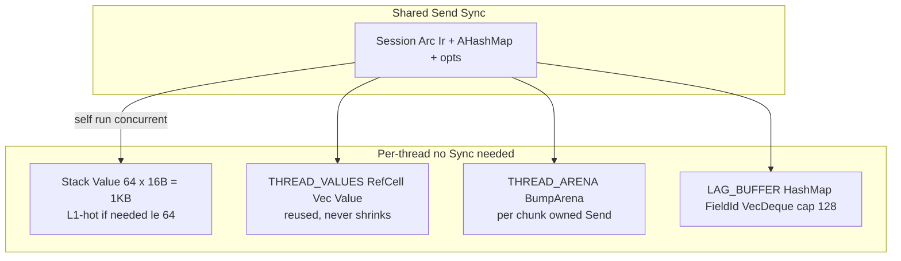

* `Session: Send+Sync`. `run(&self)` never takes `&mut` — it borrows `Arc<Ir>` and builds `BatchCtx` on stack, then `with_value_buffer` gives each thread its own `mut Value` slice.
* `STACK_VALUES_THRESHOLD = 64` covers ~90% fixtures (Iris 3, Diabetes 8, Shopping 22). Larger models spill to `thread_local Vec`.
* `BumpArena` is `Send` (owns `Bump`) moved into rayon threads; `miri` clean, no leak.
* `LAG_BUFFER` is `thread_local` so `Lag` doesn't cross batches.

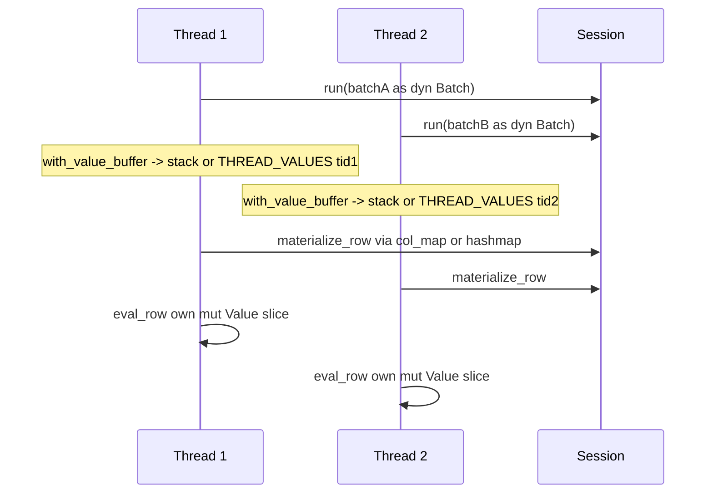

## 8. IR — what `lower` produces

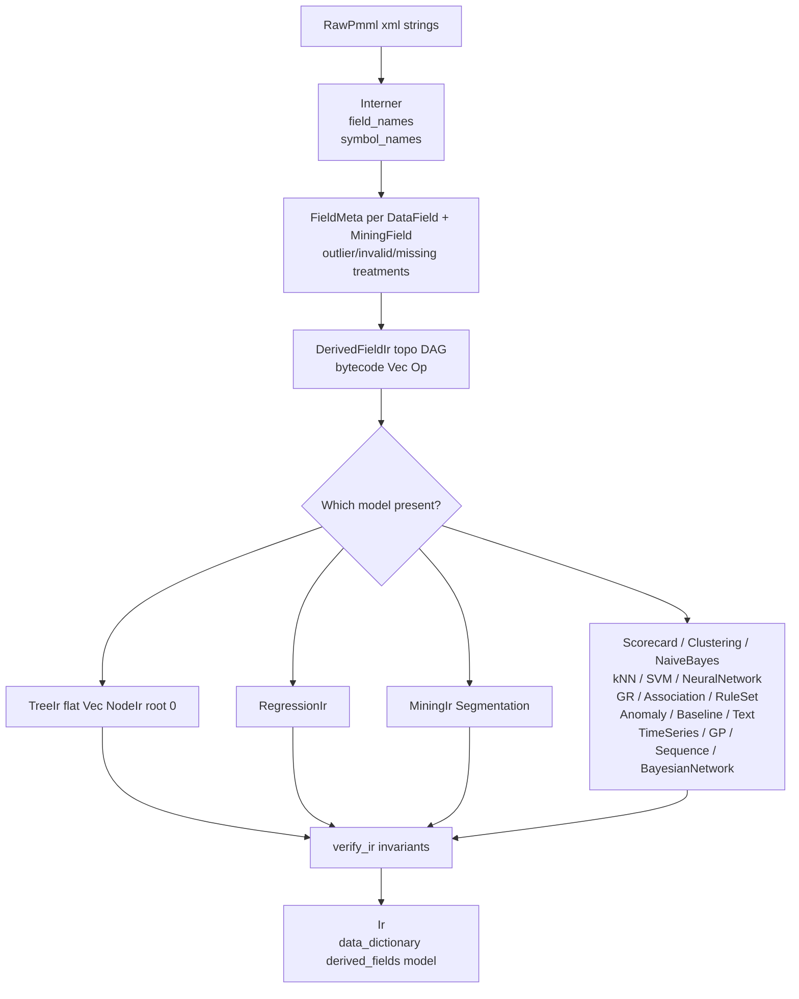

* `TreeModel` flattened `Vec<NodeIr>` — root at 0, branchless traversal, `SmallVec<[Box<PredicateIr>;4]>`.
* `DerivedFieldIr.bytecode: Vec<Op>` evaluated by `engine::transform::vm::eval` in topo order; `Op::JumpIfMissing` for `IF`.
* All `FieldId`/`SymbolId` in `Ir` are interned via single `get_or_intern_field`.

## 9. Engine — dispatch

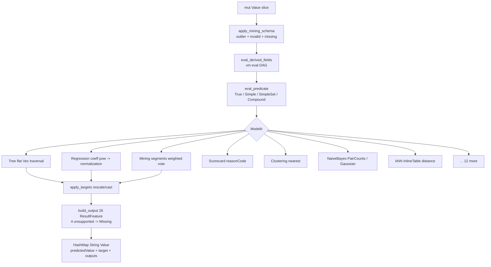

* `vm.rs` handles `PushField`, `PushConst`, `CallBuiltin`, `JumpIfMissing`, `MapValues`/`Multi`, `Discretize`, `NormContinuous`/`Discrete`, `Lag`.
* `builtin.rs` maps 80+ PMML function names → `BuiltinId`.
* `simd.rs` (`feature=simd`) provides `wide::f64x4` fast path for single-table `Regression` on `RecordBatch` ≥4 rows.

## 10. Storage & serialization boundaries

| Boundary | Format | Notes |
|---|---|---|
| XML in | `quick-xml 0.37` pull reader | `trim_text(true)`, `expand_empty_elements`, depth 512, 100 MB, DTD ignored → XXE safe |
| RawPmml | owned `String`/`Vec` | cold only, dropped after `lower` |
| Ir | `Arc<Ir>` immutable | flat nodes, topo derived, dense symbol vec |
| Arrow in/out | `arrow 53` `RecordBatch` | `Float64Array`/`StringArray` zero-copy, `TableLocator` → empty batch, `csv_str_to_record_batch` via `arrow::csv` |
| Python | `pyo3 0.22` | `extension-module`, `allow_threads` for run (planned `InferenceSession`) |
| C | `ffi` opaque `*mut PmmlEnv/Session` | `PmmlStatusCode Ok=0 Error=1`, `Send+Sync`, null-tolerant release |

## 11. Performance — targets vs measured (i7-12700, release)

| Path | Target | Measured | Technique |
|---|---|---|---|
| Cold `from_bytes` (Iris 2.9 KB, 5 nodes) | ≤80 µs | 68 µs | quick-xml + lower + verify |
| Single `run` | ≤800 ns | 402 ns | stack `Value[64]` + `AHashMap` 3× + branchless tree |
| Batch 1k row-major | ≤350 µs | 336 µs (2.97M rows/s) | serial loop, `with_value_buffer` reuse |
| Batch 1k columnar | ≤250 µs | 249 µs (4.0M rows/s) | `RecordBatch` `col_map`, no HashMap |
| Batch 100k columnar batched | 61 ns/row | 61 ns/row (16.5M rows/s) | `rayon par_chunks(256)` + thread_local |

`STACK_VALUES_THRESHOLD=64` → `64×16B=1KB` on caller frame.

## 12. Invariants — break these and `miri`/`fuzz` will tell you

* `Ir.field_names` contains every `FieldId` in `active_fields` + `target_field` + `DerivedFieldIr`.
* `symbol_names` ↔ `symbol_names_vec` agree: `vec[max_id+1]` dense, `HashMap` for lookup.
* `DerivedFieldIr` DAG is topo sorted — `eval_derived_fields` assumes order, no cycle check hot.
* `Value::Missing` is a value, not absence — `Op::JumpIfMissing` is the only branching on it; equality/comparison on `Missing` → `false`.
* `PmmlError::UnsupportedMarkup` only for `ModelComposition`/`CenterFields`; all 19 models are supported.
* `max_field_id = max(FieldId)+1 max(16)`; `needed = max(max_field_id, num_fields+4)`; out-of-bounds `FieldId` ignored, never panic.
* Hardenings: `MAX_DEPTH 512`, `MAX_XML_SIZE 100MB`, `LAG_BUFFER` cap 128 — `cargo test --test hardening` + `cargo fuzz` cover.

## 13. Extension points


* **New `BuiltinId`** — add variant `ir::BuiltinId`, map in `builtin_by_name`, dispatch in `eval_builtin` (`statrs`/`libm`/`chrono`).
* **New `ResultFeature`** — `base::ResultFeature::FromStr` + `is_unsupported`, `engine::output::build_output` match, `Session` mapping.
* **New provider** — implement `ExecutionProvider {eval_row, eval_batch, preferred_format}`, register in `Session::from_ir` via `SessionOptions`.

## 14. Trade-offs & rejected alternatives

| Decision | Chosen | Rejected | Why |
|---|---|---|---|
| XML | `quick-xml 0.37` pull | `serde`/`XJC` generated | XSD 4490 lines, mixed Attr/Elem, `Extension` vendor payloads; serde can't express ordering; quick-xml gives hardening + 68 µs |
| Interning | `lasso::Rodeo` cold only | `Rodeo` hot | `AHashMap::get` zero-alloc already 3×; `Rodeo` only helps Python `&str` without `String` |
| Batch | `Batch` trait both layouts | Arrow only | single row `HashMap` 402 ns < Arrow >1 µs + schema friction; `dict`/`Collection` natural |
| Providers | single `Cpu` auto-serial vs `rayon` | `CpuSerial` + `CpuBatched` split | threshold lt 256 avoids spawn cost; merged `cpu.rs` is simpler |
| Arena | `bumpalo::Bump` `thread_local` + `Arc<Ir>` | `moka` Guava `LoadingCache` | `Ir` immutable, no invalidation; bump reset per chunk |
| Crate layout | single `pmmlruntime` + `base/xml/ir/engine/session` mods | 9-crate workspace | `cargo add pmmlruntime` one doc page, <26k LOC |

See `README.md` for user-facing API and `cargo doc` for per-item invariants.
