# pmmlruntime: Fast PMML Inference in Pure Rust

> **Info:** This guide covers production PMML scoring with pmmlruntime for Rust services, Python pipelines, Java and JavaScript callers, and edge deployments. For training or exporting PMML, see [sklearn2pmml](https://github.com/jpmml/sklearn2pmml) or [jpmml-sparkml](https://github.com/jpmml/jpmml-sparkml).

<p align="center">
  
</p>

<p align="center">
  <a href="https://crates.io/crates/pmmlruntime"></a>
  <a href="https://docs.rs/pmmlruntime"></a>
  <a href="https://github.com/pab1s/pmmlruntime/blob/main/LICENSE"></a>
  
  
</p>

<p align="center">
  <b>A fast, modern PMML inference runtime.</b><br>
  Zero JVM, pure Rust. Score sklearn, XGBoost, LightGBM, SparkML, and R models from one PMML file.
</p>

---

Load one PMML 4.4 file and score it anywhere. Train in Python, R, or Spark and ship the same artifact to Rust, Python, C, Java, or JavaScript without a JVM.

`sklearn2pmml`, `jpmml-sparkml`, `jpmml-xgboost`, `jpmml-lightgbm`, and `r2pmml` all emit the same `MiningModel`. pmmlruntime is a from-scratch engine for that file. A **Session** is built once, then `run` scores one row or a hundred thousand rows through the same call, on one thread or many.

> **Note:** By default `Session::from_bytes` runs `verify_raw` and `verify_ir` once. Use `SessionOptions` to relax or tighten limits for 100 MB XML, depth 512, and XXE-blocked parsing.

## Compared with JPMML-Evaluator

You trade a JVM classpath for a single binary that starts in microseconds.

| | JPMML-Evaluator | pmmlruntime |
| --- | --- | --- |
| **Runtime** | JVM (Java 11+) | Pure Rust |
| **Deploy** | JAR + classpath | Single binary or library |
| **Cold start** | JVM warmup | 68 µs for a 2.8 KB tree |
| **Batch** | Row-major only | Row-major and columnar (Arrow), sharded across cores |
| **Hardening** | JAXB | Hardened XML, fuzzed and sanitized |
| **License** | AGPL-3.0 (commercial on request) | Apache-2.0 |

For measurements on the same hardware, see [Performance](./evaluation/performance.md). For the Rust entry points, see [Session::from_bytes](https://docs.rs/pmmlruntime/latest/pmmlruntime/session/struct.Session.html#method.from_bytes).

## What the runtime gives you

| Capability | What you get | Guide |
| --- | --- | --- |
| **Scoring** | One `run` method for all 19 PMML model types. `Send + Sync` sessions with an immutable `Arc<Ir>`. | [Quickstart](./getting-started/quickstart.md) |
| **Batch** | `HashMap` rows for latency, `RecordBatch` for throughput, `Collection` support included. | [Batch API](./batch/batch.md) |
| **Parity** | `ModelVerification`, 52 fixtures in `bench/pmml/`, and property tests, all run by `cargo test`. | [Correctness & Fixtures](./evaluation/correctness.md) |
| **Bindings** | Rust crate, `pyo3` Python wheels, a C ABI with a versioned `PmmlApi` table, JNI for Java, NAPI for Node, and WASM for the browser. | [Bindings overview](./deployment/bindings.md) |
| **Hardening** | `quick-xml` 0.37 pull parsing, depth 512, a 100 MB cap, DTD ignored, `miri`-clean internals. | [Security & Hardening](./production/security.md) |

## One file, any framework

Train with any converter and score the same way. The PMML carries the pipeline, so you never branch on the training framework.

* `sklearn2pmml` emits `TreeModel` or `MiningModel` for RandomForest and GradientBoosting.
* `jpmml-lightgbm` and `jpmml-xgboost` emit a `MiningModel` with `multipleModelMethod="sum"` over `Regression` stumps.
* `jpmml-sparkml` emits `MiningModel` chains plus a `TransformationDictionary`.
* `r2pmml` emits `RegressionModel`, `GeneralRegressionModel`, or `NeuralNetwork`.

```bash
# Score any PMML with the same binary
cargo run -p pmmlruntime --example score_file -- bench/pmml/DecisionTreeIris.pmml
cargo run -p pmmlruntime --example score_file -- bench/pmml/GradientBoosterTest.pmml

# CSV in, CSV out (the header must match the active fields)
cargo run -p pmmlruntime --example score_file -- model.pmml input.csv --output out.csv
```

Run this in CI against [`bench/pmml/`](https://github.com/pab1s/pmmlruntime/tree/main/bench/pmml). The full example lives in [`score_file.rs`](https://github.com/pab1s/pmmlruntime/blob/main/crates/pmmlruntime/examples/score_file.rs).

## Quick start: score in 8 lines

Point this snippet at `DecisionTreeIris.pmml` or `GradientBoosterTest.pmml`. You load once, then reuse the session for any batch.

```rust
use std::collections::HashMap;
use pmmlruntime::{PmmlEnv, Session, SessionOptions, Value};
let env = PmmlEnv::new();
let sess = Session::from_bytes(&env, &std::fs::read("bench/pmml/DecisionTreeIris.pmml")?, SessionOptions::default())?;
let mut input = HashMap::new();
input.insert("Petal.Length".into(), Value::Continuous(1.4));
let out = sess.run(&input as &dyn pmmlruntime::session::batch::Batch)?;
println!("{:?}", out.into_single().unwrap().get("predictedValue"));
```

You turned raw bytes into an immutable session and scored one row in 402 ns. Change map values and reuse the same `sess` for 100k rows. The reference page walks through every step in [Quickstart](./getting-started/quickstart.md).

> **Tip:** Use `Session::from_file` for a local path, or `Session::from_bytes` when you fetch PMML from S3 or a database. Both return the same `Send + Sync` session.

## How it works

Move from bytes to session once, then from session to scores repeatedly. The cold path builds an immutable **Ir**; the hot path writes only to per-thread `Value` slices.

```mermaid
flowchart LR
    A["PMML bytes<br>u8 slice"] --> B["Session::from_bytes<br>xml::unmarshal<br>quick-xml 0.37"]
    B --> C["Ir<br>verify + lower<br>Rodeo FieldId"]
    C --> D["Session<br>Arc Ir + CpuProvider<br>Send Sync"]
    D --> E["run dyn Batch<br>HashMap or RecordBatch"]
    E --> F["Value slice<br>eval DerivedFields<br>evaluate_model"]
    F --> G["HashMap output<br>predictedValue + Output"]

    style A fill:#36404a,stroke:#222,color:#fff
    style B fill:#36404a,stroke:#222,color:#fff
    style C fill:#0b7285,stroke:#083d4a,color:#fff
    style D fill:#e8590c,stroke:#a8450a,color:#fff
    style E fill:#e8590c,stroke:#a8450a,color:#fff
    style F fill:#0b7285,stroke:#083d4a,color:#fff
    style G fill:#e8590c,stroke:#a8450a,color:#fff
```



Create `PmmlEnv::new()` once per process and share it. Call `from_bytes` per model and keep the `Session` alive, since it picks serial or `rayon` `par_chunks(256)` on its own. See [Architecture Overview](./internals/architecture.md) and [Session, Env & Lifecycle](./concepts/session.md).

## Next Steps

* [Setup](./getting-started/setup.md): add `pmmlruntime = "0.1"` and confirm `rustc 1.78+`.
* [Quickstart](./getting-started/quickstart.md): load `DecisionTreeIris.pmml` and score rows and batches.
* [Batch API: One Method, Two Layouts](./batch/batch.md): pick row-major or columnar for your workload.
* [Migrating from JPMML](./production/migration.md): map `Evaluator` calls to `Session::run` and keep score parity.

*Next: [Setup](./getting-started/setup.md) → · Previous: [Summary](./SUMMARY.md)*
