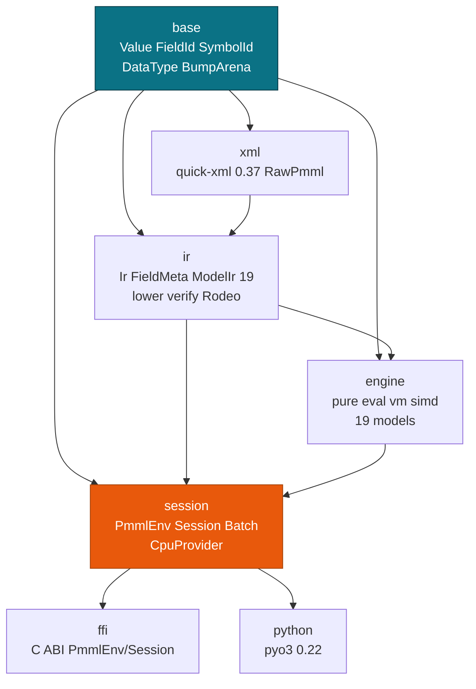

# API Reference

> **Info:** This page covers the public Rust API and the per-language entry points for the six bindings. For the cold and hot pipeline, see [Architecture Overview](./internals/architecture.md). For the intermediate representation, see [IR & Lowering](./internals/ir.md).

Score `DecisionTreeIris.pmml` in one crate with one `Session`. The crate root re-exports the common types, so `use pmmlruntime::{PmmlEnv, Session, SessionOptions, Value};` covers most code.

## Concepts

| Concept | Description |
| --- | --- |
| **Crate** | `pmmlruntime` `0.1.0`, `resolver = 2`, `edition = 2021`, `rust-version = 1.78`, `Apache-2.0` (`Cargo.toml`). |
| **Modules** | `base`, `xml`, `ir`, `engine`, `session`, `ffi`, `python` (`lib.rs:56`). |
| **Re-exports** | `base::{FieldId, PmmlError, Result, SymbolId, Value}` and `session::{PmmlEnv, Session, SessionOptions}` (`lib.rs:65`). |
| **Features** | `default = []`, `simd = ["dep:wide"]`, `python = ["dep:pyo3"]` (`Cargo.toml:46`). |
| **Version** | `pmmlruntime::VERSION` reads `CARGO_PKG_VERSION`, currently `0.1.0` (`lib.rs:69`). |
| **Generated docs** | `cargo doc --open -p pmmlruntime`, or [docs.rs/pmmlruntime](https://docs.rs/pmmlruntime). |

## Module map

One crate, seven modules, no workspace indirection.



Layout at `lib.rs`:

```
pub mod base;    // value.rs FieldId/Value, field.rs DataType, arena.rs, error.rs
pub mod xml;     // reader.rs quick-xml, unmarshal.rs -> RawPmml 304
pub mod ir;      // ir.rs ModelIr 19, lower.rs, verify.rs, intern.rs Rodeo
pub mod engine;  // predicate.rs mining_schema.rs output.rs targets.rs models/ transform/vm.rs
pub mod session; // env.rs PmmlEnv, session.rs, batch.rs, providers/cpu.rs
pub mod ffi;     // C ABI opaque handles
pub mod python;  // pyo3 0.22 feature-gated placeholder
pub use base::{FieldId, PmmlError, Result, SymbolId, Value};
pub use session::{PmmlEnv, Session, SessionOptions};
```

> **Note:** Run `cargo doc --open -p pmmlruntime` for per-type invariants such as `Ir` immutability and the `Safety` contracts on the C ABI.

## Quick example

Load `DecisionTreeIris.pmml`, score one row, then score a batch with the same session:

```rust
use pmmlruntime::{PmmlEnv, Session, SessionOptions, Value};
use pmmlruntime::session::batch::Batch;
use std::collections::HashMap;

let env = PmmlEnv::new();
let bytes = std::fs::read("bench/pmml/DecisionTreeIris.pmml")?;
let sess = Session::from_bytes(&env, &bytes, SessionOptions::default())?;

let mut input = HashMap::new();
input.insert("Petal.Length".to_string(), Value::Continuous(1.4));
input.insert("Petal.Width".to_string(), Value::Continuous(0.2));
let out = sess.run(&input as &dyn Batch)?.into_single().unwrap();
assert!(out.contains_key("predictedValue"));
println!("{:?}", out.get("probability(setosa)"));
# Ok::<(), Box<dyn std::error::Error>>(())
```

```rust
use arrow::array::Float64Array;
use arrow::datatypes::{DataType, Field, Schema};
use arrow::record_batch::RecordBatch;
use pmmlruntime::session::batch::Batch;
use std::sync::Arc;
let schema = Arc::new(Schema::new(vec![Field::new("Petal.Length", DataType::Float64, true), Field::new("Petal.Width", DataType::Float64, true)]));
let rb = RecordBatch::try_new(schema.clone(), vec![Arc::new(Float64Array::from(vec![Some(1.4), Some(6.0)])) as _, Arc::new(Float64Array::from(vec![Some(0.2), Some(2.5)])) as _])?;
let rows = sess.run(&rb as &dyn Batch)?.into_rows();
# Ok::<(), Box<dyn std::error::Error>>(())
```

Both layouts go through the same `run` and the same `BatchCtx`.

> **Tip:** `Session` is `Send + Sync` and `run(&self)` takes no `&mut`. Share one `Arc<Session>` across threads instead of cloning the model.

## Environment and options

| Item | Purpose | Source |
| --- | --- | --- |
| `PmmlEnv::new()` | Process-wide environment holding the interner caches; clones are an `Arc` bump. | `session/env.rs` |
| `PmmlEnv::with_name(name)` | Same environment with a name for logs. | `session/env.rs` |
| `PmmlEnv::name()` | Read the configured name. | `session/env.rs` |
| `SessionOptions::default()` | `graph_optimization_level = EnableBasic`. | `session/options.rs` |
| `SessionOptions::new()` | Alias of `default()`. | `session/options.rs` |
| `.graph_optimization_level(level)` | Builder for `DisableAll` / `EnableBasic` / `EnableExtended` / `EnableAll`. Only the first two change behavior today. | `session/options.rs` |

`SessionOptions` carries one field, `graph_optimization_level`. The XML limits stay fixed at depth 512 and 100 MB with DTD ignored, so you cannot widen them through options. See [Security & Hardening](./production/security.md).

## Session lifecycle

| Item | Purpose | Notes |
| --- | --- | --- |
| `Session::from_bytes(env, bytes, options)` | Parse, verify, lower, and cache `Arc<Ir>`. | The public cold path, 68 µs for the Iris fixture. |
| `Session::from_file(env, path, options)` | Same pipeline from a filesystem path. | Reads the file, then calls `from_bytes`. |
| `Session::run(&dyn Batch)` | Score one row, many rows, or a `RecordBatch`. | 402 ns single row, 61 ns per row at 100k columnar. |
| `Session::num_active_fields()` | Count the MiningSchema active fields. | Useful in a startup log. |
| `Session::field_id(name)` | Resolve a name to `FieldId`. | Returns `None` for unknown names. |
| `Session::symbol_id(label)` | Resolve a category label to `SymbolId`. | Used for `Value::Discrete`. |
| `Session::string_to_value(field, s)` | Coerce a string into a `Value` for that field. | Numeric strings become `Continuous`, unknown labels become `Missing`. |

The public fields `sess.env`, `sess.options`, and `sess.ir` are readable, so a service can log the configured optimization level or walk `sess.ir.field_names` at startup. Rebuilding a session from a pre-lowered `Ir` is internal (`Session::from_ir` is crate private), so cache the `Session` itself or reload from bytes.

> **Warning:** Do not cache `&mut [Value]` between calls. Each `run` initializes its own slice, and the heap buffer behind large models never shrinks.

## Values and field identifiers

| Item | Purpose | Example |
| --- | --- | --- |
| `Value::Continuous(f64)` | Every numeric PMML type, including `double`, `float`, `integer`, and date fields. | `Value::Continuous(1.4)` |
| `Value::Discrete(SymbolId)` | Categorical fields, interned on the cold path. | `Value::Discrete(sess.symbol_id("setosa").unwrap())` |
| `Value::Missing` | Explicit missing value rather than `Option`. | Inserted when a key is absent or a value is null. |
| `FieldId(u32)` | Dense index into the per-row `Value` slice. | `values[fid.as_usize()]` |
| `SymbolId(u32)` | Dense identifier for one category label. | Resolved back through `sess.ir.symbol_names`. |

## Batch layouts and results

| Item | Purpose | Example |
| --- | --- | --- |
| `Batch` trait | Object-safe input with `len`, `format`, and `materialize_row`. | Implemented for `HashMap`, `Vec<HashMap>`, `&[HashMap]`, and `RecordBatch`. |
| `BatchFormat` | Layout hint used to choose the sharding path. | `RowMajor` or `Columnar`. |
| `BatchCtx::new(...)` | Borrowed cache for row-major input. | Built by the provider, not by you. |
| `BatchCtx::for_record_batch(...)` | Column cache mapping `FieldId` to column index. | Built by the provider, not by you. |
| `BatchResult::into_single()` | Unwrap one row. | `sess.run(&row as &dyn Batch)?.into_single()` |
| `BatchResult::into_rows()` | Unwrap many rows in input order. | `sess.run(&batch as &dyn Batch)?.into_rows()` |
| `BatchResult::into_record_batch(schema, opts)` | Convert rows back to Arrow. | Needs a target schema. |

Arrow helpers live in `session::arrow`: `csv_str_to_record_batch`, `ir_to_arrow_schema`, `data_dictionary_to_schema`, `value_maps_to_record_batch`, `record_batch_to_value_maps`, `inline_table_to_record_batch`, and `table_locator_placeholder_batch`.

## XML, IR, and engine modules

| Item | Purpose | Source |
| --- | --- | --- |
| `xml::unmarshal` | `quick-xml` 0.37 pull parse into `RawPmml` (304 elements). | `xml/unmarshal.rs` |
| `xml::PmmlReader`, `xml::new_reader` | Hardened reader with the depth and size guards. | `xml/reader.rs` |
| `ir::verify_raw` | Reject unsupported markup before lowering. | `ir/verify.rs` |
| `ir::lower` | `RawPmml` into `Ir` with `Rodeo` interning and a topo-sorted derived DAG. | `ir/lower.rs` |
| `ir::verify_ir`, `ir::verify_ir_strict` | Check density, DAG order, and root invariants. | `ir/verify.rs` |
| `ir::Interner` | Cold interner behind `FieldId` and `SymbolId`. | `ir/intern.rs` |
| `engine::apply_mining_schema` | Apply missing, invalid, and outlier treatments. | `engine/mining_schema.rs` |
| `engine::eval_derived_fields` | Run the derived-field bytecode in topo order. | `engine/transform/vm.rs` |
| `engine::output::build_output` | Map the prediction and `Output` features to a row. | `engine/output.rs` |
| `engine::models::evaluate_*` | One pure evaluator per model family, 19 in total. | `engine/models/mod.rs` |

`ModelIr` dispatch happens in `session/providers/cpu.rs`, which matches every `ModelIr` variant and calls the matching `evaluate_*` function. Adding a model means adding an `ir` variant, a `lower` arm, and an `evaluate_*` function.

## C ABI surface

The C header is `include/pmml_runtime.h`. `PmmlGetApi(PMML_API_VERSION)` returns a `const PmmlApi*` table; `PMML_API_VERSION` is `1`. Status values are `PmmlStatus*` pointers where `NULL` means `PMML_OK`, and you release every non-null status with `PmmlReleaseStatus`.

| Group | Functions |
| --- | --- |
| Api table | `PmmlGetApi` |
| Status | `PmmlGetErrorCode`, `PmmlGetErrorMessage`, `PmmlReleaseStatus` |
| Environment | `CreateEnv`, `ReleaseEnv` |
| Session options | `CreateSessionOptions`, `ReleaseSessionOptions`, `SetGraphOptimizationLevel`, `SetIntraOpNumThreads`, `SetInterOpNumThreads`, `SetLogLevel`, `AddSessionConfigEntry`, `AppendExecutionProvider` |
| Session | `CreateSession`, `CreateSessionFromArray`, `ReleaseSession` |
| Introspection | `SessionGetInputCount`, `SessionGetInputName`, `SessionGetOutputCount`, `SessionGetOutputName`, `SessionGetModelType`, `SessionGetFieldId`, `SessionGetSymbolId`, `GetVersionString` |
| Scoring | `Run`, `RunBatch`, `RunArrow` |
| Bindings and run options | `CreateIoBinding`, `ReleaseIoBinding`, `BindInput`, `BindInputArrow`, `BindOutput`, `RunWithBinding`, `CopyBindingOutputsToCpu`, `CreateRunOptions`, `ReleaseRunOptions`, `SetRunTag`, `SetRunLogLevel` |

`PmmlValue` mirrors `Value` with the tags `PMML_VALUE_MISSING`, `PMML_VALUE_CONTINUOUS`, and `PMML_VALUE_DISCRETE`. Error codes run from `PMML_ERR_INVALID_ARGUMENT` (1) to `PMML_ERR_UNKNOWN` (8). See [C ABI & FFI](./deployment/c.md) for the full walkthrough.

## Per-language surface

Every binding loads the same `Session` and returns the same `predictedValue`. The rows below name what each wrapper exposes today.

| Capability | Rust | Python | C | Java | JavaScript |
| --- | --- | --- | --- | --- | --- |
| **Create environment** | `PmmlEnv::new()` | Constructed by `InferenceSession(path_or_bytes)` | `CreateEnv(log_level, log_id, &env)` | `PmmlEnv.create()` | Constructed inside the session object |
| **Load from a file** | `Session::from_file(&env, path, opts)` | `InferenceSession("model.pmml")` | `CreateSession(env, path, opts, &sess)` | `PmmlSession.fromFile(env, path)` | Node: `new InferenceSession("model.pmml")` |
| **Load from bytes** | `Session::from_bytes(&env, bytes, opts)` | `InferenceSession.from_bytes(data)` | `CreateSessionFromArray(env, ptr, len, opts, &sess)` | `fromBytes` raises `UnsupportedOperationException` until v2 | Web: `new InferenceSession(uint8Array)` |
| **Score one row** | `sess.run(&map as &dyn Batch)` | `sess.run(None, {"Petal.Length": 1.4})` | `Run(sess, opts, in_names, in_vals, n, out_names, m, out_vals)` | `sess.run(Map.of("Petal.Length", 1.4, "Petal.Width", 0.2))` | `sess.run({"Petal.Length": 1.4})` |
| **Score a batch** | `&Vec<HashMap>` or `&RecordBatch` | `sess.run(None, [row, row])` | `RunBatch` or `RunArrow` | Not in v1 | One row per call |
| **Inspect the schema** | `sess.ir.field_names`, `num_active_fields()` | `get_inputs()`, `get_outputs()`, `get_modelmeta()` | `SessionGetInputName`, `SessionGetOutputName`, `SessionGetModelType` | `getInputNames()` raises `UnsupportedOperationException` until v2 | Not exposed in v1 |
| **Discrete inputs** | `Value::Discrete(sess.symbol_id(label))` | `str` values through `string_to_value` | `PMML_VALUE_DISCRETE` | Continuous doubles only in v1 | Numbers only in v1 |
| **Thread safety** | `Send + Sync`, `run(&self)` | GIL released around `run` | `Send + Sync` handles | `Closeable` session handle | Single-threaded JS runtime |
| **Build** | `cargo add pmmlruntime` | `maturin develop --features python` | `cargo build --release` plus `cbindgen` | `cargo build -p pmmlruntime --features capi --release` plus `mvn package` | Node: `napi build --platform --release`; Web: `wasm-pack build --target web` |

> **Warning:** `Value` is not `Copy` across the C boundary. Handles own the session lifetime, so release each `PmmlEnv*` and `PmmlSession*` exactly once.

## Working with sessions

### Sharing one session across threads

`Session` holds `Arc<Ir>` and never mutates shared state, so an `Arc<Session>` works in `axum`, `tokio`, or a `rayon` pool:

```rust
use std::sync::Arc;
use pmmlruntime::session::batch::Batch;
use std::collections::HashMap;
use pmmlruntime::Value;

let sess = Arc::new(sess);
let handles: Vec<_> = (0..4).map(|_| {
    let s = sess.clone();
    std::thread::spawn(move || {
        let mut row = HashMap::new();
        row.insert("Petal.Length".into(), Value::Continuous(1.4));
        s.run(&row as &dyn Batch).map(|_| ())
    })
}).collect();
for h in handles { h.join().unwrap()?; }
# Ok::<(), Box<dyn std::error::Error>>(())
```

### Dropping a session

The environment outlives the sessions built from it. When the last `Arc<Session>` drops, the `Ir` and its caches are freed, and `PmmlEnv` stays usable for the next model:

```rust
use std::sync::{Arc, Weak};
let sess = Arc::new(Session::from_bytes(&env, &std::fs::read("bench/pmml/DecisionTreeIris.pmml")?, SessionOptions::default())?);
let weak: Weak<Session> = Arc::downgrade(&sess);
drop(sess);
assert!(weak.upgrade().is_none());
# Ok::<(), Box<dyn std::error::Error>>(())
```

### Inspecting a loaded model

`sess.ir` exposes everything lowering produced, so a service can log the model family at startup:

```rust
use pmmlruntime::ir::ModelIr;
let regressions: Vec<&str> = ["bench/pmml/DecisionTreeIris.pmml", "bench/pmml/GeneralRegression.pmml"]
    .iter()
    .filter(|p| matches!(Session::from_bytes(&env, &std::fs::read(p).unwrap(), SessionOptions::default()).unwrap().ir.model, ModelIr::Regression(_)))
    .copied()
    .collect();
println!("regression models: {regressions:?}");
# Ok::<(), Box<dyn std::error::Error>>(())
```

## Workload to layout

| Workload | Layout | Cost | Why |
| --- | --- | --- | --- |
| One request | `HashMap<String, Value>` | 402 ns | No Arrow construction. |
| A thousand rows | `Vec<HashMap>` | 592 ns per row | Serial below the 256-row threshold. |
| An ETL run | `RecordBatch` | 61 ns per row at 100k | Column cache and `rayon` sharding. |
| Association output | `HashMap` | Varies with the rules | A `Collection` value does not fit a columnar cell. |

The provider picks serial or `rayon` on its own, so the choice you make is the input layout, not the thread count. See [Batch API: One Method, Two Layouts](./batch/batch.md).

## Feature flags

| Feature | Flag | Pulls in | Use when |
| --- | --- | --- | --- |
| default | `pmmlruntime = "0.1"` | `arrow 53`, `quick-xml 0.37`, `rayon`, `statrs` | Most builds. |
| **simd** | `features = ["simd"]` | `wide 0.7` | Columnar `Regression` with four or more rows. |
| **python** | `features = ["python"]` | `pyo3 0.22` | Only for `maturin` builds of the extension module. |

`simd` changes vector width, not results. `python` is off by default so `cargo test --workspace` needs no `libpython`.

> **Attention:** Keep `rust-version = 1.78` in `Cargo.toml` in step with `rust-toolchain.toml`, or CI and local builds will disagree on the toolchain.

## Next Steps

* [Architecture Overview](./internals/architecture.md): follow `base -> xml -> ir -> engine -> session` and the cold and hot split.
* [IR & Lowering](./internals/ir.md): see how `RawPmml` becomes `FieldMeta`, `Vec<Op>`, and `ModelIr`.
* [Engine Dispatch](./internals/engine.md): read the evaluation order and the 80+ builtins.
* [Bindings overview](./deployment/bindings.md): compare the Rust, C, Python, Java, Node, and WASM wrappers.

*Next: [Session, Env & Lifecycle](./concepts/session.md) → · Previous: [Summary](./SUMMARY.md)*
