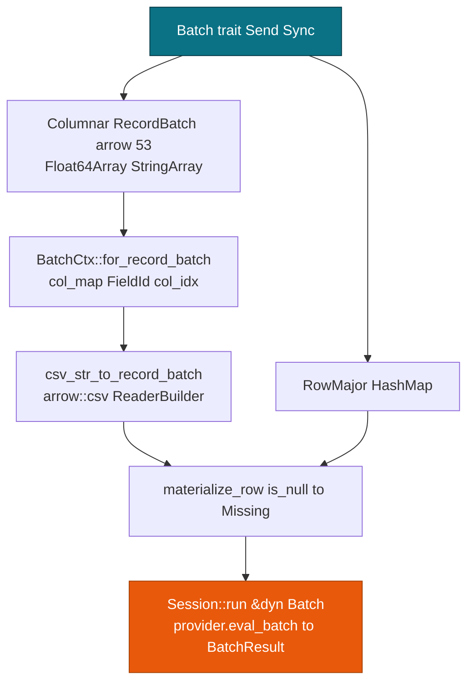

# Arrow & CSV Integration

> This guide covers Arrow 53 integration for pmmlruntime columnar scoring and CSV loading. For **Batch** basics, see [Batch API: One Method, Two Layouts](./batch.md). For schema output, see [MiningSchema, DataDictionary & Output](../concepts/schema.md).

**Session** accepts a `RecordBatch` and CSV text through `arrow::csv`. You keep `Session::run` and change only the builder.

## Concepts

| Concept | Description |
| --- | --- |
| **RecordBatch** | Arrow 53 batch with a `Schema` and `Float64Array` or `StringArray` columns. |
| **csv_str_to_record_batch** | `arrow::csv` helper that reads CSV text into one batch. |
| **TableLocator placeholder** | Empty `RecordBatch` with a schema and zero rows, used when an `InlineTable` is missing. |
| **is_null to Missing** | `col.is_null(row)` becomes `Value::Missing`, else the code reads `Float64Array::value` or `StringArray::value`. |
| **into_record_batch** | `BatchResult::into_record_batch(schema)` converts rows back to Arrow. |

## How it works

| Aspect | RowMajor | Columnar |
| --- | --- | --- |
| **Build** | `HashMap::insert` per field | `RecordBatch::try_new(schema, vec![Float64Array, StringArray])` |
| **CSV** | `string_to_value` per cell | `csv_str_to_record_batch(csv, Some(schema), true)` through `arrow::csv` |
| **Empty** | Empty `Vec` gives empty `Rows` | `table_locator_placeholder_batch(schema)` gives 0 rows with the same schema |
| **Null** | A missing key stays `Missing` | `is_null(row)` becomes `Missing` |
| **Discrete** | `Discrete(SymbolId)` direct | `Utf8` through `symbol_str_to_id`, then `parse::<f64>`, else `Missing` |
| **Output** | `into_single` or `into_rows` | `into_record_batch(schema)` with `Float64` and `Utf8` builders |

`BatchCtx::for_record_batch` scans `batch.schema().fields()` once and keeps only the columns listed in `name_to_id`. Each row then costs one array read per field.



CSV text becomes scores in one step:

```rust
use std::sync::Arc;
use arrow::datatypes::{DataType, Field, Schema};
use pmmlruntime::{PmmlEnv, Session, SessionOptions};
use pmmlruntime::session::arrow::csv_str_to_record_batch;
use pmmlruntime::session::batch::Batch;
let env = PmmlEnv::new();
let sess = Session::from_bytes(&env, &std::fs::read("bench/pmml/DecisionTreeIris.pmml")?, SessionOptions::default())?;
let csv = "Petal.Length,Petal.Width\n1.4,0.2\n6.0,2.5\n";
let schema = Arc::new(Schema::new(vec![
    Field::new("Petal.Length", DataType::Float64, true),
    Field::new("Petal.Width", DataType::Float64, true),
]));
let batch = csv_str_to_record_batch(csv, Some(schema.clone()), true)?;
let rows = sess.run(&batch as &dyn Batch)?.into_rows();
let out = sess.run(&batch as &dyn Batch)?.into_record_batch(schema, None)?;
```

`csv_str_to_record_batch` built the reader with `with_header(true)`, so the first line became column names. An empty CSV field arrives as null and turns into `Missing`. See [`csv_str_to_record_batch`](https://docs.rs/pmmlruntime/latest/pmmlruntime/session/arrow/fn.csv_str_to_record_batch.html).

Build arrays yourself when you have categorical columns or need a placeholder batch:

```rust
use std::sync::Arc;
use arrow::array::{Float64Array, StringArray};
use arrow::datatypes::{DataType, Field, Schema};
use arrow::record_batch::RecordBatch;
use pmmlruntime::session::arrow::table_locator_placeholder_batch;
let schema = Arc::new(Schema::new(vec![
    Field::new("x", DataType::Float64, true),
    Field::new("category", DataType::Utf8, true),
]));
let batch = RecordBatch::try_new(schema.clone(), vec![
    Arc::new(Float64Array::from(vec![Some(1.0), None])) as _,
    Arc::new(StringArray::from(vec![Some("setosa"), None])) as _,
])?;
let empty = table_locator_placeholder_batch(schema)?;
```

## Columnar sources

Five sources reach the engine, and each one has explicit type handling.

| Data Source | Arrow Type | How Built | Null Handling | Discrete Handling |
| --- | --- | --- | --- | --- |
| **CSV with header** | `RecordBatch` through `arrow::csv` | `csv_str_to_record_batch(csv, Some(schema), true)` | Empty field becomes null, then `Missing` | `Utf8` through `symbol_str_to_id`, else parse |
| **CSV without header** | `RecordBatch` with all `Utf8` | `csv_str_to_record_batch(csv, None, true)` | Same | Caller casts, so prefer an explicit `Float64` schema |
| **RecordBatch in memory** | `Float64Array` with `StringArray` | `RecordBatch::try_new(schema, vec![arrays])` | `is_null(row)` becomes `Missing` | `StringArray::value` through the symbol map |
| **TableLocator placeholder** | `RecordBatch` with 0 rows and a schema | `table_locator_placeholder_batch(schema)` | 0 rows, schema kept | Prevents a panic on a missing `InlineTable` |
| **IPC or Parquet** | `RecordBatch` from a reader | `arrow::ipc` or `parquet`, then a `RecordBatch` | Same `is_null` rule | Same `Utf8` to `SymbolId` path |

You always end at a `RecordBatch`, because CSV and IPC are only builders. `Session::run` never sees file I/O, only a `&dyn Batch` with `col_map` resolved.

```rust
use std::sync::Arc;
use arrow::datatypes::{DataType, Field, Schema};
use pmmlruntime::session::arrow::csv_str_to_record_batch;
use pmmlruntime::session::batch::Batch;

let env = pmmlruntime::PmmlEnv::new();
let sess = pmmlruntime::Session::from_bytes(&env, &std::fs::read("bench/pmml/DecisionTreeIris.pmml")?, pmmlruntime::SessionOptions::default())?;

// CSV with a header and an explicit schema
let schema = Arc::new(Schema::new(vec![
    Field::new("Petal.Length", DataType::Float64, true),
    Field::new("species", DataType::Utf8, true),
]));
let csv = "Petal.Length,species\n1.4,setosa\n6.0,virginica\n";
let batch = csv_str_to_record_batch(csv, Some(schema.clone()), true)?;
let rows = sess.run(&batch as &dyn Batch)?.into_rows();
assert_eq!(rows.len(), 2);
# Ok::<(), Box<dyn std::error::Error>>(())
```

```rust
// In-memory RecordBatch with mixed types
use std::sync::Arc;
use arrow::array::{Float64Array, StringArray};
use arrow::datatypes::{DataType, Field, Schema};
use arrow::record_batch::RecordBatch;
use pmmlruntime::session::batch::Batch;

let schema = Arc::new(Schema::new(vec![
    Field::new("Petal.Length", DataType::Float64, true),
    Field::new("species", DataType::Utf8, true),
]));
let batch = RecordBatch::try_new(schema.clone(), vec![
    Arc::new(Float64Array::from(vec![Some(1.4), None])) as _,
    Arc::new(StringArray::from(vec![Some("setosa"), Some("versicolor")])) as _,
])?;
let rows = sess.run(&batch as &dyn Batch)?.into_rows();
assert_eq!(rows.len(), 2);
# Ok::<(), Box<dyn std::error::Error>>(())
```

## Schema inference versus explicit schema

A schema can be inferred from the CSV header or declared up front. For scoring, declare it.

| Approach | How | Pros | Cons | When to Use |
| --- | --- | --- | --- | --- |
| **Explicit schema** | `Schema::new(vec![Field::new("x", Float64, true)])`, then `csv_str_to_record_batch(csv, Some(schema), true)` | Types match the `DataDictionary`, so `Float64Array` and `StringArray` are right | You must know the `DataField` names and types | Every scoring path |
| **Inferred schema** | `csv_str_to_record_batch(csv, None, true)` gives all `Utf8` | No schema to maintain | Numbers need `parse::<f64>` per cell | Quick CSV exploration |
| **Placeholder** | `table_locator_placeholder_batch(schema)` | 0 rows with the schema preserved | No data | Missing `InlineTable` |

Inference hides type errors. A `double` read as `Utf8` still scores through the `parse::<f64>` fallback, but it pays per-cell parsing and loses the distinction between `Missing` and an unparseable value. An explicit `Float64Array` reads `value(row)` directly.

```rust
use std::sync::Arc;
use arrow::datatypes::{DataType, Field, Schema};
use pmmlruntime::session::arrow::csv_str_to_record_batch;

// Explicit: correct Float64 for a continuous field
let schema = Arc::new(Schema::new(vec![
    Field::new("Petal.Length", DataType::Float64, true),
]));
let csv = "Petal.Length\n1.4\n\n6.0\n"; // empty line becomes null, then Missing
let batch = csv_str_to_record_batch(csv, Some(schema), true)?;
# Ok::<(), Box<dyn std::error::Error>>(())
```

```rust
// Inferred: all Utf8, fallback parsing per cell
use pmmlruntime::session::arrow::csv_str_to_record_batch;
let csv = "Petal.Length\n1.4\n6.0\n";
let batch = csv_str_to_record_batch(csv, None, true)?;
# Ok::<(), Box<dyn std::error::Error>>(())
```

Choose the explicit schema for correctness and speed, and check each name with `sess.field_id(name)` before you build it.

## Arrow helpers

`pmmlruntime::session::arrow` also exposes the pieces the batch path uses internally, which you can call directly.

| Function | Purpose |
| --- | --- |
| `ir_to_arrow_schema(&Ir)` | Build an Arrow `Schema` from the model's output fields. |
| `data_dictionary_to_schema(&[FieldMeta])` | Build an Arrow `Schema` from the `DataDictionary` fields. |
| `value_maps_to_record_batch(&[HashMap], schema, symbol_names)` | Turn scored rows into a `RecordBatch`. |
| `record_batch_to_value_maps(&RecordBatch)` | Turn a `RecordBatch` back into rows of `Value`. |
| `inline_table_to_record_batch(&[rows], schema)` | Materialize an `InlineTable` into a `RecordBatch`. |
| `csv_str_to_record_batch(csv, schema, has_header)` | Parse CSV text into a `RecordBatch`. |
| `table_locator_placeholder_batch(schema)` | Build the 0-row batch used when an `InlineTable` is absent. |

> **Tip:** `data_dictionary_to_schema` and `ir_to_arrow_schema` save you from hand-writing a `Schema` that drifts from the PMML. Build the input schema from the `DataDictionary` and the output schema from the `Ir`.

## Checking row-major and columnar parity

Score the same rows as a `HashMap` and as a `RecordBatch` and compare the results.

### Small fixture comparison

```rust
use std::{collections::HashMap, sync::Arc};
use arrow::array::Float64Array;
use arrow::datatypes::{DataType, Field, Schema};
use arrow::record_batch::RecordBatch;
use pmmlruntime::{PmmlEnv, Session, SessionOptions, Value};
use pmmlruntime::session::batch::Batch;

let env = PmmlEnv::new();
let sess = Session::from_bytes(&env, &std::fs::read("bench/pmml/DecisionTreeIris.pmml")?, SessionOptions::default())?;

let mut row = HashMap::new();
row.insert("Petal.Length".into(), Value::Continuous(1.4));
row.insert("Petal.Width".into(), Value::Continuous(0.2));
let expected = sess.run(&row as &dyn Batch)?.into_single().unwrap();

let schema = Arc::new(Schema::new(vec![
    Field::new("Petal.Length", DataType::Float64, true),
    Field::new("Petal.Width", DataType::Float64, true),
]));
let batch = RecordBatch::try_new(schema, vec![
    Arc::new(Float64Array::from(vec![Some(1.4)])) as _,
    Arc::new(Float64Array::from(vec![Some(0.2)])) as _,
])?;
let actual = sess.run(&batch as &dyn Batch)?.into_single().unwrap();
assert_eq!(expected.get("predictedValue"), actual.get("predictedValue"));
# Ok::<(), Box<dyn std::error::Error>>(())
```

Run this once per model in CI. When the two layouts diverge, the schema is wrong, usually a case mismatch or a `Float64` column arriving as `Utf8`.

### Isolating columnar issues

| Check | Command | Catches |
| --- | --- | --- |
| Field existence | `sess.field_id("Petal.Length")` | A case mismatch, which yields `None` and then all `Missing` |
| Schema agreement | Compare `batch.schema().fields()` names, then call `sess.field_id(name)` for each | An unknown column, which becomes `Missing` |
| Type agreement | `batch.column(i).data_type()` against the `DataDictionary` `DataType` | `Float64` against `StringArray` |
| Null against `Missing` | `array.is_null(row)` | `None` becoming `Missing` |
| Output parity | `cargo test --test all_fixtures -- --nocapture` | 52 fixtures asserting offline equality |

```rust
use pmmlruntime::{PmmlEnv, Session, SessionOptions};
let env = PmmlEnv::new();
let sess = Session::from_bytes(&env, &std::fs::read("bench/pmml/DecisionTreeIris.pmml")?, SessionOptions::default())?;
for name in ["Petal.Length", "Petal.Width", "petal.length"] {
    println!("{} -> {:?}", name, sess.field_id(name));
}
# Ok::<(), Box<dyn std::error::Error>>(())
```

Check small fixtures before you trust a 100k-row `RecordBatch`. A wrong column name costs nothing at row 1 and silently scores `Missing` at row 100 000.

## Choosing a layout

| Scenario | Use | Cost | Schema |
| --- | --- | --- | --- |
| 1 row at 402 ns | `HashMap` | 402 ns against more than 1 µs for Arrow | No schema |
| 100k Arrow | `RecordBatch` | **61 ns/row** (16.5M/s) | Header must match the active fields |
| CSV with header | `csv_str_to_record_batch(csv, Some(schema), true)` | One `arrow::csv` pass | Names must match the `DataDictionary` |
| No header | `csv_str_to_record_batch(csv, None, true)` with all `Utf8` | Caller casts | Prefer an explicit `Float64` schema |
| `TableLocator` | `table_locator_placeholder_batch(schema)` | 0 rows, schema kept | Prevents a panic |
| Downstream Arrow | `into_record_batch(schema)` | `Vec<Option<T>>` per column | Provide the output schema |

The break-even sits near 1k rows.

> **Tip:** A `RecordBatch` wins at 100k rows with 61 ns per row through `par_chunks`, while a `HashMap` wins at 1 row with 402 ns.

> **Warning:** Schema agreement is strict. Names must equal the active fields in the `DataDictionary`, and a column declared `Float64Array` must match a `DataType` of `double`. An unknown column becomes `Missing`.

### Schema mismatches

| Symptom | Cause | Fix |
| --- | --- | --- |
| Every field `Missing` | Header `petal.length` against `Petal.Length` | Match `DataField@name` case exactly |
| Cells become `Missing` | `Float64` sent as `StringArray` | Use `Float64Array` for `double` and `float` fields |
| `Err("empty csv")` | Empty CSV text | Use `table_locator_placeholder_batch` |

Check the names with `sess.field_id(name)` when a batch scores `Missing` everywhere.

## Next Steps

- [Batch API: One Method, Two Layouts](./batch.md): pick `BatchCtx::new` or `for_record_batch` and compare layouts.
- [CSV & CLI Workflows](../deployment/cli.md): run `score_file model.pmml input.csv` end to end.
- [Concurrency & Memory](../production/concurrency.md): shard with the `rayon` thresholds.
- [Values, Fields & Types](../concepts/values.md): handle `Continuous`, `Discrete`, and `Missing`.

*Next: [Overview: 19 Model Types](../models/overview.md) → · Previous: [Batch API](./batch.md)*
