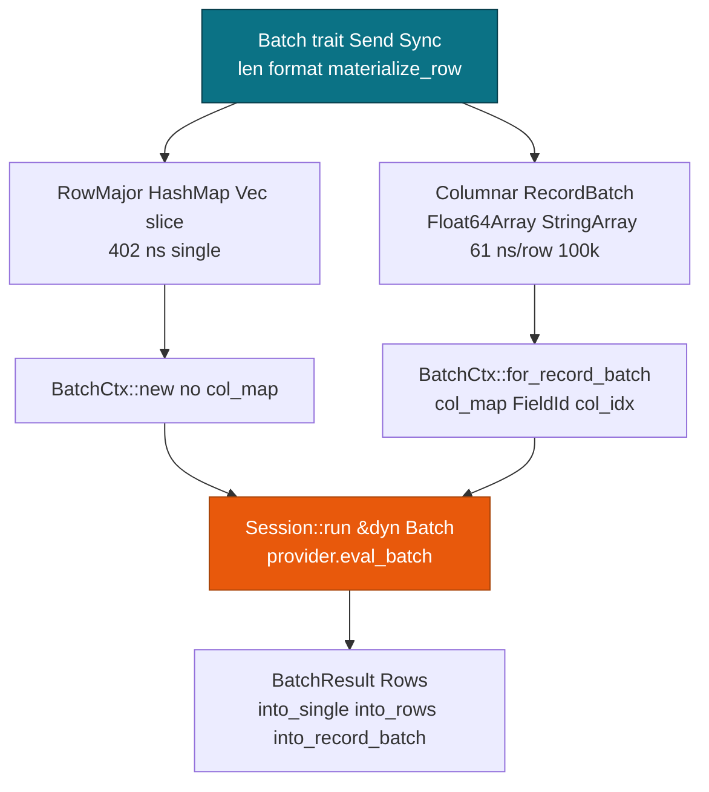

# Batch API: One Method, Two Layouts

> This guide covers the **Batch** trait for pmmlruntime services that score any PMML model. For Arrow and CSV helpers, see [Arrow & CSV Integration](./arrow.md). For session lifecycle, see [Session, Env & Lifecycle](../concepts/session.md).

**Session** scores one row and 100k rows through `Session::run` with any `&dyn Batch`. You get a **BatchResult** back, and the engine takes the same path either way.

Two layouts exist because neither one wins at every size. A map is ergonomic for a single row, and a `RecordBatch` avoids a map per row at scale.

## Concepts

| Concept | Description |
| --- | --- |
| **Batch** | Object-safe `Send + Sync` trait with `len`, `is_empty`, `format`, and `materialize_row`. You pass it as `&dyn Batch`. |
| **BatchCtx** | Borrowed cache holding `name_to_id`, `symbol_str_to_id`, `ir`, and `col_map`. It allocates nothing per row. |
| **BatchResult** | `Rows(Vec<HashMap<String, Value>>)` or `Columnar(RecordBatch)`. |
| **BatchFormat** | Layout hint the provider reads: `RowMajor` or `Columnar`. |
| **Value** | `Continuous(f64)`, `Discrete(SymbolId)`, or `Missing`, which `Op::JumpIfMissing` propagates. |

**Batch** is the input, **BatchCtx** is the cache, and **BatchResult** is the output. **MiningSchema** validates fields before scoring.

## How the layouts differ

| Aspect | RowMajor | Columnar |
| --- | --- | --- |
| **Type** | `HashMap<String, Value>`, `Vec<HashMap>`, `&[HashMap]` | `RecordBatch` with `Float64Array` and `StringArray` (arrow 53) |
| **Ctx** | `BatchCtx::new`, `col_map` empty | `BatchCtx::for_record_batch`, `col_map: Vec<(FieldId, col_idx)>` from the schema |
| **materialize_row** | Loops the map and reads `name_to_id` | Loops `col_map`, turns `is_null` into `Missing`, else reads the array value |
| **Discrete** | `Discrete(SymbolId)` direct | `Utf8` through `symbol_str_to_id`, then `parse::<f64>`, else `Missing` |
| **Provider** | `CpuProvider::eval_batch` | Same `eval_batch`, with no map per row |

`Session::run` builds `BatchCtx` on the stack and gives each thread its own `&mut [Value]` through `with_value_buffer`.



Score the same model with either layout, and swap only the input:

```rust
use std::collections::HashMap;
use pmmlruntime::{PmmlEnv, Session, SessionOptions, Value};
use pmmlruntime::session::batch::Batch;
let env = PmmlEnv::new();
let sess = Session::from_bytes(&env, &std::fs::read("bench/pmml/DecisionTreeIris.pmml")?, SessionOptions::default())?;
let mut single = HashMap::new();
single.insert("Petal.Length".into(), Value::Continuous(1.4));
single.insert("Petal.Width".into(), Value::Continuous(0.2));
let out = sess.run(&single as &dyn Batch)?.into_single().unwrap();
let batch = vec![single.clone(), single.clone()];
let rows = sess.run(&batch as &dyn Batch)?.into_rows();
```

```rust
use std::sync::Arc;
use arrow::array::Float64Array;
use arrow::datatypes::{DataType, Field, Schema};
use arrow::record_batch::RecordBatch;
use pmmlruntime::session::batch::Batch;
let schema = Arc::new(Schema::new(vec![
    Field::new("Petal.Length", DataType::Float64, true),
    Field::new("Petal.Width", DataType::Float64, true),
]));
let rb = RecordBatch::try_new(schema.clone(), vec![
    Arc::new(Float64Array::from(vec![Some(1.4), Some(6.0)])) as _,
    Arc::new(Float64Array::from(vec![Some(0.2), Some(2.5)])) as _,
])?;
let rows = sess.run(&rb as &dyn Batch)?.into_rows();
let out = sess.run(&rb as &dyn Batch)?.into_record_batch(schema, None)?;
```

You scored a `HashMap` row and a `Vec<HashMap>` batch through hash lookups, then a `RecordBatch` through `col_map` with no map per row. `None` becomes `Missing`, and a `StringArray` carries categoricals. See [`Session::run`](https://docs.rs/pmmlruntime/latest/pmmlruntime/session/struct.Session.html#method.run).

## Batch API surface

| Function | Purpose | Example |
| --- | --- | --- |
| `Batch::len()` | Number of rows without materializing | `batch.len() // 100_000` |
| `Batch::format()` | Layout hint (`RowMajor` or `Columnar`) for the provider | `batch.format() // Columnar` |
| `Batch::materialize_row(row, values, ctx)` | Fill `Value[FieldId]`, `Missing`-initialized | `batch.materialize_row(42, &mut buf, &ctx)` |
| `BatchCtx::new(name_to_id, symbol_str_to_id)` | RowMajor cache with an empty `col_map` | `BatchCtx::new(&field_names, &symbols)` |
| `BatchCtx::for_record_batch(ctx, batch)` | Columnar cache with `Vec<(FieldId, col_idx)>` | `BatchCtx::for_record_batch(&base, &rb)` |
| `BatchResult::into_single()` | Unwrap one `HashMap<String, Value>` | `result.into_single().unwrap()` |
| `BatchResult::into_rows()` | Unwrap `Vec<HashMap<String, Value>>` | `result.into_rows()` |
| `BatchResult::into_record_batch(schema, symbol_names)` | Convert rows back to Arrow | `result.into_record_batch(schema, None)?` |

The trait is implemented for `HashMap<String, Value>`, `Vec<HashMap<String, Value>>`, `[HashMap<String, Value>]`, and `RecordBatch`, so you only implement it for a new input type. `CpuProvider::eval_batch` calls `materialize_row` for you, and `BatchCtx` is always borrowed from `Session`:

```rust
use pmmlruntime::{PmmlEnv, Session, SessionOptions, Value};
use pmmlruntime::session::batch::Batch;

let env = PmmlEnv::new();
let sess = Session::from_bytes(&env, &std::fs::read("bench/pmml/DecisionTreeIris.pmml")?, SessionOptions::default())?;
let mut buf = vec![Value::Missing; 8];
println!("buf[0] before={:?}", buf[0]);
# Ok::<(), Box<dyn std::error::Error>>(())
```

### Which cells reach the value buffer

| Input Cell | `name_to_id` Hit? | Symbol Lookup | `&mut [Value]` |
| --- | --- | --- | --- |
| `Continuous(1.4)` for `Petal.Length` | Yes, `FieldId(2)` | not needed | `buf[2]=Continuous(1.4)` |
| `Discrete(SymbolId(0))` for `species` | Yes | already a `SymbolId` | `Discrete(0)` |
| `"setosa"` from a `RecordBatch` `Utf8` | Yes | `symbol_str_to_id.get("setosa")` | `Discrete(0)` |
| `"1.4"` numeric string | Yes | miss, then `parse::<f64>` | `Continuous(1.4)` |
| `"unknown"` discrete parse fail | Yes | miss, then parse fail | `Missing` |
| `None` or null | not needed | not needed | `Missing` from the initial fill |
| Extra column `"extra"` | No | not needed | ignored, stays `Missing` |

You initialize `buf` to `Missing` and only overwrite hits, so an extra column costs one failed `AHashMap::get`.

## Sharding across cores

`CpuProvider::eval_batch` runs serially when `n < 256` or `n < num_threads * 4`. Above that it shards with `rayon::par_chunks(chunk_size)`, where `chunk_size = 256.max(n / num_threads)`. The serial cut exists because a `rayon` spawn costs about 100 µs, which a 256-row batch does not earn back.

### Sequential rows

```rust
use pmmlruntime::session::batch::Batch;
use std::collections::HashMap;
use pmmlruntime::Value;

let rows: Vec<HashMap<String, Value>> = (0..100).map(|_| {
    let mut m = HashMap::new();
    m.insert("Petal.Length".into(), Value::Continuous(1.4));
    m
}).collect();
let out = sess.run(&rows as &dyn Batch)?; // n=100 < 256, so serial
assert_eq!(out.len(), 100);
# Ok::<(), Box<dyn std::error::Error>>(())
```

### One session across threads

```rust
use std::{sync::Arc, thread, collections::HashMap};
use pmmlruntime::{Value, session::batch::Batch};

let sess = Arc::new(sess);
let handles: Vec<_> = (0..4).map(|_| {
    let s = sess.clone();
    thread::spawn(move || {
        let mut row = HashMap::new();
        row.insert("Petal.Length".into(), Value::Continuous(1.4));
        s.run(&row as &dyn Batch).unwrap().into_single().unwrap()
    })
}).collect();
let results: Vec<_> = handles.into_iter().map(|h| h.join().unwrap()).collect();
assert_eq!(results.len(), 4);
# Ok::<(), Box<dyn std::error::Error>>(())
```

### Columnar shards

```rust
use std::sync::Arc;
use arrow::array::Float64Array;
use arrow::datatypes::{DataType, Field, Schema};
use arrow::record_batch::RecordBatch;
use pmmlruntime::session::batch::Batch;

let schema = Arc::new(Schema::new(vec![Field::new("Petal.Length", DataType::Float64, true)]));
let batch = RecordBatch::try_new(schema.clone(), vec![
    Arc::new(Float64Array::from(vec![1.4; 100_000])) as _,
])?;
let out = sess.run(&batch as &dyn Batch)?; // n >= 256, so par_chunks
assert_eq!(out.len(), 100_000);
# Ok::<(), Box<dyn std::error::Error>>(())
```

## Per-row timings

Measured on an i7-12700 with release builds. Use the table to pick a layout.

| Rows | Layout | Total Time | Per-Row | Speedup vs HashMap | Provider |
| --- | --- | --- | --- | --- | --- |
| 1 | `HashMap` single | 402 ns | **402 ns** | 1× | serial |
| 100 | `Vec<HashMap>` | 59.2 µs | 592 ns | 1× | serial (`n<256`) |
| 1 000 | `RecordBatch` | 249 µs | 249 ns | 2.4× | boundary |
| 10 000 | `RecordBatch` | 1.1 ms | 110 ns | 5.4× | `par_chunks` |
| 100 000 | `RecordBatch` | 6.1 ms | **61 ns** (16.5M/s) | 9.7× | `par_chunks` |

The break-even sits near 1k rows. Arrow wins through `col_map`, which avoids a map per row, plus thread-local buffers in the sharded path. A single row stays fastest as a `HashMap` because building a `RecordBatch` costs more than 1 µs.

```rust
use std::time::Instant;
use pmmlruntime::session::batch::Batch;
use std::collections::HashMap;
use pmmlruntime::Value;

let mut row = HashMap::new();
row.insert("Petal.Length".into(), Value::Continuous(1.4));
let t0 = Instant::now();
for _ in 0..10_000 { let _ = sess.run(&row as &dyn Batch)?; }
println!("10k singles: {:?}", t0.elapsed());
# Ok::<(), Box<dyn std::error::Error>>(())
```

Reproduce the columnar numbers with `cargo bench --bench scoring`.

## Choosing a layout

| Scenario | Use | Per-row (i7-12700 release) | Reason |
| --- | --- | --- | --- |
| 1 row | `HashMap` | **402 ns** against more than 1 µs for Arrow | No schema needed, natural for a `dict` |
| 100 rows | `Vec<HashMap>` | 592 ns | Serial path, ergonomic |
| 1k columnar | `RecordBatch` | 249 µs total | `col_map` avoids maps |
| 100k columnar | `RecordBatch` | **61 ns** (16.5M/s) | Sharded, thread-local buffers |
| `Association` `Collection` | `HashMap` | n/a | A `RecordBatch` cannot carry a `Collection` |

> **Tip:** Use a `HashMap` for a single row and a `RecordBatch` for 100k rows. The provider picks the path from `Batch::format()` and the row count.

> **Warning:** A `RecordBatch` needs schema agreement. Column names must equal the active fields in the `DataDictionary`, and `Float64Array` against `StringArray` must match the `DataType`. An unknown column becomes `Missing`.

## Batch inputs in the bindings

Every binding reaches the same `CpuProvider`, and each one spells the input differently.

Rust passes a `HashMap<String, Value>` or a `RecordBatch` directly.

Python wraps the same session and takes a `dict`:

```python
import pmmlruntime
sess = pmmlruntime.InferenceSession("bench/pmml/DecisionTreeIris.pmml")
out = sess.run(None, {"Petal.Length": 1.4, "Petal.Width": 0.2})
print(out[0]["predictedValue"])
```

C passes tagged values through the `PmmlApi` table:

```c
const PmmlApi* api = PmmlGetApi(PMML_API_VERSION);
PmmlEnv* env = NULL; api->CreateEnv(PMML_LOG_WARNING, "batch", &env);
PmmlSession* sess = NULL; api->CreateSessionFromArray(env, bytes, len, NULL, &sess);
const char* in_names[] = {"Petal.Length", "Petal.Width"};
PmmlValue in_vals[] = {
  {.tag = PMML_VALUE_CONTINUOUS, .continuous = 1.4},
  {.tag = PMML_VALUE_CONTINUOUS, .continuous = 0.2}};
const char* out_names[] = {"predictedValue"};
PmmlValue out_val[1];
api->Run(sess, NULL, in_names, in_vals, 2, out_names, 1, out_val);
```

A few limits are worth knowing before you write C. `PmmlValue` is a tagged union over `continuous` (`double`) and `discrete` (`SymbolId`), with `PMML_VALUE_MISSING` as the third tag. `RunBatch` returns one `PmmlValue` per row, holding `predictedValue` only, so loop over `Run` when you need every `Output` field. `RunArrow` returns `PMML_ERR_UNSUPPORTED_MARKUP` in v1, so pass rows through `RunBatch` until the Arrow C Data Interface path lands. `CreateIoBinding`, `BindInput`, and `RunWithBinding` reuse `BatchCtx` and the value buffer across calls, which suits a fixed model scored in a loop.

> **Note:** Java and JavaScript call the same `PmmlApi` table. See [Java Bindings](../deployment/java.md) and [JavaScript Bindings](../deployment/javascript.md) for their wrappers.

## Next Steps

- [Arrow & CSV Integration](./arrow.md): build a `RecordBatch` through `arrow::csv` and handle a `TableLocator` empty batch.
- [Session, Env & Lifecycle](../concepts/session.md): share one `Session` across threads with `PmmlEnv`.
- [MiningSchema, DataDictionary & Output](../concepts/schema.md): handle `Missing` and read `predictedValue`.
- [Performance: Cold vs Hot vs Batch](../evaluation/performance.md): reproduce the 61 ns/row batch numbers.

*Next: [Arrow & CSV Integration](./arrow.md) → · Previous: [Session, Env & Lifecycle](../concepts/session.md)*
