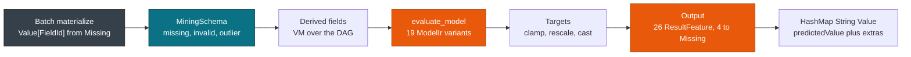

# MiningSchema, DataDictionary & Output

> This guide covers **DataDictionary**, **MiningSchema**, **Output**, and **Targets**. For session setup, see [Session, Env & Lifecycle](./session.md). For value types, see [Values, Fields & Types](./values.md).

Every score passes three stages in a fixed order: the DataDictionary declares types, the MiningSchema picks fields and corrects values, and Output plus Targets shape the result. This page shows what each stage reads from the PMML and what it writes back.

## Concepts

| Concept | Description |
| --- | --- |
| **DataDictionary** | Declares every field with `dataType` and `opType`, plus an optional allowed `Value` list. Lowers into `Ir.data_dictionary`. |
| **MiningSchema** | Selects `active_fields` and `target_field`, and carries per-field treatments in `FieldMeta`. Lives on each `ModelIr` variant as `mining_schema`. |
| **Output** | Declares result fields. 26 `ResultFeature` values exist, and 4 of them resolve to `Value::Missing`. |
| **Targets** | Rescales, clamps, and casts a continuous prediction. Lives on the model as `targets: Vec<TargetIr>`. |

## DataDictionary

The DataDictionary is the type registry behind every score. Each `DataField` carries a name, a `dataType`, an `opType`, and an optional list of allowed values. Lowering folds this into `Ir.data_dictionary` as a `Vec<FieldMeta>` with dense `FieldId` values.

`FieldMeta` keeps the declaration plus the treatments that the MiningSchema adds:

| Field | Meaning |
| --- | --- |
| `field_id`, `name` | Dense id and the original `DataField` or `DerivedField` name. |
| `data_type`, `op_type` | Declared `dataType` and `opType`, both case sensitive per `pmml.xsd`. |
| `values` | Allowed discrete values as `Vec<SymbolId>`, empty when unrestricted. |
| `invalid_value_treatment`, `invalid_value_replacement` | How to handle a value that breaks the type or the allowed list. |
| `missing_value_treatment`, `missing_value_replacement` | How to handle an absent value. |
| `outlier_treatment`, `low_value`, `high_value` | Bounds and handling for continuous outliers. |

## MiningSchema

The MiningSchema is the per-model field contract. It gives you `active_fields: Vec<FieldId>`, an optional `target_field`, and `field_metas` in document order. Each `ModelIr` variant carries its own `mining_schema`, so a segmented ensemble can select different fields per segment.

Treatments run in this order for every active field:

1. **Missing.** `missing_value_treatment` keeps `Missing`, substitutes a replacement value, or fails with `ReturnInvalid`.
2. **Invalid.** A value that breaks `dataType` or falls outside the allowed list is handled by `invalid_value_treatment`.
3. **Outlier.** A valid continuous value outside `[low_value, high_value]` is kept, cleared, or clamped by `outlier_treatment`.

| Treatment | Options | Effect on the value slice |
| --- | --- | --- |
| `outlier_treatment` | `AsIs`, `AsMissingValues`, `AsExtremeValues` | Keep, clear, or clamp a continuous value outside the bounds. |
| `invalid_value_treatment` | `ReturnInvalid`, `AsIs`, `AsMissing`, `AsValue` | Fail, keep, clear, or replace with `invalid_value_replacement`. |
| `missing_value_treatment` | `AsIs`, `AsMean`, `AsMode`, `AsMedian`, `AsValue`, `ReturnInvalid` | Keep `Missing`, substitute a statistic or a replacement, or fail. |

> **Attention:** `apply_mining_schema(schema, input_map, values)` writes the corrected slice, so it must run before derived fields and before any predicate. Reversing that order makes an `isMissing` predicate read an uncorrected value.

```rust
use pmmlruntime::{PmmlEnv, Session, SessionOptions, Value};
use pmmlruntime::session::batch::Batch;
use std::collections::HashMap;

let env = PmmlEnv::new();
let sess = Session::from_bytes(&env, &std::fs::read("bench/pmml/GradientBoosterTest.pmml")?, SessionOptions::default())?;
let mut input = HashMap::new();
input.insert("x1".to_string(), Value::Missing);
input.insert("x2".to_string(), Value::Continuous(999.0));
let out = sess.run(&input as &dyn Batch)?.into_single().unwrap();
println!("{:?}", out.get("predictedValue"));
# Ok::<(), Box<dyn std::error::Error>>(())
```

## Output

Output maps the predicted value and any requested extras into `HashMap<String, Value>`. `build_output` and `build_output_with_context` fill the map, using the output fields that the session resolved during lowering.

You always get `predictedValue`. When the PMML declares no `Output`, the engine synthesizes that key, so the result map is never empty.

| Output field | ResultFeature | Value type | Always present |
| --- | --- | --- | --- |
| `predictedValue` | `PredictedValue`, synthesized when absent | `Continuous` or `Discrete` | Yes |
| `probability(setosa)` | `Probability` | `Continuous` in `0..1` | Only when declared |
| `residual` | `Residual` | `Continuous` | Only when declared |

Four `ResultFeature` values resolve to `Missing` because the engine does not compute them: `standardError`, `standardDeviation`, `confidenceIntervalLower`, and `confidenceIntervalUpper`.

> **Note:** A declared but unsupported feature returns `Value::Missing` by default. `build_output_strict` turns those four into `PmmlError::UnsupportedMarkup` instead, which suits a validation job rather than a scoring path.

## Targets

Targets post-process a prediction after the model evaluates and before Output runs. Categorical predictions pass through untouched. A continuous prediction follows this order:

1. Clamp to `min` and `max`.
2. Multiply by `rescale_factor` and add `rescale_constant`.
3. Cast to integer with `Round`, `Ceiling`, or `Floor` when `cast_method` is set.

When the prediction is `Missing`, `apply_targets` scans `target_values` for the first entry with a default and returns it, or keeps `Missing` when none exists. Only the first `TargetIr` is consulted, because multi-target output is not supported yet.

```rust
use pmmlruntime::{PmmlEnv, Session, SessionOptions};
use pmmlruntime::session::batch::Batch;
use std::collections::HashMap;
use pmmlruntime::Value;

let env = PmmlEnv::new();
let sess = Session::from_bytes(&env, &std::fs::read("bench/pmml/RegressionOutputTest.pmml")?, SessionOptions::default())?;
let mut row = HashMap::new();
row.insert("input".to_string(), Value::Continuous(1e6)); // far outside the training range
let out = sess.run(&row as &dyn Batch)?.into_single().unwrap();
println!("regression: {:?}", out.get("predictedValue"));
# Ok::<(), Box<dyn std::error::Error>>(())
```

## Accepted and ignored input

| Rule | Input seen | Enforcement |
| --- | --- | --- |
| Required active field | `Missing` for `active_fields[i]` | `missing_value_treatment` applies. |
| Inactive or extra field | Key absent from `Ir.field_names` | Ignored, so a CSV with more columns still scores. |
| Type mismatch | `Continuous` on a categorical field | `invalid_value_treatment` applies. |
| Outlier | Continuous value outside the bounds | `outlier_treatment` clamps or clears it. |
| Numeric widening | An `integer` field fed a float | Always allowed, since every number is `f64`. |

Validation cost is `O(active_fields)`.

## Mismatch troubleshooting

Most mismatches become `Missing` instead of failing the run, so check the field map first:

```rust
use pmmlruntime::{PmmlEnv, Session, SessionOptions};

let env = PmmlEnv::new();
let sess = Session::from_bytes(&env, &std::fs::read("bench/pmml/DecisionTreeIris.pmml")?, SessionOptions::default())?;
for name in ["Petal.Length", "Petal.Width", "badName"] {
    match sess.field_id(name) {
        Some(fid) => println!("{name} -> FieldId({})", fid.as_usize()),
        None => println!("{name} -> not in the schema"),
    }
}
# Ok::<(), Box<dyn std::error::Error>>(())
```

| Symptom | Cause | Fix |
| --- | --- | --- |
| Every value `Missing` | Header case does not match `DataField/@name` | Match the name exactly and recheck with `sess.field_id(name)`. |
| `ReturnInvalid` error | `missing_value_treatment="returnInvalid"` | Provide `missing_value_replacement`. |
| Category cleared | `invalid_value_treatment="asMissing"` | Pass `Discrete(SymbolId)` through `symbol_id`. |
| Outlier unchanged | `outlierTreatment="asIs"` | Set `AsExtremeValues` with `lowValue` and `highValue`. |
| `standardError` missing | Unsupported `ResultFeature` | Expected, since 4 features always resolve to `Missing`. |
| Score off by a factor | Target rescale mismatch | Check clamp, then `value * factor + constant`, then cast. |

## Score pipeline



Targets runs before Output, so a rescale changes `predictedValue` and every probability that the output fields derive from it.

## Next Steps

* [Values, Fields & Types](./values.md): see how `FieldId` and `SymbolId` drive the slice layout.
* [Derived Fields & Inline Transforms](../transforms/derived.md): evaluate transforms after the schema correction step.
* [Correctness & Fixtures](../evaluation/correctness.md): run the 52 fixtures and compare output.
* [Session, Env & Lifecycle](./session.md): build the session that caches the resolved output fields.

*Next: [Derived Fields & Inline Transforms](../transforms/derived.md) → · Previous: [Values, Fields & Types](./values.md)*
