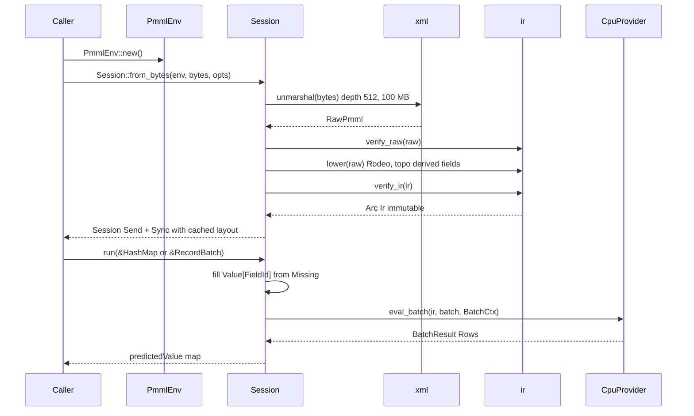

# Session, Env & Lifecycle

> This guide covers **Session** and **PmmlEnv** on the cold load path and the hot scoring path. For field values, see [Values, Fields & Types](./values.md). For schema handling, see [MiningSchema, DataDictionary & Output](./schema.md).

Load `DecisionTreeIris.pmml` once, then score rows from one session on as many threads as you need. This page shows how a session is built, what it caches, and how to share it.

## Concepts

| Concept | Description |
| --- | --- |
| **PmmlEnv** | Process-wide handle with an `Arc` inner. Cheap to clone, `Send + Sync`, never blocks scoring. |
| **Session** | Immutable scorer holding `Arc<Ir>`, the field maps, and a `CpuProvider`. |
| **SessionOptions** | Cold path tuning. One field today: `graph_optimization_level`. |
| **Value buffer** | The `&mut [Value]` slice that `run` fills per row. A stack array of 64 or a thread-local `Vec`. |

## Cold path and hot path

`PmmlEnv::new()` allocates one global handle per process. Every `Session` holds its own `Arc` clone of the inner `EnvInner`, so dropping the original handle never invalidates live sessions.

`Session::from_bytes(&env, bytes, opts)` runs `xml::unmarshal` with quick-xml 0.37, then `verify_raw`, `ir::lower` with Rodeo interning, and `verify_ir`, then wraps the model in `Arc<Ir>`. `Session::from_file` runs the same pipeline over a path.

> **Note:** Both constructors run `verify_raw` and `verify_ir`. `SessionOptions` tunes graph optimization only; the hardening limits (depth 512, 100 MB cap, DTD ignored) always apply.

`run(&self, &dyn Batch)` reads the shared `Arc<Ir>` and never writes it, so one session serves any number of threads without a lock. `Session` is `Send + Sync`.

```rust
use pmmlruntime::{PmmlEnv, Session, SessionOptions, Value};
use pmmlruntime::session::batch::Batch;
use std::collections::HashMap;

let env = PmmlEnv::new();
let bytes = std::fs::read("bench/pmml/DecisionTreeIris.pmml")?;
let sess = Session::from_bytes(&env, &bytes, SessionOptions::default())?;

let mut input = HashMap::new();
input.insert("Petal.Length".to_string(), Value::Continuous(1.4));
input.insert("Petal.Width".to_string(), Value::Continuous(0.2));
let out = sess.run(&input as &dyn Batch)?.into_single().unwrap();
println!("{:?}", out.get("predictedValue"));
# Ok::<(), Box<dyn std::error::Error>>(())
```

That call scored a row in 402 ns. Keep `sess` for later batches and threads. See [Batch API: One Method, Two Layouts](../batch/batch.md).

## Session API

| Function | Purpose | Example |
| --- | --- | --- |
| `PmmlEnv::new()` | Create the process-wide handle with an `Arc` inner | `let env = PmmlEnv::new();` |
| `PmmlEnv::with_name(name)` | Tag the handle for logs and multi-tenant setups | `PmmlEnv::with_name("scoring-svc")` |
| `PmmlEnv::name()` | Read the tag back | `env.name()` |
| `Session::from_bytes(&env, bytes, opts)` | Parse, verify, lower, and cache `Arc<Ir>` from memory | `Session::from_bytes(&env, &bytes, opts)?` |
| `Session::from_file(&env, path, opts)` | Same pipeline from the filesystem | `Session::from_file(&env, "model.pmml", opts)?` |
| `Session::field_id(name)` | Resolve a name to `FieldId` through an `AHashMap` | `sess.field_id("Petal.Length")` |
| `Session::symbol_id(value)` | Resolve a category string to `SymbolId` | `sess.symbol_id("setosa")` |
| `Session::string_to_value(field, s)` | Parse a string into the value the field expects | `sess.string_to_value("Species", "setosa")` |
| `Session::num_active_fields()` | Count the active MiningFields | `sess.num_active_fields()` |
| `Session::run(&dyn Batch)` | Score one row, a vector, or a `RecordBatch` | `sess.run(&row as &dyn Batch)?` |

The value buffer stays internal. `run` borrows it through crate-private `with_value_buffer`, which picks a 64-element stack array or a thread-local `Vec<Value>` from the row size, so you never call it yourself. `field_id` returns `None` for a name the schema does not declare.

## SessionOptions

`SessionOptions` carries one field, `graph_optimization_level`, and it affects lowering only:

| Level | Meaning |
| --- | --- |
| `DisableAll` | Interpreter path, lowest cold overhead. |
| `EnableBasic` | Bytecode output. The default. |
| `EnableExtended` | Reserved for SIMD and batch hints. A no-op today. |
| `EnableAll` | Reserved for a future JIT. A no-op today. |

Build options with the setter, then read them back from the public `Session.options` field:

```rust
use pmmlruntime::session::{GraphOptimizationLevel, SessionOptions};

let opts = SessionOptions::default()
    .graph_optimization_level(GraphOptimizationLevel::EnableBasic);
assert_eq!(opts.graph_optimization_level, GraphOptimizationLevel::EnableBasic);
```

The execution provider is not configurable. Each session installs the `CpuProvider`, which picks a serial loop or `rayon` chunking from the batch size.

## Sharing one session

Score on the calling thread for small work, and share an `Arc<Session>` when you already have a pool:

```rust
use pmmlruntime::{PmmlEnv, Session, SessionOptions};
use std::sync::Arc;

let env = PmmlEnv::new();
let sess = Arc::new(Session::from_bytes(
    &env,
    &std::fs::read("bench/pmml/DecisionTreeIris.pmml")?,
    SessionOptions::default(),
)?);

let handles: Vec<_> = (0..8)
    .map(|_| {
        let s = Arc::clone(&sess);
        std::thread::spawn(move || s.num_active_fields())
    })
    .collect();
for handle in handles {
    assert_eq!(handle.join().unwrap(), 2);
}
# Ok::<(), Box<dyn std::error::Error>>(())
```

Eight threads shared one `Arc<Ir>`, and each thread built its own value slice inside `run`. For bulk work, hand the session one `RecordBatch` and let the provider shard it at 100k rows for 61 ns per row.

## Cached layout

The session caches everything the hot path needs, so no lookup happens per row:

| Cached item | Source | Use |
| --- | --- | --- |
| `max_field_id` | Highest `FieldId` plus one, clamped to 16 | Sizes the `&mut [Value]` slice. |
| `needed` | `max(max_field_id, num_fields + 4).max(16)` | Chooses the stack buffer or the thread-local buffer. |
| `name_to_id` | Built from `Ir.field_names` | Backs `field_id(name)` at zero cost per call. |
| `symbol_names_vec` | Dense table built from `Ir.symbol_names` | Decodes `Discrete` values for output fields. |
| `output_fields` | Pre-resolved from `Output` | Builds the result map without per-row matching. |

Read what you need through `field_id`, `symbol_id`, and the public `sess.ir` handle. `Ir` itself stays immutable after publication, which is why no lock guards it.

> **Attention:** Never hold a `&mut [Value]` past `run`. Each call re-initializes the slice to `Value::Missing`, and the thread-local buffer never shrinks.

## Lifecycle

The diagram shows one cold pass building `Arc<Ir>`, then every hot call reusing it with a per-thread buffer.



`RawPmml` is dropped after lowering, and only `Arc<Ir>` survives. Each `run` materializes a fresh `Value[FieldId]` slice and hands batch sharding to the provider.

## Next Steps

* [Values, Fields & Types](./values.md): map `Value::Discrete` and `FieldId` onto dense slices.
* [MiningSchema, DataDictionary & Output](./schema.md): handle missing, invalid, and outlier values.
* [Batch API: One Method, Two Layouts](../batch/batch.md): choose between `HashMap` and `RecordBatch`.
* [Architecture Overview](../internals/architecture.md): trace `base → xml → ir → engine → session`.

*Next: [Values, Fields & Types](./values.md) → · Previous: [Introduction](../README.md)*
