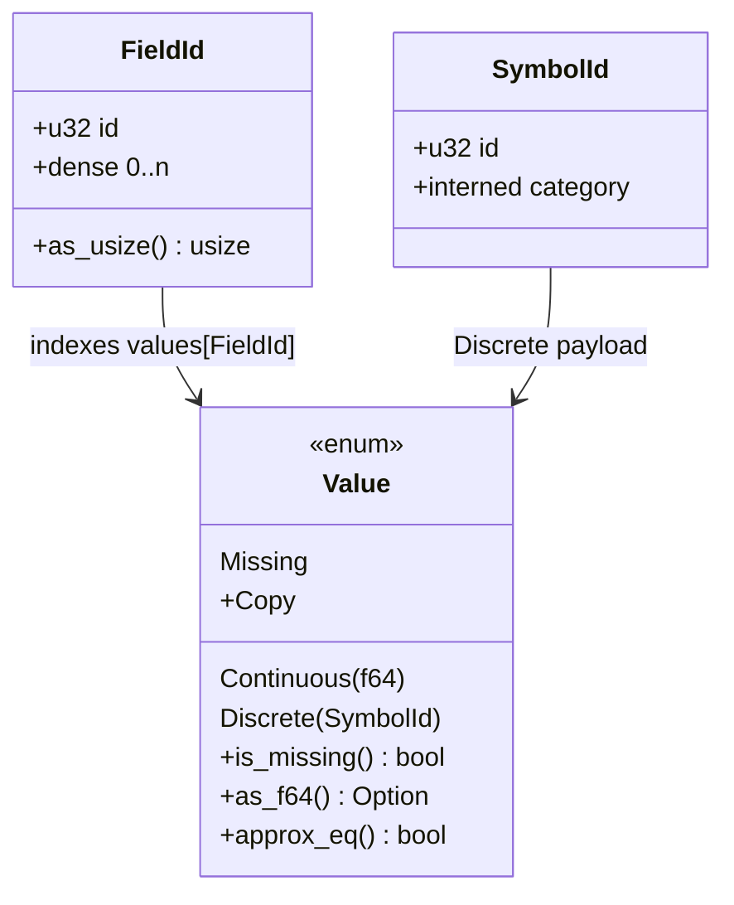

# Values, Fields & Types

> This guide covers **Value**, **FieldId**, and **SymbolId** on the hot path. For session setup, see [Session, Env & Lifecycle](./session.md). For schema validation, see [MiningSchema, DataDictionary & Output](./schema.md).

The engine scores `&mut [Value]` slices indexed by `FieldId`. This page explains the three types that make that layout cheap, and how missing and invalid values flow through it.

## Concepts

| Concept | Description |
| --- | --- |
| **Value** | `Copy` enum: `Continuous(f64)`, `Discrete(SymbolId)`, or `Missing`. |
| **FieldId** | Dense `u32` index from `0..n` into a `&mut [Value]` slice, checked once on access. |
| **SymbolId** | Interned id for a category string, assigned during lowering. |
| **Missing** | An explicit variant, not `Option<Value>`. `Op::JumpIfMissing` propagates it without branching on `None`. |

## Value

`Value` is the only value type the hot path handles, and it is `Copy`, so a move costs 16 bytes and needs no allocation:

| Variant | Holds | Use |
| --- | --- | --- |
| `Continuous(f64)` | Any numeric PMML type | `double`, `float`, and `integer` all coerce to `f64`. |
| `Discrete(SymbolId)` | An interned category | Strings, booleans, and named scores. |
| `Missing` | Nothing | Absent input, or the result of an invalid or outlier treatment. |

Three methods cover the common checks: `is_missing()`, `as_f64()` for the continuous payload, and `approx_eq(other, eps)` for comparison. `approx_eq` treats `NaN` as equal to `NaN`, which keeps fixtures with missing numeric branches stable.

```rust
use pmmlruntime::Value;
use pmmlruntime::base::SymbolId;

let v = Value::Continuous(42.0);
assert_eq!(v.as_f64(), Some(42.0));
let d = Value::Discrete(SymbolId(0));
assert!(d.as_f64().is_none());
assert!(Value::Missing.is_missing());
# Ok::<(), Box<dyn std::error::Error>>(())
```

## FieldId and SymbolId

**FieldId** is a dense `u32` assigned by the interner during `ir::lower`. Indexing `values[fid.as_usize()]` costs one bounds check, and packing the range `0..n` keeps the slice cache friendly. `Session::field_id(name)` resolves a name through a field map built from `Ir.field_names`, which is a `HashMap<FieldId, String>` snapshot taken at lowering time.

**SymbolId** works the same way for category strings. `Interner::intern_symbol` hands out dense ids through a `lasso::Rodeo` on the cold path, the interner is dropped once `Ir` exists, and `Ir.symbol_names` keeps the `SymbolId` to `String` snapshot for output. `Session::symbol_id("setosa")` and `Session::string_to_value(field, s)` expose the reverse direction to callers.

> **Note:** Interning runs on the cold path only. The hot path reads dense ids and `f64` payloads, so a row never allocates a string.

Numeric strings that miss the symbol map fall back to `f64` parsing and become `Continuous`, which preserves coercion for CSV input. A string that is neither a known category nor a number becomes `Missing`, so a predicate treats it as non-matching instead of panicking.

## Type mapping

| Rust type | PMML dataType | PMML opType | Value variant | Example |
| --- | --- | --- | --- | --- |
| `f64` | `double` | `continuous` | `Continuous(f64)` | `Value::Continuous(1.4)` |
| `f32` | `float` | `continuous` | `Continuous(f64)` | `Value::Continuous(3.14)` |
| `i32`, `i64` | `integer` | `continuous` | `Continuous(f64)` | `Value::Continuous(42.0)` |
| `String` | `string` | `categorical` | `Discrete(SymbolId)` | `Value::Discrete(SymbolId(0))` |
| `bool` as a string | `boolean` | `categorical` | `Discrete(SymbolId)` | `Value::Discrete(SymbolId(3))` |
| absent | any | any | `Missing` | `Value::Missing` |
| `NaN` | `double` | `continuous` | `Continuous(f64::NAN)` | `approx_eq` treats `NaN` as equal to `NaN` |

Every numeric dataType collapses to `f64`, so no evaluator branches on `integer` against `double`. Categories go through `SymbolId`, so equality is one `u32` comparison.

## Missing values

`Value::Missing` is a value, not an absence:

| Situation | Value seen by the engine | Result |
| --- | --- | --- |
| Key absent from the row | `Missing` after materialization | `missingValueTreatment` decides the next step. |
| Predicate compares `Missing` with `Continuous` | `Missing` | The predicate is false. |
| `isMissing` predicate on `Missing` | `Missing` | The predicate is true. |
| Derived field reads a `Missing` input | `Missing` | `Op::JumpIfMissing` skips to the else branch. |
| Unknown key in a `HashMap` or `RecordBatch` column | `Missing` | Ignored, and the row still scores. |

Initialize every `&mut [Value]` slice to `Value::Missing`, then overwrite the fields you have. Tree predictors then skip absent inputs instead of reading stale data.

> **Attention:** Never use `Option<Value>` in a `Batch` implementation. Set the slice to `Missing` and overwrite known slots, so `Op::JumpIfMissing` stays predictable.

```rust
use pmmlruntime::{PmmlEnv, Session, SessionOptions, Value};
use pmmlruntime::session::batch::Batch;
use std::collections::HashMap;

let env = PmmlEnv::new();
let sess = Session::from_bytes(&env, &std::fs::read("bench/pmml/GradientBoosterTest.pmml")?, SessionOptions::default())?;
let mut input = HashMap::new();
input.insert("x1".to_string(), Value::Missing);
input.insert("x2".to_string(), Value::Continuous(1.0));
let out = sess.run(&input as &dyn Batch)?.into_single().unwrap();
println!("{:?}", out.get("predictedValue"));
# Ok::<(), Box<dyn std::error::Error>>(())
```

## Invalid values

A value that contradicts the schema becomes `Missing` unless the field asks for an error. `PmmlError::InvalidValue` appears only when `invalidValueTreatment` is `returnInvalid`.

| Scenario | Value provided | Field expects | Outcome |
| --- | --- | --- | --- |
| Continuous on a categorical field | `Continuous(1.4)` | `values = ["setosa"]` | `asMissing` clears it, `returnInvalid` errors. |
| Category outside the allowed list | `Discrete(SymbolId(99))` | `values = ["setosa", "versicolor"]` | `asMissing` clears it. |
| Numeric string | `"1.4"` | categorical field | Parsed into `Continuous(1.4)`. |
| Unknown category | `"unknown"` | categorical field | `Missing`. |

## Dense layout

The slice length follows `needed = max(max_field_id, num_fields + 4).max(16)`, which keeps 90% of the bundled fixtures on a 1 KB stack array. Larger models spill to the thread-local buffer, which grows but never shrinks.

```rust
use pmmlruntime::{PmmlEnv, Session, SessionOptions, Value};

let env = PmmlEnv::new();
let sess = Session::from_bytes(&env, &std::fs::read("bench/pmml/DecisionTreeIris.pmml")?, SessionOptions::default())?;
let fid = sess.field_id("Petal.Length").unwrap();
let mut buf = vec![Value::Missing; 16];
buf[fid.as_usize()] = Value::Continuous(1.4);
println!("field_id={} value={:?}", fid.as_usize(), buf[fid.as_usize()]);
# Ok::<(), Box<dyn std::error::Error>>(())
```

## Interning costs

| Item | Cold path | Hot path | Cost |
| --- | --- | --- | --- |
| Field name | `Rodeo` interning | `AHashMap<FieldId, String>` lookup through `field_id` | One hash per name lookup |
| Category string | `Rodeo` interning plus dense table | `symbol_str_to_id` get, else numeric parse | One hash per category |
| `FieldId` | Dense `0..n` | `fid.as_usize()` | One bounds check |
| `SymbolId` | Dense `0..m` | `symbol_names_vec[id]` | One table lookup |
| `Value` payload | None | `Copy`, 16 bytes | Moved by value |
| Interner | Lives through `ir::lower`, then dropped | Gone | No hot-path cost |



## Next Steps

* [Session, Env & Lifecycle](./session.md): build `Arc<Ir>` and share one session across threads.
* [MiningSchema, DataDictionary & Output](./schema.md): apply value treatments before derived fields run.
* [Batch API: One Method, Two Layouts](../batch/batch.md): materialize `Value[FieldId]` from a `HashMap` or a `RecordBatch`.
* [Architecture Overview](../internals/architecture.md): see where `base::Value` sits in the crate layout.

*Next: [MiningSchema, DataDictionary & Output](./schema.md) → · Previous: [Session, Env & Lifecycle](./session.md)*
