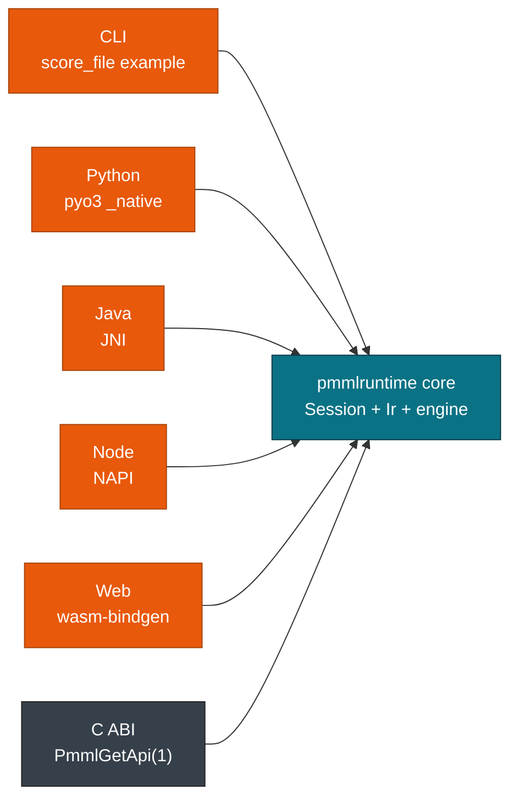

# Bindings Overview

> **Info:** Looking for one binding in depth? Jump to [Rust: Library & Binary](./rust.md), [Python Bindings](./python.md), [C ABI & FFI](./c.md), [Java Binding](./java.md), or [JavaScript Bindings](./javascript.md). This page compares all of them.

Seven entry points score the same PMML file. The Rust crate holds parsing, lowering, and evaluation, and every other binding converts host values into that engine.

## Concepts

| Concept | Description |
| --- | --- |
| **Core** | `crates/pmmlruntime` holds `Session`, `Batch`, `Ir`, and the 19 model evaluators. |
| **C ABI** | `include/pmml_runtime.h` publishes the versioned `PmmlApi` table returned by `PmmlGetApi(1)`. |
| **Binding** | A shim that converts host values, calls the engine, and converts results back. |
| **Fixture** | `bench/pmml/DecisionTreeIris.pmml`, the two feature tree used by every binding test. |



## Binding matrix

| Binding | Entry point | Build or install | Row input | Concurrency |
| --- | --- | --- | --- | --- |
| **Rust** | `Session::from_bytes`, `Session::run` | `cargo add pmmlruntime` | `HashMap`, `Vec<HashMap>`, `RecordBatch` | `Send + Sync`, `run` takes `&self` |
| **Python** | `pmmlruntime.InferenceSession` | `maturin develop` inside `python/` | `dict`, `list[dict]` | `py.allow_threads` wraps every `run` |
| **C** | `PmmlGetApi(1)->CreateSession` | `cbindgen` plus `cargo build --release` | `PmmlValue[]`, `RunBatch`, `RunArrow` | handles are `Send` |
| **Java** | `PmmlSession.fromFile` | `mvn package` over `java/native` | `Map<String, Object>` of doubles | `AutoCloseable` session, JNI call per row |
| **Node** | `new InferenceSession(path)` | `napi build --platform --release` | `Record<string, number>` | single addon call |
| **Web** | `new InferenceSession(bytes)` | `wasm-pack build --target web` | `Object` of numbers | single thread |
| **CLI** | `cargo run -p pmmlruntime --example score_file` | ships with the crate | PMML plus a CSV file | one process per batch |

## What every binding shares

Every entry point inherits the same cold path checks: a 100 MB size cap, depth 512, and DTD and XXE blocked. They share the value model too. A numeric field becomes `Continuous(f64)`, a categorical field becomes a discrete symbol, and an absent field becomes `Missing`. Results carry `predictedValue`, and Discrete labels resolve back to strings at the binding boundary.

```bash
# Build the JNI shim, the Node addon, or the wasm bundle
cargo build --manifest-path java/native/Cargo.toml
cd javascript/node && npx napi build --platform --release
cd javascript/web && wasm-pack build --target web
```

> **Note:** Java, Node, and Web accept continuous numbers only today. Discrete inputs through `Session::string_to_value` are follow-up work there. Rust, Python, and C accept discrete values now.

## Scope per binding

| Binding | Accepts today | Rejects or defers |
| --- | --- | --- |
| **Rust** | `Continuous`, `Discrete`, `Missing`, row-major and columnar batches | nothing in the scoring path |
| **Python** | numbers, `bool`, `str` through `string_to_value`, `None` as `Missing`, `list[dict]` batches | `pyarrow.Table` asks for `to_pylist()` until `RunArrow` lands |
| **C** | `PmmlValue` rows, `RunBatch`, IoBinding | `RunArrow` returns `PMML_ERR_UNSUPPORTED_MARKUP` |
| **Java** | `Petal.Length` and `Petal.Width` as numbers | `fromBytes`, `getInputNames`, and `getOutputNames` raise `UnsupportedOperationException` |
| **Node** | `Record<string, number>` | non numeric values are not convertible |
| **Web** | `Uint8Array` of PMML bytes, `Object` of numbers | no filesystem, so construction from a path is impossible |
| **CLI** | PMML path, optional CSV in and out | header must match the active fields |

## Next Steps

Pick your host language next.

* [Rust: Library & Binary](./rust.md): embed the engine directly and reuse `Arc<Ir>` across threads.
* [Python Bindings](./python.md): build the wheel and score a `dict` or a `list[dict]`.
* [C ABI & FFI](./c.md): drive the versioned `PmmlApi` table from any C or C++ caller.
* [Java Binding](./java.md): build the JNI library and run `mvn test`.

*Next: [Rust: Library & Binary](./rust.md) → · Previous: [Predicates & MiningSchema Eval](../transforms/predicates.md)*
