# C ABI & FFI

> This guide covers C deployment through `include/pmml_runtime.h` and `PmmlGetApi(1)`. For Rust see [Rust: Library & Binary](./rust.md). For Python see [Python Bindings](./python.md). For CSV batch see [CSV & CLI Workflows](./cli.md).

The crate exposes one versioned `PmmlApi` table that you fetch once and reuse. Train with `sklearn2pmml` or `jpmml-lightgbm`, ship the same `model.pmml`, generate the header with `cbindgen`, link `libpmmlruntime.so` or `.a`, and call `CreateEnv`, `CreateSessionFromArray`, and `Run`. The C caller reaches the same `Arc<Ir>` and `CpuProvider` as Rust: 402 ns for one row and 61 ns per row for a batch.

## Concepts

| Concept | Description |
| --- | --- |
| **PmmlStatusCode** | `PMML_OK = 0` is the `NULL` status; codes `1=InvalidArgument` through `8=Unknown` map from `PmmlError`. |
| **PmmlEnv** | Opaque `*mut PmmlEnv` holding a boxed `PmmlEnv`. `Send + Sync`, released with `ReleaseEnv`. |
| **PmmlSession** | Opaque `*mut PmmlSession` holding a `Session` and a cached `CString` for `GetInputName`, released with `ReleaseSession`. |
| **PmmlValue** | Tagged union `{ tag, union { double continuous; uint32_t discrete } }` that carries a `Value`. |
| **PmmlApi** | Versioned struct from `PmmlGetApi(1)` with `CreateEnv`, `CreateSessionFromArray`, `Run`, `RunBatch`, and `RunArrow`. |

## How it works

The C caller fetches the table once. Rust owns the heap boxes behind the opaque pointers.

```mermaid
flowchart LR
    A["PMML bytes<br>void* + len"] --> B["PmmlGetApi(1)<br>const PmmlApi*"]
    B --> C["CreateEnv<br>Arc EnvInner"]
    C --> D["CreateSessionFromArray<br>xml verify + lower"]
    D --> E["PmmlSession*<br>Arc Ir Send Sync"]
    E --> F["PmmlValue inputs<br>names + PmmlValue[]"]
    F --> G["Run<br>materialize_row eval_row"]
    G --> H["PmmlValue outputs<br>NULL status = Ok"]

    style A fill:#36404a,stroke:#222,color:#fff
    style D fill:#0b7285,stroke:#083d4a,color:#fff
    style E fill:#e8590c,stroke:#a8450a,color:#fff
    style G fill:#0b7285,stroke:#083d4a,color:#fff
```



## Build the library and header

Generate the header with `cbindgen`, then build the shared and static libraries:

```bash
cargo install cbindgen
cbindgen --config cbindgen.toml --crate pmmlruntime --output include/pmml_runtime.h
cargo build -p pmmlruntime --release
ls target/release/libpmmlruntime.so
ls target/release/libpmmlruntime.a
```

The build produces the artifacts below.

| Artifact | Produced by | Provides | When to use |
| --- | --- | --- | --- |
| **Header** | `cbindgen --config cbindgen.toml` | `PmmlApi`, `PmmlValue`, `PmmlStatusCode` | Always |
| **Shared library** | `cargo build --release` `cdylib` | Dynamic linking and `PmmlGetApi(1)` | Services, `dlopen` |
| **Static library** | `cargo build --release` `staticlib` | One binary for `scratch` | Lean containers, edge |
| **Options** | `PmmlSessionOptions*` | `GraphOptimizationLevel`, `IntraOpNumThreads` | Columnar tuning |

## Fetch the table and create a session

```c
#include "pmml_runtime.h"
#include <stdio.h>
int main() {
    const PmmlApi* api = PmmlGetApi(1);
    if (!api) return 1;
    PmmlEnv* env = NULL;
    PmmlStatus* s = api->CreateEnv(PMML_LOG_WARNING, "my-service", &env);
    if (s) { printf("%s\n", PmmlGetErrorMessage(s)); PmmlReleaseStatus(s); return 1; }
    printf("%s\n", api->GetVersionString());
    api->ReleaseEnv(env);
}
```

Create the session from bytes or a file, with or without options:

```c
PmmlSessionOptions* opts = NULL;
api->CreateSessionOptions(&opts);
api->SetGraphOptimizationLevel(opts, PMML_GRAPH_ENABLE_BASIC);
api->SetIntraOpNumThreads(opts, 0);
PmmlSession* sess = NULL;
PmmlStatus* cs = api->CreateSessionFromArray(env, bytes, len, opts, &sess);
if (cs) { printf("load: %s\n", PmmlGetErrorMessage(cs)); PmmlReleaseStatus(cs); }
api->ReleaseSessionOptions(opts);
```

A `NULL` options pointer uses the defaults. Score one row in ten lines:

```c
const char* in_names[] = {"x"};
PmmlValue in_vals[1] = {{.tag = PMML_VALUE_CONTINUOUS, .continuous = 1.0}};
const char* out_names[] = {"predictedValue"};
PmmlValue out_vals[1];
PmmlStatus* rs = api->Run(sess, NULL, in_names, in_vals, 1, out_names, 1, out_vals);
if (rs) { printf("%d %s\n", PmmlGetErrorCode(rs), PmmlGetErrorMessage(rs)); PmmlReleaseStatus(rs); }
else if (out_vals[0].tag == PMML_VALUE_CONTINUOUS) printf("pred %f\n", out_vals[0].continuous);
api->ReleaseSession(sess);
```

> **Attention:** Handles are `Send + Sync`, but `input_names` must outlive `Run`, and every array must stay valid for `input_count`. Check each `PmmlStatus*`, remember that `NULL` means `Ok=0`, and call `PmmlReleaseStatus` once.

## Versioning handles

Keep one `PmmlEnv` as the root and version the sessions in a map:

| Operation | C | How |
| --- | --- | --- |
| Load a version | `HashMap<String, PmmlSession*>` | `CreateSessionFromArray` per build |
| Promote an alias | `alias["iris@champion"] = sess_v2` | pointer alias |
| Read the champion | `hash_get("iris@champion")` | returns `PmmlSession*` |

```c
PmmlSession *v1=NULL, *v2=NULL;
api->CreateSessionFromArray(env, bytes1, len1, NULL, &v1);
api->CreateSessionFromArray(env, bytes2, len2, NULL, &v2);
PmmlSession* champion = v2;
const char* out_n[]={"predictedValue"}; PmmlValue outv;
const char* in_n[]={"x"}; PmmlValue in_v[]={{.tag=PMML_VALUE_CONTINUOUS,.continuous=1.0}};
api->Run(champion, NULL, in_n, in_v, 1, out_n, 1, &outv);
```

## Serving from a C handler

Load once and score every request, one row at a time or as a batch:

```c
PmmlStatus* serve(PmmlSession* sess, double x) {
    const char* in_n[]={"x"}; PmmlValue in_v[]={{.tag=PMML_VALUE_CONTINUOUS,.continuous=x}};
    const char* out_n[]={"predictedValue"}; PmmlValue out_v[1];
    PmmlStatus* s = api->Run(sess, NULL, in_n, in_v, 1, out_n, 1, out_v);
    if (!s && out_v[0].tag == PMML_VALUE_CONTINUOUS) printf("pred %f\n", out_v[0].continuous);
    return s;
}
```

```c
PmmlValue batch_out[1000];
PmmlStatus* bs = api->RunBatch(sess, NULL, in_names, in_vals, n, out_names, 1, batch_out);
```

## Performance budget

Gate a release on the numbers below, measured on `i7-12650H`:

| Path | pmmlruntime | JPMML | Speedup | Budget |
| --- | --- | --- | --- | --- |
| **Cold Tree** | **68 µs** | 8757 µs | **169×** | under 100 µs |
| **Hot single** | **402 ns** | 4562 ns | **9.9×** | under 550 ns |
| **Batch 100k** | **61 ns/row** | 4.5 µs | **73×** | under 80 ns |

- **Latency.** `Run` is **402 ns**. Keep `mean + std` under 550 ns; `RunBatch` shards only above 256 rows.
- **Memory.** The value buffer stays on the stack, `64×16B = 1KB` for 90% of fixtures.
- **Startup.** `CreateSessionFromArray` costs **68 µs** for Iris against 8757 µs for JPMML. Gate on the median of 20 loads.
- **Throughput.** `RunBatch` reaches **61 ns/row** (16.5M/s) through `par_chunks(256)` with a per-chunk `BumpArena`.

> **Note:** Reproduce with `cargo build -p pmmlruntime --release && ./target/release/examples/score_file bench/pmml/DecisionTreeIris.pmml`.

## API surface

Six calls cover the whole lifecycle: table, env, load, score, release.

| Function | Purpose | Example |
| --- | --- | --- |
| `PmmlGetApi(1)` | Fetch the versioned `const PmmlApi*` | `api = PmmlGetApi(1)` |
| `CreateEnv` | Create the `PmmlEnv*` with an `Arc` inner | `api->CreateEnv(PMML_LOG_WARNING, "svc", &env)` |
| `CreateSessionFromArray` | Parse, verify, and lower into a `PmmlSession*` | `CreateSessionFromArray(env, bytes, len, opts, &sess)` |
| `PmmlGetErrorMessage` | Read a `PmmlStatus*` | `PmmlGetErrorMessage(s)` |
| `Run` / `RunBatch` | Score a `PmmlValue[]` row or batch | `Run(sess, NULL, in_n, in_v, 1, out_n, 1, out_v)` |
| `ReleaseSession` | Free a handle, `NULL` tolerant | `api->ReleaseSession(sess)` |

```c
const PmmlApi* api = PmmlGetApi(1);
PmmlEnv* env=NULL; PmmlStatus* es=api->CreateEnv(PMML_LOG_WARNING,"svc",&env);
PmmlSession* sess=NULL; PmmlStatus* cs=api->CreateSessionFromArray(env,bytes,len,NULL,&sess);
if (cs) { printf("%s\n", PmmlGetErrorMessage(cs)); PmmlReleaseStatus(cs); }
const char* n[]={"x"}; PmmlValue v[]={{.tag=PMML_VALUE_CONTINUOUS,.continuous=1.0}};
PmmlValue outv; api->Run(sess,NULL,n,v,1,(const char*[]){"predictedValue"},1,&outv);
api->ReleaseSession(sess); api->ReleaseEnv(env);
```

## The same call in Rust and Python

**Rust**

```rust
let env = PmmlEnv::new();
let sess = Session::from_bytes(&env, &std::fs::read("bench/pmml/DecisionTreeIris.pmml")?, SessionOptions::default())?;
let mut m=std::collections::HashMap::new(); m.insert("x".into(), Value::Continuous(1.0));
let out = sess.run(&m as &dyn pmmlruntime::session::batch::Batch)?;
```

**Python**

```python
import pmmlruntime
sess = pmmlruntime.InferenceSession("bench/pmml/DecisionTreeIris.pmml")
print(sess.run(None, {"x": 1.0})[0]["predictedValue"])
```

## Deployment targets

| Target | Runtime | Artifact | Scoring path | Scaling |
| --- | --- | --- | --- | --- |
| **Local** | `gcc` or `clang` | `libpmmlruntime.so` | `Run` at 402 ns | Single thread |
| **Docker** | `bookworm-slim` | `libpmmlruntime.a` | `RunBatch` at 61 ns/row | `rayon` |
| **Lambda** | custom runtime | `bootstrap` plus the `.so` | `FromArray` bytes | Per event |
| **Edge** | `aarch64` cross build | `staticlib` | Stack `Value[64]` | Thread-local |
| **Browser** | `wasm` | `cdylib` wasm | `Run`, single row | Single thread |

See [Docker & CI](./docker.md).

## Next Steps

- [Rust: Library & Binary](./rust.md): the same `Session` without the C indirection, with `cargo doc`.
- [CSV & CLI Workflows](./cli.md): exercise `score_file` before you write C.
- [Security & Hardening](../production/security.md): depth 512, 100 MB cap, and blocked XXE for untrusted PMML.
- [Quickstart: Score Iris in 5 min](../getting-started/quickstart.md): end-to-end with the `DecisionTreeIris.pmml` fixture.

*Next: [CSV & CLI Workflows](./cli.md) → · Previous: [Python Bindings](./python.md)*
