# CSV & CLI Workflows

> This guide covers CSV and CLI workflows through `cargo run --example score_file`. For library use see [Rust: Library & Binary](./rust.md). For Python see [Python Bindings](./python.md). For containers see [Docker & CI](./docker.md).

One binary scores any PMML file, with no framework flag and no JDK. Ship `model.pmml`, pass a CSV whose header matches the active fields, and the example runs `csv_str_to_record_batch` into a `RecordBatch` and then `Session::run`. Cold load is 68 µs and batch scoring is 61 ns per row.

## Concepts

| Concept | Description |
| --- | --- |
| **score_file** | The example at `examples/score_file.rs`. It loads a `Session` and scores one row or a CSV batch. |
| **Header** | The CSV header must equal the `MiningSchema` active fields, for example `x` or `Petal.Length,Petal.Width`. Unknown columns are ignored, and missing ones become `Value::Missing`. |
| **MiningModel** | A GBDT arrives as a `MiningModel` with `Segmentation method="sum"` over `Regression` stumps. |
| **Batch** | `csv_str_to_record_batch` builds a `RecordBatch`, and `Session::run` returns `Rows` for the CSV writer. |
| **Output** | `predictedValue` plus declared `Output` fields such as `probability(setosa)`, written with sorted keys. |

## How it works

CSV text becomes a `RecordBatch` through `arrow::csv`, and then `Session::run` scores it columnar.

```mermaid
flowchart LR
    A["model.pmml"] --> B["Session::from_file<br>68µs Iris verify + lower"]
    B --> C["active_fields<br>num_active_fields"]
    C --> D["input.csv<br>header = active fields<br>csv_str_to_record_batch"]
    D --> E["RecordBatch<br>col_map FieldId->col_idx"]
    E --> F["Session::run Batch<br>par_chunks 256 61 ns/row"]
    F --> G["Rows HashMap<br>predictedValue + Output"]
    G --> H["out.csv<br>sorted header Discrete->str"]

    style A fill:#36404a,stroke:#222,color:#fff
    style B fill:#0b7285,stroke:#083d4a,color:#fff
    style E fill:#0b7285,stroke:#083d4a,color:#fff
    style F fill:#e8590c,stroke:#a8450a,color:#fff
```



## Quickstart

```bash
cargo run --example score_file -- bench/pmml/DecisionTreeIris.pmml
cargo run --example score_file -- bench/pmml/DecisionTreeIris.pmml input.csv --output out.csv
cargo run --example score_file -- bench/pmml/GradientBoosterTest.pmml input.csv --output out.csv
```

A run with no CSV prints the active fields and the model kind:

```bash
cargo run --example score_file -- bench/pmml/GradientBoosterTest.pmml
# Loaded GradientBoosterTest.pmml: 1 active field(s)
#   FieldId(0) = x
#   Model: MiningModel (3 segments, method Sum)
```

Score a CSV end to end:

```bash
cat > /tmp/in.csv <<'CSV'
x
0.5
1.0
1.5
2.0
CSV
cargo run --example score_file -- bench/pmml/GradientBoosterTest.pmml /tmp/in.csv --output /tmp/out.csv
cat /tmp/out.csv
```

The same pipeline in Rust:

```rust
use pmmlruntime::{PmmlEnv, Session, SessionOptions};
use pmmlruntime::session::batch::Batch;
let env = PmmlEnv::new();
let sess = Session::from_file(&env, "bench/pmml/GradientBoosterTest.pmml", SessionOptions::default())?;
let csv = std::fs::read_to_string("input.csv")?;
let batch = pmmlruntime::session::arrow::csv_str_to_record_batch(&csv, None, true).map_err(|e| anyhow::anyhow!(e))?;
let outs = sess.run(&batch as &dyn Batch)?.into_rows();
println!("{}", outs.len());
```

A 100k-row file finishes in one sharded pass:

```bash
python -c "print('x\n' + '\n'.join([str(i*0.00001) for i in range(100000)]))" > /tmp/big.csv
time cargo run --release --example score_file -- bench/pmml/GradientBoosterTest.pmml /tmp/big.csv --output /tmp/big_out.csv
wc -l /tmp/big_out.csv  # 100001 (header + 100k)
```

## Batch sizes and per-row cost

Small files run serial, large files shard:

| Variant | Input | Per-row cost | Sharding | When to use |
| --- | --- | --- | --- | --- |
| **Single or 100 rows** | `HashMap` or `Vec<HashMap>` | **402 ns** or **592 ns** | serial below 256 | Latency probe |
| **1k columnar** | `RecordBatch`, 1k rows | **249 ns/row** | at the boundary | Small ETL |
| **10k columnar** | `RecordBatch`, 10k rows | **110 ns/row** | `par_chunks(256)` | Medium ETL |
| **100k columnar** | `RecordBatch`, 100k rows | **61 ns/row**, 16.5M/s | `par_chunks(256)` | Bulk jobs |

```bash
python -c "print('Petal.Length,Petal.Width\n' + '1.4,0.2\n'*100)" > /tmp/small.csv
time cargo run --release --example score_file -- bench/pmml/DecisionTreeIris.pmml /tmp/small.csv --output /tmp/out.csv
python -c "print('x\n' + '\n'.join(['0.5']*1000))" > /tmp/1k.csv
time cargo run --release --example score_file -- bench/pmml/GradientBoosterTest.pmml /tmp/1k.csv --output /tmp/out.csv
python -c "print('x\n' + '\n'.join(['0.5']*10000))" > /tmp/10k.csv
time cargo run --release --example score_file -- bench/pmml/GradientBoosterTest.pmml /tmp/10k.csv --output /tmp/out.csv
```

## CSV header and schema

The header decides which columns reach the model.

| Item | Value | Provides | When to use |
| --- | --- | --- | --- |
| **Header** | `x` or `Petal.Length,Petal.Width` | `MiningSchema` validation | Always |
| **Explicit schema** | `Schema::new(vec![Field::new("x", Float64, true)])` | Correct `Float64Array` types | Production 100k runs |
| **Inferred schema** | `csv_str_to_record_batch(csv, None, true)`, all `Utf8` | Quick probe | Exploration |
| **Output** | `predictedValue` plus `probability(...)` | Sorted output columns | Downstream joins |

```bash
head -1 input.csv  # must equal the FieldId names
cargo run --example score_file -- bench/pmml/GradientBoosterTest.pmml input.csv --output out.csv
```

## Versioning PMML files

Keep each build as a file and point one symlink at the champion:

| Operation | CLI | How |
| --- | --- | --- |
| Load a version | `bench/pmml/DecisionTreeIris.pmml` | one file per build |
| Promote an alias | `ln -sf iris_v2.pmml iris@champion.pmml` | symlink |
| Read the champion | `score_file iris@champion.pmml input.csv` | path per batch |

```bash
cp bench/pmml/DecisionTreeIris.pmml /tmp/registry/iris_v1.pmml
cp bench/pmml/GradientBoosterTest.pmml /tmp/registry/iris_v2.pmml
ln -sf /tmp/registry/iris_v2.pmml /tmp/registry/iris@champion.pmml
cargo run --example score_file -- /tmp/registry/iris@champion.pmml input.csv --output out.csv
ln -sf /tmp/registry/iris_v1.pmml /tmp/registry/iris@champion.pmml
cargo run --example score_file -- /tmp/registry/iris@champion.pmml input.csv --output out.csv
```

## Batch scoring runs

A one-shot run reads one CSV and writes one CSV:

```bash
cat > /tmp/in.csv <<'CSV'
x
0.5
1.0
1.5
2.0
CSV
cargo run --release --example score_file -- bench/pmml/GradientBoosterTest.pmml /tmp/in.csv --output /tmp/out.csv
cat /tmp/out.csv
```

Loop over shards when the input arrives in parts:

```bash
for f in /data/shards/*.csv; do
  cargo run --release --example score_file -- /tmp/registry/iris@champion.pmml "$f" --output "${f%.csv}.out.csv"
done
```

## Performance budget

Gate a release on the numbers below, measured on `i7-12650H`:

| Path | pmmlruntime | JPMML | Speedup | Budget |
| --- | --- | --- | --- | --- |
| **Cold Tree** | **68 µs** | 8757 µs | **169×** | under 100 µs |
| **Hot 100 rows** | **592 ns/row** | 4.5 µs | **7.6×** | under 800 ns |
| **Batch 100k** | **61 ns/row** | 4.5 µs | **73×** | under 80 ns |

- **Latency.** A 100-row file runs at **592 ns/row**.
- **Memory.** The value buffer stays on the stack, `64×16B = 1KB`, and stays L1 hot.
- **Startup.** Cold load is **68 µs** against 8757 µs for JPMML. Gate on 20 loads.
- **Throughput.** A 100k file reaches **61 ns/row** (16.5M/s) through `par_chunks(256)`.

> **Note:** Reproduce with `python -c "print('x\n' + '\n'.join(['0.5']*100000))" > /tmp/big.csv; time cargo run --release --example score_file -- bench/pmml/GradientBoosterTest.pmml /tmp/big.csv --output /tmp/out.csv`.

## API surface

| Function | Purpose | Example |
| --- | --- | --- |
| `Session::from_file` | Parse, verify, and lower `model.pmml` | `Session::from_file(&env, "model.pmml", opts)?` |
| `num_active_fields` | Count the `MiningSchema` active fields | `sess.num_active_fields()` |
| `csv_str_to_record_batch` | Turn CSV text into a `RecordBatch` | `csv_str_to_record_batch(&csv, None, true)?` |
| `Session::run` | Score the `RecordBatch` columnar | `sess.run(&batch as &dyn Batch)?` |
| `BatchResult::into_rows` | Return `Vec<HashMap>` for the writer | `sess.run(&batch)?.into_rows()` |
| **Sorted header** | Write `out.csv` with sorted keys | `keys.join(",")` |

```rust
let env = PmmlEnv::new();
let sess = Session::from_file(&env, "bench/pmml/DecisionTreeIris.pmml", SessionOptions::default())?;
println!("active {}", sess.num_active_fields());
let csv = std::fs::read_to_string("input.csv")?;
let batch = pmmlruntime::session::arrow::csv_str_to_record_batch(&csv, None, true).map_err(|e| anyhow::anyhow!(e))?;
let rows = sess.run(&batch as &dyn pmmlruntime::session::batch::Batch)?.into_rows();
```

## The same call in Rust and Python

**Rust with an explicit schema**

```rust
let env = PmmlEnv::new(); let sess = Session::from_file(&env, "model.pmml", SessionOptions::default())?;
let batch = pmmlruntime::session::arrow::csv_str_to_record_batch(&csv, Some(schema), true)?;
let rows = sess.run(&batch as &dyn pmmlruntime::session::batch::Batch)?.into_rows();
```

**Python with a list of dicts**

```python
import pmmlruntime
sess = pmmlruntime.InferenceSession("bench/pmml/GradientBoosterTest.pmml")
print(sess.run(None, [{"x": 0.5}, {"x": 1.0}]))
```

**CLI from CSV to CSV**

```bash
cargo run --example score_file -- bench/pmml/GradientBoosterTest.pmml input.csv --output out.csv
cat out.csv  # predictedValue
```

## Deployment targets

One CSV workflow runs everywhere. Only the runner changes.

| Target | Runtime | Invocation | Input | Scaling |
| --- | --- | --- | --- | --- |
| **Local** | `cargo run` | `cargo run --example score_file -- model.pmml input.csv` | Local file | Single process |
| **Docker** | `rust:1.78` to `scratch` | `docker run pmmlruntime model.pmml input.csv` | Mounted volume | K8s Jobs |
| **Lambda** | `provided.al2` | `bootstrap model.pmml /tmp/in.csv` | S3 into `/tmp` | Concurrency |
| **Edge** | `aarch64` | `./score_file model.pmml input.csv` | SD card | Thread-local |
| **Browser** | `wasm` | `score_file.wasm model.pmml csvStr` | `csv_str_to_record_batch` | Single thread |

See [Docker & CI](./docker.md).

## Next Steps

- [Rust: Library & Binary](./rust.md): embed the same engine with `Session::from_bytes` and `RecordBatch`.
- [Arrow & CSV Integration](../batch/arrow.md): build a `RecordBatch` by hand and handle empty `TableLocator` batches.
- [MiningSchema, DataDictionary & Output](../concepts/schema.md): control `Missing`, outlier, and the `Output` columns of `out.csv`.
- [Quickstart: Score Iris in 5 min](../getting-started/quickstart.md): train a new PMML with `sklearn2pmml` and score it with `score_file`.

*Next: [Docker & CI](./docker.md) → · Previous: [C ABI & FFI](./c.md)*
