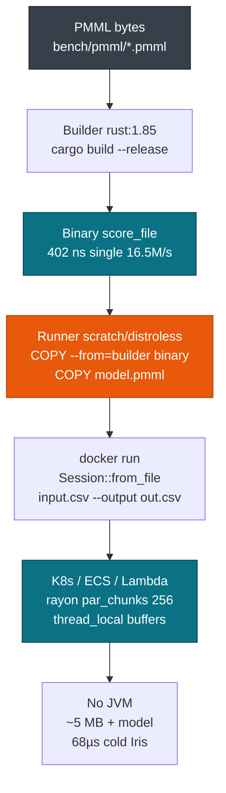

# Docker & CI

> This guide covers Docker and CI deployment for containers without a JVM. For the Rust library see [Rust: Library & Binary](./rust.md). For CLI batch see [CSV & CLI Workflows](./cli.md). For Python wheels see [Python Bindings](./python.md).

One static binary under 10 MB scores any PMML file. Build it with a `rust:1.85` builder and a `scratch` or `distroless` runner, then deploy the same image to a laptop, Kubernetes, or Lambda. Cold load is 68 µs for Iris and batch scoring is 61 ns per row.

## Concepts

| Concept | Description |
| --- | --- |
| **Lean container** | `scratch` or `distroless` with one binary: no `openjdk`, no `python`, no classpath. |
| **Single binary** | `cargo build --release` produces `score_file` or a service. Create `PmmlEnv::new()` once and cache the `Session`. |
| **Multi-stage** | A `rust:1.85` builder stage feeds a `debian:bookworm-slim` or `scratch` runner stage. |
| **GitHub Actions** | `ci.yml` runs `fmt`, `clippy`, tests, `miri`, and `fuzz`. `cd.yml` publishes crates.io, PyPI, npm, Maven Central, the image, and the C libraries on a tag. See [Releasing & Registries](./release.md). |

## How it works

The builder compiles the binary. The runner copies only the binary and the PMML file.



## Quickstart

This multi-stage `Dockerfile` produces an image under 20 MB:

```dockerfile
# builder
FROM rust:1.85-bookworm as builder
WORKDIR /app
COPY Cargo.toml Cargo.lock ./
COPY crates ./crates
RUN cargo build -p pmmlruntime --release --example score_file
# runner
FROM gcr.io/distroless/cc-debian12
WORKDIR /app
COPY --from=builder /app/target/release/examples/score_file /app/score_file
COPY bench/pmml/GradientBoosterTest.pmml /app/model.pmml
ENTRYPOINT ["/app/score_file"]
CMD ["/app/model.pmml"]
```

Build the image and score a file inside it:

```bash
cargo run --example score_file -- bench/pmml/GradientBoosterTest.pmml input.csv --output out.csv
docker build -t pmmlruntime:0.1 .
docker run --rm -v $PWD:/data pmmlruntime:0.1 /app/model.pmml /data/input.csv --output /data/out.csv
```

The CI job runs the same checks before the image builds:

```yaml
# .github/workflows/ci.yml excerpt
- run: cargo fmt --check
- run: cargo clippy --workspace -- -W clippy::pedantic -D warnings
- run: cargo test --workspace -- --nocapture
- run: cargo build -p pmmlruntime --release
```

Deploy the image to a cluster or to Lambda:

```bash
kubectl run score --image=pmmlruntime:0.1 -- /app/model.pmml /data/input.csv --output /data/out.csv
zip lambda.zip bootstrap model.pmml && aws lambda update-function-code --function-name pmml --zip-file fileb://lambda.zip
```

## Multi-stage versus single-stage builds

| Approach | Dockerfile | Image size | When to use |
| --- | --- | --- | --- |
| **Single-stage** | `FROM rust:1.85` and `cargo run` in one layer | about 1.5 GB with the toolchain | Local debug only |
| **Multi-stage lean** | `builder rust:1.85` into `distroless/cc-debian12` | **8 to 20 MB** | Production K8s, ECS |
| **Multi-stage musl** | `builder` into `scratch` with `musl` | **about 5 MB**, static | Edge, minimal images |

```dockerfile
# Multi-stage build: the builder keeps the toolchain out of the final image
FROM rust:1.85-bookworm as builder
WORKDIR /app
COPY Cargo.toml Cargo.lock ./
COPY crates ./crates
RUN cargo build -p pmmlruntime --release --example score_file
FROM gcr.io/distroless/cc-debian12
COPY --from=builder /app/target/release/examples/score_file /app/score_file
COPY bench/pmml/*.pmml /app/
ENTRYPOINT ["/app/score_file"]
# ~12 MB, only binary + PMML
```

Use a multi-stage build for every deploy.

## Build variants

| Variant | Dockerfile | Provides | When to use |
| --- | --- | --- | --- |
| **Core** | `FROM gcr.io/distroless/cc-debian12` | `score_file` and CA certificates | Always |
| **SIMD** | `RUN cargo build --features simd` in the builder | `wide 0.7` `f64x4` | Columnar `Regression` |
| **Model** | `COPY bench/pmml/*.pmml /app/model.pmml` | One PMML file per image | Per deploy |
| **Alias** | `docker tag pmml:0.1 gcr.io/proj/pmml:champion` | A champion tag | Promotion |

```bash
docker tag pmmlruntime:0.1 gcr.io/my-project/pmml:champion
docker push gcr.io/my-project/pmml:champion
kubectl set image deployment/scoring scoring=gcr.io/my-project/pmml:champion
```

## Image tags and promotion

Tags carry the version, and the champion tag points at the build in production.

| Operation | Docker | How |
| --- | --- | --- |
| Load a version | `gcr.io/proj/pmml:iris_v1` | `docker build -t pmml:iris_v1` per PMML |
| Promote an alias | `docker tag pmml:iris_v2 pmml:champion` | second tag |
| Read the champion | `kubectl set image --image=pmml:champion` | pull by tag per pod |

```bash
docker build -t pmmlruntime:iris_v1 -f Dockerfile.iris_v1 .
docker build -t pmmlruntime:iris_v2 -f Dockerfile.iris_v2 .
docker tag pmmlruntime:iris_v2 gcr.io/my-project/pmml:champion
docker push gcr.io/my-project/pmml:champion
kubectl run score --image=gcr.io/my-project/pmml:champion -- /app/model.pmml /data/input.csv --output /data/out.csv
```

```yaml
# Kubernetes orchestration
apiVersion: apps/v1
kind: Deployment
metadata: { name: scoring }
spec:
  replicas: 3
  template:
    spec:
      containers:
      - { name: scoring, image: gcr.io/my-project/pmml:champion,
          args: ["/app/model.pmml", "/data/input.csv", "--output", "/data/out.csv"],
          env: [{ name: RAYON_NUM_THREADS, value: "2" }] }
---
apiVersion: autoscaling/v2
kind: HorizontalPodAutoscaler
metadata: { name: scoring-hpa }
spec: { minReplicas: 3, maxReplicas: 20, metrics: [{ type: Resource, resource: { name: cpu, target: { averageUtilization: 60 } } }] }
```

## Running the image

```bash
docker build -t pmmlruntime:0.1 .
docker run --rm -v $PWD:/data pmmlruntime:0.1 /app/model.pmml /data/input.csv --output /data/out.csv
echo "x\n1.0" > /tmp/single.csv
docker run --rm -v /tmp:/data pmmlruntime:0.1 /app/model.pmml /data/single.csv --output /data/single_out.csv
```

## Performance budget

Gate a release on the numbers below, measured on `i7-12650H`:

| Path | pmmlruntime in Docker | JPMML | Speedup | Budget |
| --- | --- | --- | --- | --- |
| **Cold Tree** | **68 µs** | 8757 µs | **169×** | under 100 µs |
| **Hot single** | **402 ns** | 4562 ns | **9.9×** | under 550 ns |
| **Batch 100k** | **61 ns/row** | 4.5 µs | **73×** | under 80 ns |
| **Image size** | **about 8 MB** plus model | about 800 MB plus JDK | **100×** smaller | under 20 MB |

- **Latency.** A single row is **402 ns**. Run the horizontal pod autoscaler at 60% CPU.
- **Memory.** The value buffer is 1 KB on the stack. A `128Mi` limit holds the workload.
- **Startup.** Cold load is **68 µs** against 8757 µs for JPMML. Gate on 20 loads.
- **Throughput.** A batch reaches **61 ns/row** (16.5M/s) through `par_chunks(256)`.

> **Attention:** Create `PmmlEnv` and `Session` once at startup and clone `Arc<Session>` per request. Never rebuild the session per row, because cold load is 68 µs. Pin the toolchain to `1.85`.

## API surface

Six commands cover build, publish, run, and scale.

| Command | Purpose | Example |
| --- | --- | --- |
| `cargo build --release` | Build `score_file` | `cargo build --release --example score_file` |
| `docker build -t pmml:0.1` | Build the lean image from the multi-stage file | `docker build -t pmmlruntime:0.1 .` |
| `docker tag` and `push` | Publish a version tag and the champion tag | `docker tag pmml:0.1 gcr.io/proj/pmml:champion` |
| `docker run` | Score `model.pmml` with `input.csv` | `docker run -v $PWD:/data pmml:0.1 /app/model.pmml /data/in.csv --output /data/out.csv` |
| `kubectl` or `compose` | Run replicas and the autoscaler | `kubectl run score --image=pmml:champion -- ...` |
| `RAYON_NUM_THREADS` | Cap the thread pool | `RAYON_NUM_THREADS=2 docker run ...` |

```bash
cargo build -p pmmlruntime --release --example score_file
docker build -t pmmlruntime:0.1 .
docker tag pmmlruntime:0.1 gcr.io/my-project/pmml:champion
docker push gcr.io/my-project/pmml:champion
docker run --rm -v $PWD:/data gcr.io/my-project/pmml:champion /app/model.pmml /data/input.csv --output /data/out.csv
```

## The same command from Rust and C

**Rust binary**

```bash
cargo run --example score_file -- bench/pmml/DecisionTreeIris.pmml input.csv --output out.csv
```

**C against `libpmmlruntime.so`**

```bash
docker run --rm -v $PWD:/data bookworm-slim /app/score_file_c /app/model.pmml /data/input.csv
```

## Deployment targets

One artifact runs everywhere.

| Target | Runtime | Image | Scoring | Scaling |
| --- | --- | --- | --- | --- |
| **Local** | `docker run` | `pmmlruntime:0.1`, about 8 MB | `HashMap`, 402 ns | Compose replicas |
| **Docker** | K8s or ECS | `distroless` plus the binary | `RecordBatch`, 61 ns/row | Autoscaler on CPU |
| **Lambda** | `provided.al2` | `bootstrap` zip | `from_bytes` from S3 | Per event |
| **Edge** | `aarch64` Pi | `scratch` with `musl` | Stack `Value[64]` | Thread-local |
| **Browser** | `wasm` (future) | `cdylib` wasm | `HashMap`, single row | Single thread |

## Next Steps

- [Rust: Library & Binary](./rust.md): tune `simd` against a plain release build.
- [C ABI & FFI](./c.md): ship the same engine as `libpmmlruntime.so` for JNI or N-API callers.
- [Concurrency & Memory](../production/concurrency.md): cap `rayon` and understand `THREAD_VALUES`.
- [Quickstart: Score Iris in 5 min](../getting-started/quickstart.md): test the container with `DecisionTreeIris.pmml` and `input.csv`.

*Next: [Releasing & Registries](./release.md) → · Previous: [CSV & CLI Workflows](./cli.md)*
