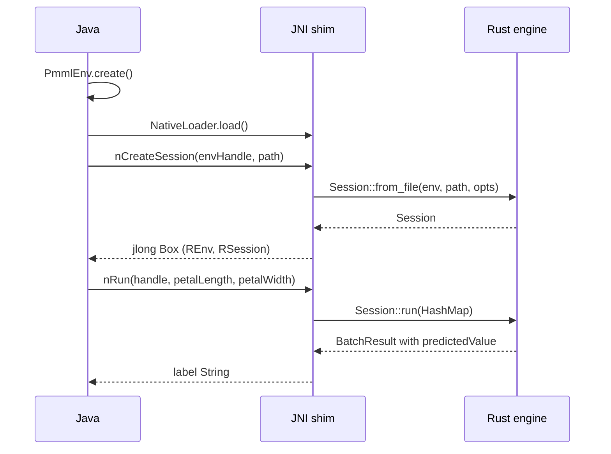

# Java Binding

> **Info:** Looking for the C layer underneath? See [C ABI & FFI](./c.md). Looking for another JVM-free binding? See [Bindings Overview](./bindings.md). This page covers the JNI shim in `java/` and its current scope.

The Java binding calls the Rust engine in the same process through JNI. `java/native` compiles to `libpmmlruntime_jni`; the Java classes load it, box a native session as a `long`, and forward each score to `Session::run`. No scoring logic lives on the Java side.

## Concepts

| Concept | Description |
| --- | --- |
| **PmmlEnv** | `Closeable` handle for process-wide state. |
| **PmmlSession** | `Closeable` session with `fromFile`, `run`, and three JNI natives. |
| **PmmlException** | `RuntimeException` carrying the `PmmlErrorCode` value in a public `code` field. |
| **NativeLoader** | Finds and loads `libpmmlruntime_jni` before any native call runs. |
| **NodeInfo** | Record of `name`, `dataType`, and `opType`, for the v2 metadata methods. |

## Step 1: Build the JNI library

`java/native` is a separate crate (`crate-type = ["cdylib"]`, `name = "pmmlruntime_jni"`, `jni = "0.21"`), excluded from the workspace. Build it by manifest path:

```bash
cargo build --manifest-path java/native/Cargo.toml --release
ls java/native/target/release/libpmmlruntime_jni.so
```

On macOS the file is `libpmmlruntime_jni.dylib`, on Windows `pmmlruntime_jni.dll`.

## Step 2: Run the Maven tests

`java/pom.xml` targets Java 17, uses JUnit 4.13.2 for tests, and marks `arrow-vector` 15.0.0 optional.

```bash
cd java
mvn test
```

`InferenceTest.scoresIris` walks candidate paths to find `bench/pmml/DecisionTreeIris.pmml`, opens a session, and asserts a `predictedValue` key in the result map.

## Step 3: Score a row

```java
try (PmmlEnv env = PmmlEnv.create()) {
    try (PmmlSession session = PmmlSession.fromFile(env, "bench/pmml/DecisionTreeIris.pmml")) {
        Map<String, Object> input = new HashMap<>();
        input.put("Petal.Length", 1.4);
        input.put("Petal.Width", 0.2);
        Map<String, Object> out = session.run(input);
        System.out.println(out.get("predictedValue")); // setosa
    }
}
```

Both classes implement `Closeable`, so try-with-resources frees the native box through `nRelease`.

## How a call reaches the engine



The Rust side boxes `(PmmlEnv, Session)` and returns the pointer as a `jlong`. `PmmlEnv.create()` returns the placeholder handle `1L`, because v1 keeps the environment inside that box. `close()` frees the box and zeroes the Java handle, so the wrapper cannot double free.

## Native library resolution

`NativeLoader.load()` runs once, guarded by a static flag:

| Order | Lookup |
| --- | --- |
| 1 | `System.loadLibrary("pmmlruntime_jni")`, which honors `java.library.path` |
| 2 | `<user.dir>/native/target/debug` and `/release` |
| 3 | `<user.dir>/java/native/target/debug` and `/release` |
| 4 | `java/native/target/debug` and `/release` relative to the working directory |

When none of them exist, the loader throws an `UnsatisfiedLinkError` that names the build command to run.

> **Warning:** `PmmlSession.fromBytes`, `getInputNames`, and `getOutputNames` raise `UnsupportedOperationException` today. They arrive with `CreateSessionFromArray` and the C metadata calls.

## Input and error mapping

| Java side | Native side | Result |
| --- | --- | --- |
| `Petal.Length` and `Petal.Width` as `Number` | `nRun` builds `Value::Continuous` for both | label returned as a `String` |
| another key or type | `run` checks both fields before the native call | `IllegalArgumentException` |
| session creation fails | `nCreateSession` throws `java/lang/RuntimeException` | `PmmlException` with code `-1` |
| empty result or missing `predictedValue` | `nRun` throws | `RuntimeException` from the shim |
| `Discrete` label in the result | resolved through `ir.symbol_names` | the category name, such as `setosa` |
| `Value::Missing` | the literal text `Missing` | readable in logs |

`PmmlException` keeps the numeric code from `PmmlStatus`, so C error codes appear unchanged.

## Next Steps

* [Bindings Overview](./bindings.md): compare the Java shim with the Python, Node, and Web bindings.
* [C ABI & FFI](./c.md): read the `PmmlApi` table that the Java classes mirror.
* [Rust: Library & Binary](./rust.md): skip the JNI hop when your service is already in Rust.
* [Session, Env & Lifecycle](../concepts/session.md): what a session owns and when to drop it.

*Next: [CSV & CLI Workflows](./cli.md) → · Previous: [C ABI & FFI](./c.md)*
