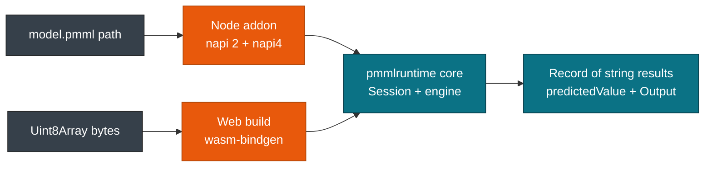

# JavaScript Bindings

> **Info:** Looking for the C layer underneath? See [C ABI & FFI](./c.md). Looking for another host language? See [Bindings Overview](./bindings.md). This page covers the Node addon in `javascript/node` and the browser build in `javascript/web`.

Two JavaScript targets ship from the same core. The Node addon loads a model from a path through NAPI; the web build takes PMML bytes through wasm-bindgen. Both expose `hello()` and a session class named `InferenceSession`.

## Concepts

| Concept | Description |
| --- | --- |
| **hello** | Exported function returning `"pmml-runtime"`, used by the test scripts. |
| **InferenceSession** | Session class. Node builds it from a path, web from a `Uint8Array`. |
| **run** | Scores one row and returns an object of string values. |
| **Triple loader** | Generated `index.js` that resolves the right prebuilt `.node` file. |

## Node addon

`javascript/node/Cargo.toml` builds the crate `pmmlruntime-node` as a `cdylib` named `pmmlruntime_node`, using `napi = "2"` with the `napi4` feature and `napi-derive = "2"`.

```typescript
export declare function hello(): string
export declare class InferenceSession {
  constructor(path: string)
  run(input: Record<string, number>): Record<string, string>
}
```

Build and test with the package scripts:

```bash
cd javascript/node
npx napi build --platform --release
node test.js
```

`run` converts each entry to `Value::Continuous` and returns `Record<string, string>`. A `Discrete` result is resolved through `ir.symbol_names`, an integral `Continuous` prints without a decimal point, and `Missing` becomes the text `Missing`. Engine failures arrive as Node errors through `napi::Error::from_reason`. `test.js` checks that `hello()` returns `pmml-runtime`, scores the Iris fixture, and finds `predictedValue`.

## Web build

`javascript/web/Cargo.toml` builds `pmmlruntime-web` with `crate-type = ["cdylib", "rlib"]`, `wasm-bindgen = "0.2"`, `js-sys = "0.3"`, and a release profile with `lto` and `opt-level = "z"`.

```bash
cd javascript/web
wasm-pack build --target web
wasm-pack test --node
```

The browser has no filesystem, so the constructor takes bytes:

```javascript
import init, { InferenceSession } from './pmmlruntime_web.js'

await init()
const bytes = await (await fetch('/model.pmml')).arrayBuffer()
const session = new InferenceSession(new Uint8Array(bytes))
const out = session.run({ 'Petal.Length': 1.4, 'Petal.Width': 0.2 })
console.log(out.predictedValue) // setosa
```

`run` keeps the input entries that are numbers and skips the rest, which the engine sees as `Missing`. Errors arrive as JavaScript strings, not error objects.



## Node compared with web

| Aspect | Node addon | Web build |
| --- | --- | --- |
| Package | `pmmlruntime-node` | `pmmlruntime-web` |
| Build | `napi build --platform --release` | `wasm-pack build --target web` |
| Constructor input | file path | `Uint8Array` of PMML bytes |
| Local files | full filesystem | none, so bytes are required |
| Prebuilt loading | local `.node` file or platform package | generated JS plus `.wasm` |
| Test command | `node test.js` | `wasm-pack test --node` |

The generated `index.js` picks a binary by platform and architecture. It tries a local file such as `pmmlruntime-node.linux-x64-gnu.node` first, then the matching optional dependency package. On Linux the loader also picks `gnu` or `musl` from `process.report`. Targets cover Linux on x64, arm64, arm, riscv64, and s390x, macOS universal, x64, and arm64, Windows on x64, ia32, and arm64, Android on arm64 and arm, and FreeBSD on x64.

> **Note:** Node and web accept continuous numbers only today. Discrete input through `Session::string_to_value` is follow-up work, so pass categories through the Python, Rust, or C binding.

> **Warning:** An unsupported triple makes the Node loader throw at import time. Rebuild the addon on the machine that runs it.

## Next Steps

* [Bindings Overview](./bindings.md): compare the Node and web shims with the other five entry points.
* [Rust: Library & Binary](./rust.md): read the engine API that both JavaScript targets wrap.
* [Python Bindings](./python.md): switch to a binding that accepts categorical strings today.
* [CSV & CLI Workflows](./cli.md): batch a CSV without JavaScript.

*Next: [Docker & CI](./docker.md) → · Previous: [CSV & CLI Workflows](./cli.md)*
