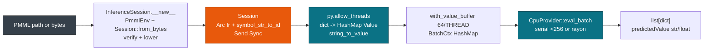

# Python Bindings

> This guide covers Python deployment with `pyo3 0.22` wheels built by `maturin`. For Rust services see [Rust: Library & Binary](./rust.md). For C embedding see [C ABI & FFI](./c.md). For CSV workflows see [CSV & CLI Workflows](./cli.md).

The binding scores a PMML file with the same Rust engine that the crate ships, so the wheel needs no JDK. Export a pipeline with `sklearn2pmml` and load the file with `InferenceSession`. Pass a path or bytes, then call `sess.run(None, dict)` for one row or `sess.run(None, list[dict])` for a batch. Every `run` releases the GIL through `py.allow_threads`, so threads scale: 402 ns for one row and 61 ns per row for 100k.

## Concepts

| Concept | Description |
| --- | --- |
| **InferenceSession** | Python class over `Session`, created from a path, `bytes`, or `Path`. |
| **allow_threads** | Every `run` releases the GIL with `py.allow_threads` so other threads score at the same time. |
| **Value mapping** | A `dict` value becomes `Value::Continuous(f64)`, `Discrete(SymbolId)`, or `Missing` through `string_to_value`. |
| **SymbolId** | Interned `u32` for categorical strings. `Discrete` reads back to Python `str` through `symbol_names`. |
| **Batch** | `dict` for one row or `list[dict]` for N rows, with `rayon` sharding above 256 rows. |

`InferenceSession` owns the `PmmlEnv` and `Session` on the Rust heap. Pass a path, `bytes`, or `Path`.

## How it works

Python `dict` entries become a `Value[FieldId]` slice, and results return as `list[dict]`.



## Install the wheel

Build the extension with `maturin`, or install the published wheel:

```bash
pip install pmmlruntime
pip install maturin
maturin develop --manifest-path python/_native/Cargo.toml --features pyo3/extension-module
pip install -e python/
python -c "import pmmlruntime; s=pmmlruntime.InferenceSession('bench/pmml/DecisionTreeIris.pmml'); print(s.get_inputs())"
```

> **Tip:** Use `InferenceSession` for scoring and `score_file` for CSV. Keep the `dict` keys exactly equal to the `DataDictionary` names.

## Quickstart

Score one row, then a batch:

```python
import pmmlruntime
sess = pmmlruntime.InferenceSession("bench/pmml/DecisionTreeIris.pmml")
print(sess.get_inputs())
out = sess.run(None, {"Petal.Length": 1.4, "Petal.Width": 0.2})
print(out[0]["predictedValue"])
batch = sess.run(None, [{"Petal.Length": 1.4}, {"Petal.Length": 6.0}])
print([r["predictedValue"] for r in batch])
```

The single row prints `setosa`, and the batch returns one dict per row. The same session serves a thread pool:

```python
from concurrent.futures import ThreadPoolExecutor
import pmmlruntime
sess = pmmlruntime.InferenceSession("bench/pmml/GradientBoosterTest.pmml")
def score(x): return sess.run(None, {"x": x})[0]["predictedValue"]
with ThreadPoolExecutor(max_workers=8) as ex:
    results = list(ex.map(score, [0.5, 1.0, 1.5, 2.0] * 25000))
print(len(results))  # 100k rows through par_chunks(256) at 61 ns/row
```

## InferenceSession lifecycle

Inspect the inputs and outputs, then decide where the session lives:

```python
import pmmlruntime
sess = pmmlruntime.InferenceSession("bench/pmml/DecisionTreeIris.pmml")
print(sess.get_inputs())   # [{"name": "Petal.Length", "type": "Double"}, ...]
print(sess.get_outputs())  # ["predictedValue", "probability(setosa)"]
out = sess.run(None, {"Petal.Length": 1.4, "Petal.Width": 0.2})
print(out[0]["predictedValue"])  # setosa
```

Wrap the session in a class when your code scores many rows:

```python
import pmmlruntime
class IrisScorer:
    def __init__(self, pmml_path: str):
        self.sess = pmmlruntime.InferenceSession(pmml_path)  # cold 68 µs
    def predict(self, l: float, w: float):
        return self.sess.run(None, {"Petal.Length": l, "Petal.Width": w})[0]["predictedValue"]
    def predict_batch(self, rows: list[dict]):
        return [r["predictedValue"] for r in self.sess.run(None, rows)]

scorer = IrisScorer("bench/pmml/DecisionTreeIris.pmml")
print(scorer.predict(1.4, 0.2))
print(scorer.predict_batch([{"Petal.Length": 1.4}, {"Petal.Length": 6.0}]))
```

## Thread safety

```python
import pmmlruntime
from concurrent.futures import ThreadPoolExecutor
sess = pmmlruntime.InferenceSession("bench/pmml/DecisionTreeIris.pmml")
with ThreadPoolExecutor(max_workers=4) as ex:
    print([f.result() for f in [ex.submit(lambda: sess.run(None, {"Petal.Length": 1.4})) for _ in range(4)]])
```

> **Attention:** `InferenceSession` is thread safe through `py.allow_threads`. Build a new `dict` per `run`, or pass a `list[dict]` for a batch.

## Versioning sessions in a dict

Keep one session per version and read the champion from the map:

| Operation | Python | How |
| --- | --- | --- |
| Load a version | `registry["iris:v1"] = sess` | dict key per build |
| Promote an alias | `registry["iris@champion"] = sess_v2` | second dict key |
| Read the champion | `registry["iris@champion"]` | once per thread |

```python
import pmmlruntime
registry = {}
registry["iris:v1"] = pmmlruntime.InferenceSession("bench/pmml/DecisionTreeIris.pmml")
registry["iris:v2"] = pmmlruntime.InferenceSession("bench/pmml/GradientBoosterTest.pmml")
registry["iris@champion"] = registry["iris:v2"]
champion = registry["iris@champion"]
print(champion.run(None, {"Petal.Length": 1.4})[0]["predictedValue"])
```

## Serving with FastAPI

Load the session at import time and score every request without reloading:

```python
import pmmlruntime
from fastapi import FastAPI
sess = pmmlruntime.InferenceSession("bench/pmml/DecisionTreeIris.pmml")
app = FastAPI()
@app.post("/invocations")
def invocations(payload: dict):
    return {"predictions": sess.run(None, payload["inputs"])}
```

## Performance budget

Gate a release on the numbers below, measured on `i7-12650H`:

| Path | pmmlruntime | JPMML | Speedup | Budget |
| --- | --- | --- | --- | --- |
| **Cold Iris** | **68 µs** | 8757 µs | **169×** | under 100 µs |
| **Hot single** | **402 ns** | 4562 ns | **9.9×** | under 550 ns |
| **Batch 100k** | **61 ns/row** | 4.5 µs | **73×** | under 80 ns |

- **Latency.** A `dict` single row is **402 ns**. Keep `mean + std` under 550 ns; `rayon` shards only above 256 rows.
- **Memory.** The value buffer stays on the stack, `64×16B = 1KB` for 90% of fixtures.
- **Startup.** The first `InferenceSession` costs **68 µs** against 8757 µs for JPMML. Gate on 20 loads.
- **Throughput.** `list[dict]` batches reach **61 ns/row** (16.5M/s) through `par_chunks(256)`.

> **Note:** Reproduce the cold load with `python -c "import pmmlruntime, time; t0=time.time(); s=pmmlruntime.InferenceSession('bench/pmml/DecisionTreeIris.pmml'); print(time.time()-t0)"`.

## API surface

Five methods cover inspection and scoring.

| Function | Purpose | Example |
| --- | --- | --- |
| `InferenceSession(path_or_bytes)` | Create the `PmmlEnv` and `Session` | `sess = InferenceSession("model.pmml")` |
| `sess.get_inputs()` | List `{"name","type","opType"}` per active field | `sess.get_inputs()` |
| `sess.get_outputs()` | List output names | `sess.get_outputs()` |
| `sess.run(None, dict)` | Score one `dict` | `sess.run(None, {"x": 1.0})[0]` |
| `sess.run(None, list[dict])` | Score a batch through `rayon` | `sess.run(None, [{}, {}])` |

```python
import pmmlruntime
sess = pmmlruntime.InferenceSession("bench/pmml/DecisionTreeIris.pmml")
assert any(f["name"]=="Petal.Length" for f in sess.get_inputs())
print(sess.run(None, {"Petal.Length": 1.4, "Petal.Width": 0.2})[0]["predictedValue"])
```

## The same call in Rust and C

**Rust**

```rust
let sess = Session::from_bytes(&env, &std::fs::read("bench/pmml/DecisionTreeIris.pmml")?, SessionOptions::default())?;
let out = sess.run(&{ let mut m=std::collections::HashMap::new(); m.insert("x".into(), Value::Continuous(1.0)); m } as &dyn pmmlruntime::session::batch::Batch)?;
```

**C**

```c
const PmmlApi* api = PmmlGetApi(1); PmmlEnv* env=NULL; api->CreateEnv(PMML_LOG_WARNING,"svc",&env);
PmmlSession* s=NULL; api->CreateSessionFromArray(env,bytes,len,NULL,&s);
const char* n[]={"x"}; PmmlValue v[]={{.tag=PMML_VALUE_CONTINUOUS,.continuous=1.0}};
PmmlValue outv; api->Run(s,NULL,n,v,1,(const char*[]){"predictedValue"},1,&outv);
```

## Deployment targets

The same wheel runs wherever Python runs.

| Target | Runtime | Install | Scoring path | Scaling |
| --- | --- | --- | --- | --- |
| **Local** | `python 3.8+` | `pip install pmmlruntime` | `dict` at 402 ns | Single thread |
| **Docker** | `python:3.11-slim` | `pip install` the wheel | `list[dict]` batch | `rayon` |
| **Lambda** | `python3.11` | `manylinux` zip | `from_bytes` from S3 | Concurrency |
| **Edge** | `aarch64` Pi | `maturin --target aarch64` | `dict`, stack buffer | Thread-local |
| **Browser** | `Pyodide` (future) | `wasm` wheel | `dict` single row | Single thread |

> **Attention:** `Session` is `Send + Sync` and `run` releases the GIL. Do not mutate one `dict` from several threads; build a `dict` per call.

## Next Steps

- [Rust: Library & Binary](./rust.md): the same engine without the GIL, with `SessionOptions`.
- [CSV & CLI Workflows](./cli.md): batch CSV through `input.csv --output out.csv`.
- [Arrow & CSV Integration](../batch/arrow.md): `RecordBatch` for 16.5M rows per second.
- [Quickstart: Score Iris in 5 min](../getting-started/quickstart.md): train with `sklearn2pmml` and score with a `dict`.

*Next: [C ABI & FFI](./c.md) → · Previous: [Rust: Library & Binary](./rust.md)*
