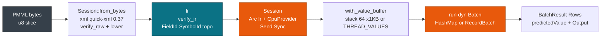

# Rust: Library & Binary

> This guide covers Rust library and binary deployment for services and CLIs. For Python pipelines see [Python Bindings](./python.md). For embedding in a C caller see [C ABI & FFI](./c.md). For CSV batch scoring see [CSV & CLI Workflows](./cli.md).

pmmlruntime is a pure Rust PMML 4.4 engine. Train with `sklearn2pmml`, `r2pmml`, `jpmml-sparkml`, `jpmml-lightgbm`, or `jpmml-xgboost`, then ship the same `model.pmml` to Rust without branching on the training framework. Add the crate with `cargo add`, load the bytes once with `Session::from_bytes`, and call `run` for every row behind a `Send + Sync` **Session** that shares `Arc<Ir>` across threads. Cold load is 68 µs for `DecisionTreeIris.pmml`, hot scoring is 402 ns for one row, and a 100k `RecordBatch` runs at 61 ns per row. The binary needs no JDK and no `libpython`. Parsing is hardened against untrusted input: a 100 MB XML cap, depth 512, and blocked DTD entities. `cargo test` reproduces all 52 fixtures.

## Concepts

| Concept | Description |
| --- | --- |
| **PmmlEnv** | Global handle with an `Arc` inner. Create it once with `PmmlEnv::new()` and clone it cheaply. |
| **Session** | Immutable scorer holding `Arc<Ir>` and a `CpuProvider`, built by `Session::from_bytes` or `Session::from_file`. |
| **SessionOptions** | Builder for `GraphOptimizationLevel`, applied on the cold path and stored in `Session.options`. |
| **Batch** | Object-safe trait that turns a `HashMap<String, Value>` or a `RecordBatch` into `Value[FieldId]`. |
| **Value** | `Continuous(f64)`, `Discrete(SymbolId)`, or `Missing`: `Copy`, and branchless on the hot path. |

## How it works

Load bytes once, then score forever with per-thread slices.



Cold is 68 µs for `DecisionTreeIris.pmml`; hot is 402 ns.

## Install and build

Install with `rustc 1.78+`:

```bash
cargo add pmmlruntime
```

```toml
[dependencies]
pmmlruntime = { version = "0.1", features = ["simd"] }
```

The flags you pick change the hot path:

| Build | Flags | When to use | Result |
| --- | --- | --- | --- |
| **Release** | `cargo build --release` | Every deploy | 402 ns single row, 61 ns/row batch |
| **Release + SIMD** | `--features simd` | Columnar `Regression` | `wide::f64x4` kernels |

> **Tip:** Pin `rustc 1.78+` and use `SessionOptions::default()` (`EnableBasic`). Add `features = ["simd"]` only for columnar `Regression`.

## Quickstart

Run the bundled example against a fixture, then score from your own code:

```bash
cargo run --example score_file -- bench/pmml/DecisionTreeIris.pmml
cargo run --example score_file -- bench/pmml/GradientBoosterTest.pmml input.csv --output out.csv
```

Score one row:

```rust
use std::collections::HashMap;
use pmmlruntime::{PmmlEnv, Session, SessionOptions, Value};
let env = PmmlEnv::new();
let sess = Session::from_bytes(&env, &std::fs::read("bench/pmml/DecisionTreeIris.pmml")?, SessionOptions::default())?;
let mut input = HashMap::new();
input.insert("Petal.Length".into(), Value::Continuous(1.4));
let out = sess.run(&input as &dyn pmmlruntime::session::batch::Batch)?;
println!("{:?}", out.into_single().unwrap().get("predictedValue"));
```

That call prints `setosa`. Score a columnar batch with the same session:

```rust
use pmmlruntime::session::{GraphOptimizationLevel, SessionOptions};
let opts = SessionOptions::default().graph_optimization_level(GraphOptimizationLevel::EnableBasic);
let sess2 = Session::from_file(&env, "bench/pmml/GradientBoosterTest.pmml", opts)?;
use arrow::array::Float64Array;
use arrow::datatypes::{DataType, Field, Schema};
let schema = std::sync::Arc::new(Schema::new(vec![Field::new("x", DataType::Float64, true)]));
let batch = arrow::record_batch::RecordBatch::try_new(schema.clone(), vec![std::sync::Arc::new(Float64Array::from(vec![1.0, 2.0])) as _])?;
let rows = sess2.run(&batch as &dyn pmmlruntime::session::batch::Batch)?.into_rows();
```

## Cargo features

Features are frozen at build time and decide what the binary links.

| Feature | State | Links | When to use |
| --- | --- | --- | --- |
| **Core** | default | `quick-xml 0.37`, `ir`, `CpuProvider` | Always |
| **Arrow** | default | `arrow 53` | CSV input and 100k batches |
| **SIMD** | opt in | `wide 0.7` `f64x4` | `RecordBatch` with 4 rows or more |
| **Python** | opt in | `pyo3 0.22` | `maturin` builds only |

```toml
pmmlruntime = "0.1"
pmmlruntime = { version = "0.1", features = ["simd"] }
```

```rust
let sess = Session::from_file(&PmmlEnv::new(), "bench/pmml/DecisionTreeIris.pmml", SessionOptions::default())?;
```

## Thread safety

`Session` holds `Arc<Ir>` and `run` takes `&self`, so you clone the handle instead of the model:

```rust
use std::sync::Arc;
use pmmlruntime::{PmmlEnv, Session, SessionOptions};

let env = PmmlEnv::new();
let sess = Arc::new(Session::from_file(&env, "bench/pmml/DecisionTreeIris.pmml", SessionOptions::default())?);
```

> **Attention:** `Session` is `Send + Sync`, but `PmmlEnv` must outlive it. Create `PmmlEnv::new()` once and share `&Session` across threads.

## Versioning sessions

Keep each version in a map and promote one entry as the champion:

| Operation | Rust | How |
| --- | --- | --- |
| Load a version | `HashMap<String, Arc<Session>>` | `insert("iris:v3", Arc::new(sess))` |
| Promote an alias | `insert("iris@champion", sess.clone())` | `Arc::clone`, one atomic increment |
| Read the champion | `get("iris@champion").cloned()` | once per thread |

```rust
use std::{collections::HashMap, sync::Arc};
use pmmlruntime::{PmmlEnv, Session, SessionOptions};
let env = PmmlEnv::new();
let mut reg: HashMap<String, Arc<Session>> = HashMap::new();
let v1 = Arc::new(Session::from_file(&env, "bench/pmml/DecisionTreeIris.pmml", SessionOptions::default())?);
let v2 = Arc::new(Session::from_file(&env, "bench/pmml/GradientBoosterTest.pmml", SessionOptions::default())?);
reg.insert("iris:v1".into(), v1.clone());
reg.insert("iris@champion".into(), v2.clone());
let champion = reg.get("iris@champion").unwrap().clone();
let out = champion.run(&{ let mut m=HashMap::new(); m.insert("x".into(), pmmlruntime::Value::Continuous(1.0)); m } as &dyn pmmlruntime::session::batch::Batch)?;
```

## Serving from a Rust service

Load at startup, then score each request through the shared session:

```rust
use std::{collections::HashMap, sync::Arc};
use pmmlruntime::{PmmlEnv, Session, SessionOptions, Value};
use pmmlruntime::session::batch::Batch;
let env = PmmlEnv::new();
let sess = Arc::new(Session::from_file(&env, "bench/pmml/DecisionTreeIris.pmml", SessionOptions::default())?);
fn handle(sess: Arc<Session>, v: f64) -> String {
    let mut m=HashMap::new(); m.insert("Petal.Length".into(), Value::Continuous(v));
    format!("{:?}", sess.run(&m as &dyn Batch).unwrap().into_single().unwrap().get("predictedValue"))
}
println!("{}", handle(sess.clone(), 1.4));
```

Measure a release build with the benchmark example:

```bash
cargo run --release --example bench_real -- bench/pmml/DecisionTreeIris.pmml --iterations 2000
cargo run --release --example score_file -- bench/pmml/GradientBoosterTest.pmml /tmp/in.csv --output /tmp/out.csv
```

## Performance budget

Gate a release on the budget below, measured on `i7-12650H`:

| Path | pmmlruntime | JPMML | Speedup | Budget |
| --- | --- | --- | --- | --- |
| **Cold Tree** | **68 µs** | 8757 µs | **169×** | under 100 µs |
| **Hot single** | **402 ns** | 4562 ns | **9.9×** | under 550 ns |
| **Batch 100k** | **61 ns/row** | 4.5 µs | **73×** | under 80 ns |

- **Latency.** A `HashMap` single row is **402 ns**. Keep `mean + std` under 550 ns; `rayon` shards only above 256 rows.
- **Memory.** `STACK_VALUES_THRESHOLD=64` keeps the value buffer on the stack, which is 1 KB for 90% of fixtures.
- **Startup.** `from_bytes` is **68 µs** against 8757 µs for JPMML. Gate on the median of 20 loads.
- **Throughput.** A `RecordBatch` reaches **61 ns/row** (16.5M/s) through `par_chunks(256)`.

> **Note:** Reproduce with `cargo run --release --example bench_real -- bench/pmml/DecisionTreeIris.pmml --iterations 2000`.

## API surface

Six entry points cover the cold path and the hot path.

| Function | Purpose | Example |
| --- | --- | --- |
| `PmmlEnv::new()` | Create the `Arc` handle | `let env = PmmlEnv::new();` |
| `Session::from_bytes` | Parse, verify, publish `Arc<Ir>` | `Session::from_bytes(&env, &bytes, SessionOptions::default())?` |
| `Session::from_file` | Same pipeline from the filesystem | `Session::from_file(&env, "model.pmml", opts)?` |
| `Session::field_id` | Resolve `&str` to `FieldId` | `sess.field_id("Petal.Length")` |
| `Session::run` | Score a `HashMap` or a `RecordBatch` | `sess.run(&map as &dyn Batch)?` |
| `BatchResult::into_rows` | Unwrap `Vec<HashMap>` | `sess.run(&batch as &dyn Batch)?.into_rows()` |

```rust
let env = PmmlEnv::new();
let sess = Session::from_bytes(&env, &std::fs::read("bench/pmml/DecisionTreeIris.pmml")?, SessionOptions::default())?;
assert!(sess.field_id("Petal.Length").is_some());
let out = sess.run(&{ let mut m=std::collections::HashMap::new(); m.insert("Petal.Length".into(), Value::Continuous(1.4)); m } as &dyn pmmlruntime::session::batch::Batch)?.into_single().unwrap();
```

## The same call in Python and C

**Python**

```python
import pmmlruntime
sess = pmmlruntime.InferenceSession("bench/pmml/DecisionTreeIris.pmml")
print(sess.run(None, {"x": 1.0})[0]["predictedValue"])
```

**C**

```c
const PmmlApi* api = PmmlGetApi(1); PmmlEnv* env=NULL; api->CreateEnv(PMML_LOG_WARNING,"svc",&env);
PmmlSession* s=NULL; api->CreateSessionFromArray(env,bytes,len,NULL,&s);
PmmlValue outv; const char* n[]={"x"}; PmmlValue v[]={{.tag=PMML_VALUE_CONTINUOUS,.continuous=1.0}};
api->Run(s,NULL,n,v,1,(const char*[]){"predictedValue"},1,&outv);
```

## Deployment targets

One artifact runs on many targets.

| Target | Runtime | Artifact | Scoring path | Scaling |
| --- | --- | --- | --- | --- |
| **Local** | `cargo run` | `rlib`, `Session::from_file` | `HashMap` single row | Single process |
| **Docker** | `rust:1.78-slim` to `scratch` | Single binary | `RecordBatch` batch | K8s replicas |
| **Lambda** | `provided.al2` | `bootstrap` under 10 MB | `from_bytes` from S3 | Concurrency |
| **Edge** | `aarch64` or `x86_64` | `staticlib` | Stack `Value[64]` | Thread-local |
| **Browser** | `wasm32` | `cdylib` (future) | `HashMap` single row | Single thread |

See [Docker & CI](./docker.md).

## Next Steps

- [Python Bindings](./python.md): same engine through `pyo3 0.22` with `allow_threads`.
- [C ABI & FFI](./c.md): embed through `include/pmml_runtime.h` and `PmmlGetApi(1)`.
- [CSV & CLI Workflows](./cli.md): run `score_file` with `input.csv --output out.csv`.
- [Quickstart: Score Iris in 5 min](../getting-started/quickstart.md): end-to-end with `DecisionTreeIris.pmml`.

*Next: [Python Bindings](./python.md) → · Previous: [Architecture Overview](../internals/architecture.md)*
