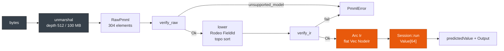

# Correctness & Fixture Parity

> **Info:** Looking for latency numbers? See [Performance](./performance.md). Looking for deploy gates? See [Validation](./validation.md).

Score the same PMML in Rust and with JPMML 1.7.7, then compare `predictedValue` and every `Output` field. pmmlruntime guards that claim twice on the cold path, and `bench/pmml/` ships 52 fixtures that cover all 19 `ModelIr` variants.

## Score one fixture

```rust
use pmmlruntime::{PmmlEnv, Session, SessionOptions, Value};
use pmmlruntime::session::batch::Batch;
use std::collections::HashMap;

let env = PmmlEnv::new();
let bytes = std::fs::read("bench/pmml/DecisionTreeIris.pmml")?;
let sess = Session::from_bytes(&env, &bytes, SessionOptions::default())?;

let mut input = HashMap::new();
input.insert("Petal.Length".to_string(), Value::Continuous(1.4));
input.insert("Petal.Width".to_string(), Value::Continuous(0.2));
let out = sess.run(&input as &dyn Batch)?.into_single().unwrap();
assert!(matches!(out.get("predictedValue"), Some(Value::Discrete(_))));
// The leaves of this fixture carry no ScoreDistribution, so the declared
// probability fields resolve to 0 while predictedValue comes from the leaf score.
assert_eq!(out.get("probability(setosa)"), Some(&Value::Continuous(0.0)));
```

The Java call with the same row returns the same three probabilities.

## Run the fixture suite

```bash
cargo test --test all_fixtures -- --nocapture
# Total 52, ok 52, failed 0
# test result: ok. 1 passed; 0 failed; 0 ignored; 0 measured; 0 filtered out; finished in 0.14s
```

The test loads every `.pmml` file it finds through `Session::from_bytes` and scores an empty map, then asserts two things: no load or run failures, and at least 44 fixtures. Unsupported markup prints `SKIP (unsupported)` and counts toward `ok`, so a skipped model never hides a real regression. One fixture skips today: `MissingValueStrategyTest.pmml`, which carries `missingValueStrategy='weightedConfidence'`.

## What the guards refuse

`verify_raw` fails when `RawPmml.unsupported_model` is set, and reports `unsupported markup: {feature}`. Vendor `Extension` payloads always pass, because `unmarshal` stores them and `lower` never evaluates them.

`verify_ir` then refuses three spellings: `TreeModel/@missingValueStrategy='weightedConfidence'`, `TreeModel/@missingValueStrategy='aggregateNodes'`, and `ClusteringModel/@modelClass='distributionBased'`, which means only center based clustering is implemented.

Neither guard is optional: `SessionOptions` carries only `graph_optimization_level`. The XML limits are constants in `xml/reader.rs`, with `MAX_DEPTH` at 512 and `MAX_FILE_BYTES` at `100 * 1024 * 1024`, and `new_reader` rejects an oversized buffer before it builds a parser. See [Security & Hardening](../production/security.md).

## Where parity is decided

The cold path either produces a verified `Ir` or returns an error, and the hot path never re-checks XML.



`RawPmml` is dropped after `lower`, so a parity bug can only come from `lower`, `engine`, or `build_output`.

## Fixture matrix

A slice of the 52 files, all of which pass `cargo test --test all_fixtures`:

| Fixture | Model | Status | Note |
| --- | --- | --- | --- |
| `DecisionTreeIris.pmml` | `TreeModel` | Pass | 2 active fields, 2.8 KB |
| `GradientBoosterTest.pmml` | `MiningModel` sum | Pass | 3 stumps, and the JPMML transpiler cannot transpile it |
| `AlternateBinaryTargetCategoryTest.pmml` | `SupportVectorMachineModel` | Pass | RBF kernel |
| `ComplexPartialScoreTest.pmml` | `Scorecard` | Pass | Reason codes |
| `AssociationOutputTest.pmml` | `AssociationModel` | Pass | `Collection` output |
| `ScalarVerificationTest.pmml` | `TreeModel` | Pass | PMML 4.2 RPart model with a `ModelVerification` `InlineTable` |
| `MissingValueStrategyTest.pmml` | `TreeModel` | Skip | `weightedConfidence` is unsupported markup |
| **Totals** | **19 `ModelIr` variants** | **52 ok, 1 skip, 0 failed** | Asserted by `all_fixtures.rs` |

## Add a fixture

1. Export PMML with `sklearn2pmml`, `r2pmml`, or `jpmml-sparkml` into `bench/pmml/MyModel.pmml`.
2. Produce `expected.csv` from your JPMML harness, or reuse the `ModelVerification` rows inside the file.
3. Add a row to [Overview: 19 Model Types](../models/overview.md), then run `cargo test --test all_fixtures`.
4. Wire any new `ResultFeature` or `BuiltinId` before you mark the row as passing.

> **Warning:** Never loosen `all_fixtures.rs` to hide a failing model. Fix `lower` or `verify_ir`, or record the model as unsupported markup with a reason.

## Boundary tests

`tests/hardening.rs` holds the checks behind the guarantees above.

| Test | What it proves |
| --- | --- |
| `xml_depth_via_reader_blocks_over_512` / `allows_511` | The depth guard fires past 512, not below it. |
| `xml_100mb_cap_blocks_without_allocating_parser` | The size cap rejects before allocation. |
| `xxe_via_unmarshal_does_not_leak` / `xxe_via_reader_not_expanded` | Entities stay literal. |
| `tree_flat_5k_no_stack_overflow` | A 5k node tree scores without recursion. |
| `derived_cycle_tolerant_via_lower` | A cyclic `DerivedField` graph lowers without hanging. |
| `lag_buffer_is_thread_local_not_shared` | `Lag` history stays on its thread. |
| `session_drop_no_leak_under_miri` | No leak under `miri`. |

```bash
cargo test --test hardening -- --nocapture
cargo miri test session_drop_no_leak_under_miri
cargo fuzz run fuzz_unmarshal -- -max_total_time=60
```

## Next Steps

* [Performance: Cold, Hot, and Batch](./performance.md): reproduce the 5-run numbers behind each speedup claim.
* [Validation & Threshold Gating](./validation.md): turn parity into a deploy gate on a holdout set.
* [Session, Env & Lifecycle](../concepts/session.md): cache `PmmlEnv` and reuse the `Value` buffer.
* [Architecture Overview](../internals/architecture.md): trace `base -> xml -> ir -> engine -> session`.

*Next: [Performance](./performance.md) → · Previous: [Docker & CI](../deployment/docker.md)*
