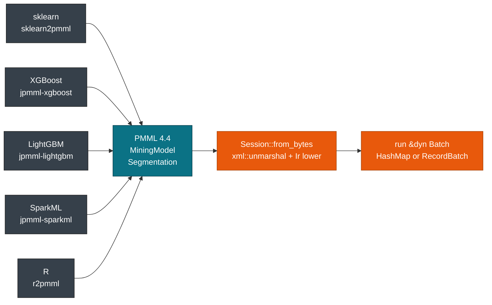
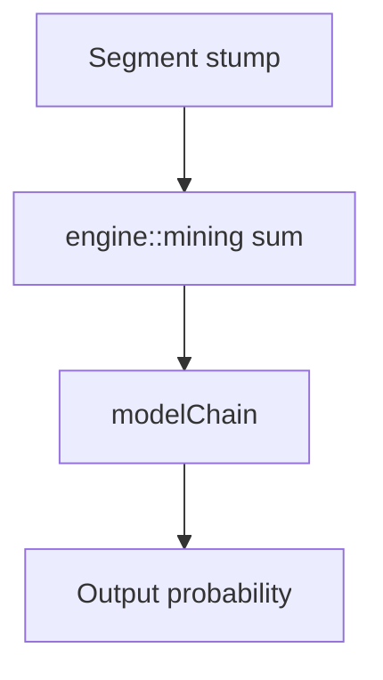

# One File, Any Framework

> This guide covers scoring PMML from any training framework with one pmmlruntime **Session** for Rust, Python, and edge deployments. For training or exporting PMML, see [sklearn2pmml](https://github.com/jpmml/sklearn2pmml) or [jpmml-sparkml](https://github.com/jpmml/jpmml-sparkml).

Train in Python, R, or Spark and ship the same file to Rust. You change the path, not the code. Every converter below writes PMML 4.4 that pmmlruntime lowers to the same **Ir** and scores with the same `Session::run`.

## What the converters share

| Aspect | What you get |
| --- | --- |
| **Scoring call** | You load any file with `Session::from_bytes` and score through `&dyn Batch`. There is no `from_xgboost` flag to pass. |
| **Where the framework lives** | In the PMML, not in the engine. `sklearn2pmml` and `jpmml-lightgbm` both write a `MiningModel`, so `ModelIr` has no `LightGBM` variant to dispatch on. |
| **Test and production bytes** | `cargo test` covers 52 fixtures, and the deployed binary loads those same bytes with `Session::from_bytes` or `InferenceSession`. |
| **Lowering** | `verify_raw` plus `verify_ir` and the `Rodeo` interner keep `lower` deterministic. See [Correctness & Fixtures](../evaluation/correctness.md). |

## From training framework to Session

The exporter rewrites your ensemble as a `Segmentation` over `TreeModel` or `RegressionModel` stumps. pmmlruntime parses the XML once, verifies the MiningSchema, and returns an immutable **Session** that you call with any **Batch**, either a `HashMap` row or an Arrow `RecordBatch`.



The engine dispatches segments without knowing which framework wrote the file. See [Session, Env & Lifecycle](../concepts/session.md).

## Exporters per training framework

Pick the exporter for your stack. pmmlruntime lowers all five to the same structure.

| **Original library** | **Exporter** | **PMML model type** | **pmmlruntime segment kind** |
| --- | --- | --- | --- |
| scikit-learn (RandomForest, GradientBoosting) | `sklearn2pmml` | `MiningModel` or `TreeModel` | `TreeModel` segments, `multipleModelMethod="majorityVote"` or `"sum"` |
| XGBoost | `jpmml-xgboost` | `MiningModel` with `Segmentation` | `RegressionModel` stumps, `multipleModelMethod="sum"` then `modelChain` |
| LightGBM | `jpmml-lightgbm` / `lightgbm2pmml` | `MiningModel` (`modelChain`) | `RegressionModel` stumps summed to `decisionFunction`, final `RegressionModel` |
| SparkML (PipelineModel) | `jpmml-sparkml` | `MiningModel` + `TransformationDictionary` | `DerivedFieldIr` bytecode + nested `TreeModel` / `RegressionModel` |
| R (glm, rpart, nnet, arima) | `r2pmml` | `RegressionModel` / `GeneralRegressionModel` / `TreeModel` / `NeuralNetwork` | Direct `ModelIr` variant, no segmentation |

Forests arrive as one `TreeModel` per `Segment` combined with `majorityVote`, and boosted models arrive as `RegressionModel` stumps combined with `sum`, then chained into a final `RegressionModel` when the exporter writes `modelChain`. SparkML pipelines keep their transforms as `DerivedFieldIr` bytecode, and R models need no wrapper at all.

## Export paths per framework

Each framework offers a native path and a wrapper path, and both produce the same `MiningModel` for one **Session**.

### scikit-learn: PMMLPipeline or plain Pipeline

```python
# Native - PMMLPipeline
from sklearn.ensemble import RandomForestClassifier
from sklearn2pmml import sklearn2pmml
from sklearn2pmml.pipeline import PMMLPipeline
pipeline = PMMLPipeline([("classifier", RandomForestClassifier(n_estimators=100))])
pipeline.fit(X_train, y_train)
sklearn2pmml(pipeline, "rf.pmml", with_repr=True)
```

```python
# Wrapper - adapt a plain sklearn Pipeline
from sklearn.pipeline import Pipeline
from sklearn.ensemble import RandomForestClassifier
from sklearn2pmml import sklearn2pmml
from sklearn2pmml.pipeline import PMMLPipeline
pipe = Pipeline([("classifier", RandomForestClassifier(n_estimators=100))])
pipe.fit(X_train, y_train)
sklearn2pmml(PMMLPipeline([("classifier", pipe)]), "rf2.pmml", with_repr=True)
```

Both emit `MiningModel` with `majorityVote`. Score either file through `Session::from_bytes`.

### XGBoost: native Booster or XGBClassifier

```java
// Native - Booster + ConverterUtil
import org.jpmml.xgboost.ConverterUtil;
Booster booster = Booster.loadModel("xgb.model");
PMML pmml = ConverterUtil.toPMML(booster, featureMap);
JAXBUtil.marshal(pmml, new FileOutputStream("xgb.pmml"));
```

```python
# Wrapper - XGBClassifier through PMMLPipeline
from xgboost import XGBClassifier
from sklearn2pmml import sklearn2pmml
from sklearn2pmml.pipeline import PMMLPipeline
clf = XGBClassifier(n_estimators=100, max_depth=3)
clf.fit(X_train, y_train)
sklearn2pmml(PMMLPipeline([("classifier", clf)]), "xgb_sklearn.pmml", with_repr=True)
```

Both write `MiningModel` stumps summed with `sum` and then chained. See `GradientBoosterTest.pmml`.

### LightGBM: jpmml-lightgbm or lightgbm2pmml

```java
// Native - jpmml-lightgbm
import org.jpmml.lightgbm.ConverterUtil;
PMML pmml = ConverterUtil.toPMML(booster);
JAXBUtil.marshal(pmml, new FileOutputStream("lgb.pmml"));
```

```python
# Wrapper - lightgbm2pmml with the compact flag
import lightgbm as lgb
from lightgbm2pmml import lightgbm2pmml
train = lgb.Dataset(X_train, label=y_train)
booster = lgb.train({"objective": "binary"}, train, num_boost_round=100)
lightgbm2pmml(booster, "lgb.pmml", compact=True)
```

> **Note:** `compact=True` still writes PMML 4.4. You get a `MiningModel` of `RegressionModel` stumps, not a native LightGBM file.

Both paths score as `RegressionModel` stumps summed to `decisionFunction`.

### R: r2pmml

```r
library(r2pmml)
fit <- glm(y ~ ., data = train, family = binomial)
r2pmml(fit, "glm.pmml")
# rpart, nnet, arima map to TreeModel, NeuralNetwork, and other variants
```

R spans the widest set of elements: `RegressionModel`, `TreeModel`, `GeneralRegressionModel`. All 19 variants are `ModelIr` cases in `crates/pmmlruntime/src/ir/ir.rs`.

### Score every file the same way

Run this against any of the files above without edits.

```rust
use pmmlruntime::{PmmlEnv, Session, SessionOptions, Value};
let env = PmmlEnv::new();
let sess = Session::from_bytes(&env, &std::fs::read("lgb.pmml")?, SessionOptions::default())?;
let mut m = std::collections::HashMap::new(); m.insert("Petal.Length".into(), Value::Continuous(1.4));
let out = sess.run(&m as &dyn pmmlruntime::session::batch::Batch)?;
println!("{:?}", out.into_single().unwrap().get("predictedValue"));
```

One `Session` covers a single row and a 100k row batch. See [`score_file.rs`](https://github.com/pab1s/pmmlruntime/blob/main/crates/pmmlruntime/examples/score_file.rs) and [Batch API](../batch/batch.md).

## Segmentation and output per exporter

| Segmentation | `multipleModelMethod` | PMML structure | pmmlruntime lowering | Example fixture |
| --- | --- | --- | --- | --- |
| **Forest** | `majorityVote` | `MiningModel` plus one `Segment` per `TreeModel` | `MiningIr` with `Tree` segments and a vote fold | `DecisionTreeIris` as a single `Tree`; a forest uses the same path |
| **GBDT sum** | `sum` | `Segment` holding `RegressionModel` stumps | Sum into the `decisionFunction` register | `GradientBoosterTest.pmml`, 3 stumps |
| **GBDT chain** | `modelChain` | Last `Segment` maps the sum to a `probability` | `DerivedFieldIr` plus a final `RegressionModel` | `GradientBoosterTest.pmml` lines 40-60 |
| **Direct** | none | `RegressionModel` / `NeuralNetwork` / `TreeModel` | Direct `ModelIr::Regression`, `Tree`, or `Neural`, with no segmentation | `AlternateBinaryTargetCategoryTest.pmml` (`SVM`) |

The exporter writes `Segmentation` and the engine folds `segments` in `engine::mining`.



## Load from a path or from bytes

Both Rust loaders and the Python binding return the same **Ir**. Use `from_file` for a local path and `from_bytes` for a fetched buffer.

| Load method | Rust | Python | Use it when | Returns |
| --- | --- | --- | --- | --- |
| **From file** | `Session::from_file(&env, "model.pmml", SessionOptions::default())` | `InferenceSession("model.pmml")` | Local disk, CI fixtures | `Session` `Send+Sync`, 100 MB cap |
| **From bytes** | `Session::from_bytes(&env, &std::fs::read("model.pmml")?, opts)` | `InferenceSession(open("model.pmml","rb").read())` | S3, database, HTTP fetch | Same `Arc<Ir>`, depth 512 |
| **Verify** | `verify_raw` + `verify_ir` | Same through `_native` | Every load | `UnsupportedMarkup` for unsupported elements |

Keep `PmmlEnv::new()` once per process. Both loaders enforce the 100 MB cap and depth 512.

```rust
use pmmlruntime::{PmmlEnv, Session, SessionOptions};
let env = PmmlEnv::new();
let sess_file = Session::from_file(&env, "bench/pmml/DecisionTreeIris.pmml", SessionOptions::default())?;
let bytes = std::fs::read("bench/pmml/GradientBoosterTest.pmml")?;
let sess_bytes = Session::from_bytes(&env, &bytes, SessionOptions::default())?;
```

```python
import pmmlruntime
sess_file = pmmlruntime.InferenceSession("bench/pmml/DecisionTreeIris.pmml")
sess_bytes = pmmlruntime.InferenceSession(open("bench/pmml/DecisionTreeIris.pmml", "rb").read())
```

Both give you the same `field_names` for the same file.

> **Info:** No converter writes a framework specific model type. Every training stack lands on a `MiningModel` or one of the other 18 `ModelIr` variants.

## Run the same file from each surface

| Target | Rust command | Python | C | Batch shape | Scaling |
| --- | --- | --- | --- | --- | --- |
| **Local CLI** | `cargo run -p pmmlruntime --example score_file -- bench/pmml/DecisionTreeIris.pmml` | `python -c "import pmmlruntime; s=pmmlruntime.InferenceSession('model.pmml'); print(s.run(None, {'x': 0.5})[0]['predictedValue'])"` | `api->Run(sess, NULL, names, values, 1, out_names, 1, &out)` | `HashMap` single row, 402 ns | One thread |
| **Batch CSV** | `cargo run --example score_file -- model.pmml input.csv --output out.csv` | `sess.run(None, list[dict])` | `RunBatch` with `PmmlValue[]` | `RecordBatch`, 61 ns per row at 100k | `rayon par_chunks(256)` |
| **Docker** | `cargo run --release -- model.pmml` | `pip install pmmlruntime` | `libpmmlruntime.so` | Columnar | `CpuProvider` |
| **Remote fetch** | `Session::from_bytes(&env, s3_bytes, opts)` | `InferenceSession(s3.read())` | `CreateSessionFromArray` | `RunArrow` | `Send+Sync` |

Swap the path and keep `sess.run(&batch as &dyn Batch)`.

```bash
cargo run -p pmmlruntime --example score_file -- bench/pmml/DecisionTreeIris.pmml
cargo run -p pmmlruntime --example score_file -- bench/pmml/GradientBoosterTest.pmml
```

```python
import pmmlruntime
sess = pmmlruntime.InferenceSession("bench/pmml/GradientBoosterTest.pmml")
print(sess.run(None, {"x": 0.5})[0]["predictedValue"])
```

See [C ABI & FFI](../deployment/c.md) and [Python Bindings](../deployment/python.md).

## Why there is no framework flag

PMML erased the framework at export time, so a `Session` never asks where the file came from. A hundred trees arrive as a hundred `Segment`s combined with `sum` or `majorityVote`, and `ModelIr` has no `LightGBM` case. See [Correctness & Fixtures](../evaluation/correctness.md).

## Next Steps

- [Quickstart: Score Iris in 5 Minutes](./quickstart.md): run `DecisionTreeIris.pmml` and `GradientBoosterTest.pmml` with `HashMap` and `RecordBatch`.
- [Session, Env & Lifecycle](../concepts/session.md): create `PmmlEnv::new`, call `Session::from_bytes`, and reuse `Send + Sync` sessions.
- [Batch API: One Method, Two Layouts](../batch/batch.md): switch from row major `HashMap` to columnar Arrow without rewriting `run`.
- [Overview: 19 Model Types](../models/overview.md): map each `ModelIr` variant to its fixture and engine module.

*Next: [Session, Env & Lifecycle](../concepts/session.md) → · Previous: [Quickstart: Score Iris in 5 Minutes](./quickstart.md)*
