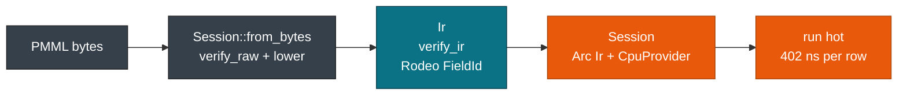

# Quickstart: Score Iris in 5 Minutes

> **Info:** Looking to train or export PMML? See [Scoring Any Framework](./one-file-any-framework.md) or [sklearn2pmml](https://github.com/jpmml/sklearn2pmml). This guide is for scoring an existing PMML file with Rust. Using Python or C? The same steps appear in [Python Bindings](../deployment/python.md) and [C ABI & FFI](../deployment/c.md).

Welcome to pmmlruntime! The purpose of this quickstart is to provide a quick guide to the most essential core APIs. In just a few minutes of following along, you will learn:

* How to **load** `DecisionTreeIris.pmml` into an immutable **Session**
* How to **inspect** the MiningSchema before you score
* How to **score** one row from a `HashMap` and a batch from a `RecordBatch`

Each step mirrors [`score_file.rs`](https://github.com/pab1s/pmmlruntime/blob/main/crates/pmmlruntime/examples/score_file.rs), so you can run the whole flow from the command line as you read. You pay the cold cost once at `Session::from_bytes`, and every later `run` reuses the same `Arc<Ir>`.

## Step 1: Install pmmlruntime

pmmlruntime is available on crates.io. If you don't already have it installed on your system, you can install it with:

```bash
cargo add pmmlruntime
cargo build
```

You need `rustc 1.78+` and no JDK. You now have the **Session** and **Batch** types in scope. Keep the default features: `arrow` ships with them and the columnar path in Step 6 uses it.

## Step 2: Get a PMML file

Use the canonical fixture `DecisionTreeIris.pmml` (2.8 KB, a `TreeModel` trained on Iris). Copy it from [`bench/pmml/DecisionTreeIris.pmml`](https://github.com/pab1s/pmmlruntime/blob/main/bench/pmml/DecisionTreeIris.pmml). It needs no export step.

```xml
<DataDictionary>
  <DataField name="Species" optype="categorical" dataType="string"/>
  <DataField name="Petal.Length" optype="continuous" dataType="double"/>
  <DataField name="Petal.Width" optype="continuous" dataType="double"/>
</DataDictionary>
```

The DataDictionary above has two continuous inputs and one categorical target. The same code later scores a `MiningModel` ensemble, so swap the path whenever you want another fixture.

If you would rather export your own model, five lines of Python produce an interchangeable file:

```python
from sklearn.datasets import load_iris
from sklearn.tree import DecisionTreeClassifier
from sklearn2pmml import sklearn2pmml
from sklearn2pmml.pipeline import PMMLPipeline

iris = load_iris()
pipeline = PMMLPipeline([("classifier", DecisionTreeClassifier(max_depth=3))])
pipeline.fit(iris.data[:, 2:4], iris.target)  # Petal.Length, Petal.Width
sklearn2pmml(pipeline, "DecisionTreeIris.pmml", with_repr=True)
```

See [Scoring Any Framework](./one-file-any-framework.md) for LightGBM, XGBoost, and SparkML exports.

## Step 3: Load the model

Create one `PmmlEnv` per process, then load the bytes into a **Session**:

```rust
use pmmlruntime::{PmmlEnv, Session, SessionOptions};

let env = PmmlEnv::new();
let bytes = std::fs::read("bench/pmml/DecisionTreeIris.pmml")?;
let sess = Session::from_bytes(&env, &bytes, SessionOptions::default())?;
```

With one call you get:

* A verified `Arc<Ir>` that holds the schema and the model.
* A `Send + Sync` **Session** you can share across threads.
* The default hardening: a 100 MB XML cap, depth 512, and XXE-blocked parsing.



The diagram above shows the one boundary that matters: the cold path builds the IR, and the hot path only reads it. Cold load takes 68 µs for the 2.8 KB Iris file on an i7-12650H, against 8.7 ms for JPMML on the same hardware. See [Session, Env & Lifecycle](../concepts/session.md).

> **Tip:** Use `Session::from_file(&env, "model.pmml", SessionOptions::default())` for a local path, or `Session::from_bytes` when you fetch PMML from S3 or a database. Both return the same session with the same limits.

## Step 4: Inspect the schema

Inspect the MiningSchema before you score, so a mismatched column fails at startup rather than in the middle of a batch:

```rust
use pmmlruntime::ir::ModelIr;

println!("active fields: {}", sess.num_active_fields());
for (fid, name) in &sess.ir.field_names {
    println!("  FieldId({}) = {name}", fid.0);
}
match &sess.ir.model {
    ModelIr::Tree(t) => println!("Model: TreeModel, {} nodes", t.nodes.len()),
    ModelIr::Mining(m) => println!("Model: MiningModel, {} segments", m.segmentation.segments.len()),
    _ => println!("Model: {:?}", sess.ir.model),
}
```

The output of this code will look something like this:

| Field | Value |
| --- | --- |
| Active fields | 2 |
| DataDictionary | 3 fields |
| Target | `Species` |
| Model | `TreeModel` |

You confirmed that `Species` is the target and that only the two petal fields are required. Keep this check in your startup log. See [Values, Fields & Types](../concepts/values.md).

## Step 5: Score one row

Score one row with a `HashMap<String, Value>` and the unified `run` method:

```rust
use std::collections::HashMap;
use pmmlruntime::Value;
use pmmlruntime::session::batch::Batch;

let mut input = HashMap::new();
input.insert("Petal.Length".to_string(), Value::Continuous(1.4));
input.insert("Petal.Width".to_string(), Value::Continuous(0.2));

let out = sess.run(&input as &dyn Batch)?.into_single().unwrap();
println!("{:?}", out.get("predictedValue"));
println!("{:?}", out.get("probability(setosa)"));
```

The output of this code will look something like this:

| Field | Value |
| --- | --- |
| `predictedValue` | `setosa` |
| `probability(setosa)` | `0.0` |
| `probability(versicolor)` | `0.0` |
| `probability(virginica)` | `0.0` |

You mapped two `Continuous` inputs and got `predictedValue` as `Discrete(SymbolId)` for setosa. The three declared probabilities come back as `0.0` because the leaves of this fixture carry no `ScoreDistribution`; `predictedValue` comes from the leaf score. A model whose scored node declares `ScoreDistribution` fills those fields instead. Hot scoring runs in 402 ns per row because the value buffer is stack-allocated. See [Batch API: One Method, Two Layouts](../batch/batch.md).

> **Note:** By default a missing field becomes `Value::Missing` and flows through the MiningSchema replacement rules. Unknown keys are ignored, so extra columns never break scoring. To pass a category, use `sess.symbol_id("setosa")` or `sess.string_to_value("Species", "setosa")`.

## Step 6: Score a batch

Score a CSV batch with the same `run` method, this time passing a `RecordBatch`:

```rust
use pmmlruntime::session::batch::Batch;
use pmmlruntime::session::arrow::csv_str_to_record_batch;

let csv = "Petal.Length,Petal.Width\n1.4,0.2\n6.0,2.0\n5.1,1.8\n";
let batch = csv_str_to_record_batch(csv, None, true).map_err(|e| anyhow::anyhow!(e))?;
let outs = sess.run(&batch as &dyn Batch)?.into_rows();

for (i, out) in outs.iter().enumerate() {
    println!("row {i}: {:?}", out.get("predictedValue"));
}
```

The output of this code will look something like this:

| Row | `Petal.Length` | `Petal.Width` | `predictedValue` |
| --- | --- | --- | --- |
| 1 | 1.4 | 0.2 | `setosa` |
| 2 | 6.0 | 2.0 | `virginica` |
| 3 | 5.1 | 1.8 | `virginica` |

You scored the same session with a row-major map and a columnar batch, and you never branched on model type. At 100k rows the columnar path runs at 61 ns per row through `rayon` sharding. Keep the session alive to avoid a cold reload. See [Arrow & CSV Integration](../batch/arrow.md).

Run the example end to end to confirm the same results:

```bash
cargo run -p pmmlruntime --example score_file -- bench/pmml/DecisionTreeIris.pmml
cargo run -p pmmlruntime --example score_file -- bench/pmml/DecisionTreeIris.pmml input.csv --output out.csv
cat out.csv
```

## Next Steps

Congratulations on working through the pmmlruntime quickstart! You should now have a basic understanding of how to load a model and score rows with the Session API.

* [Session, Env & Lifecycle](../concepts/session.md): cache `PmmlEnv` and `Session`, and choose `SessionOptions`.
* [Batch API: One Method, Two Layouts](../batch/batch.md): decide between `HashMap` and `RecordBatch` for your workload.
* [MiningSchema, DataDictionary & Output](../concepts/schema.md): handle missing, outlier, and `Output` features.
* [Correctness & Fixtures](../evaluation/correctness.md): reproduce all 52 fixtures and check JPMML parity with `cargo test`.

*Next: [Scoring Any Framework](./one-file-any-framework.md) → · Previous: [Introduction](../README.md)*
