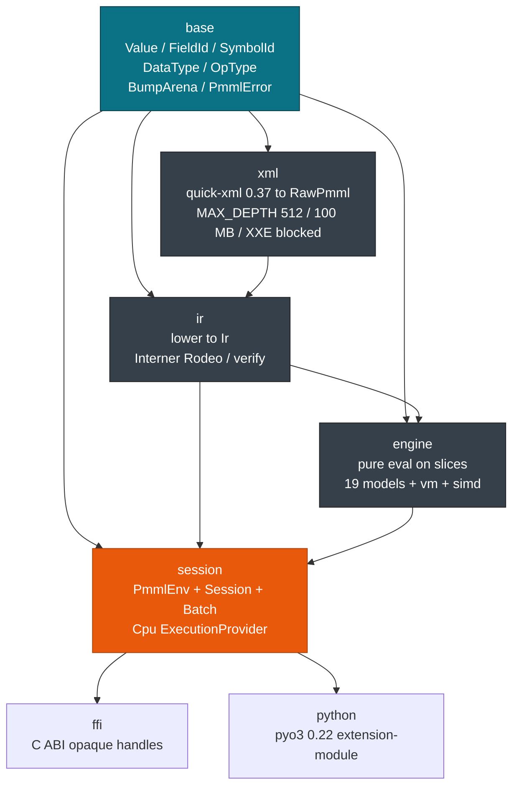
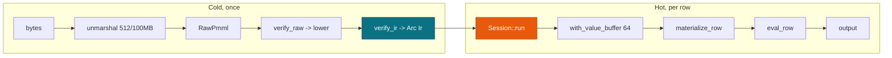
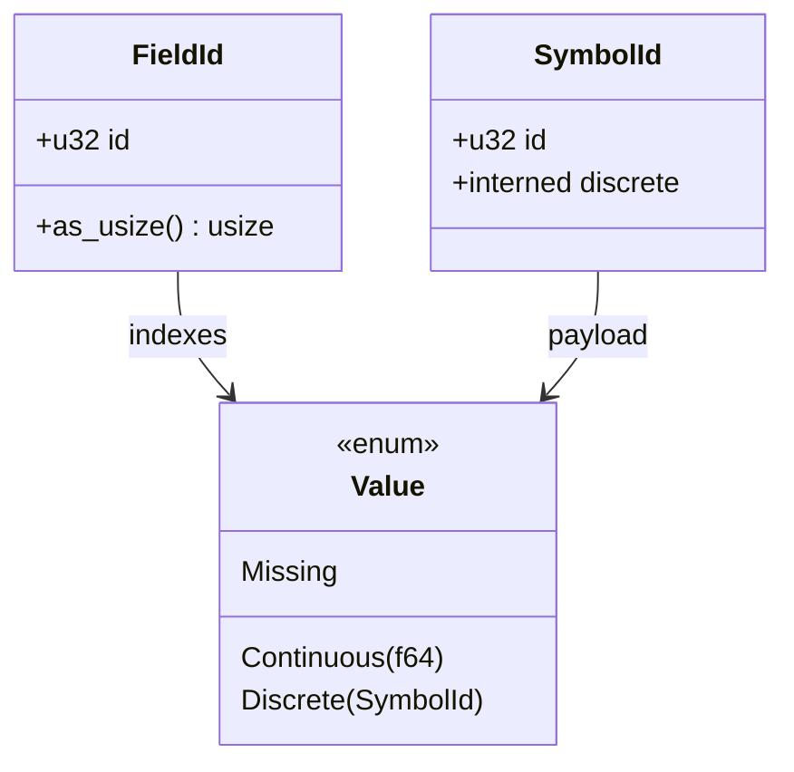

# Architecture Overview

> This guide covers the pmmlruntime crate topology and the cold and hot scoring paths for contributors extending the engine. For session construction, see [Session, Env & Lifecycle](../concepts/session.md). For IR lowering, see [IR & Lowering](./ir.md).

Load `DecisionTreeIris.pmml` once and score thousands of rows. One `HashMap` row costs 402 ns, and a 100k-row `RecordBatch` costs 61 ns per row.

## Concepts

| Concept | Description |
| --- | --- |
| **Crate** | One `pmmlruntime` crate (`resolver=2`, `edition=2021`, `rust-version=1.85`, `Apache-2.0`). |
| **Cold path** | `bytes -> RawPmml -> verify_raw -> lower -> verify_ir -> Arc<Ir>`, once at 68 µs for Iris. |
| **Hot path** | `Session::run` on `&dyn Batch` with `&mut [Value]` indexed by `FieldId`. |
| **Value slice** | Dense `Value[FieldId]`, `Missing` included as a variant, one bounds check per read. |
| **Session** | `Send+Sync` holder of `Arc<Ir>` and `CpuProvider`, shared without `&mut`. |

## Module roles

`crates/pmmlruntime/src/lib.rs:56-62` declares seven modules and `lib.rs:64-66` re-exports the public types, so `cargo add pmmlruntime` pulls a single docs page.

| Module | Responsibility | Depends on |
| --- | --- | --- |
| `base` | `Value`, `FieldId`, `SymbolId`, `DataType`, `OpType`, `PmmlError`, `BumpArena`. No XML, no IR. | nothing |
| `xml` | Hardened `quick-xml 0.37` reader, `unmarshal` to `RawPmml` (304 `pmml.xsd` elements, depth 512, 100 MB cap, DTD ignored). | `base` |
| `ir` | `lower` builds `Ir`; `Rodeo` interns names; `verify_raw` and `verify_ir` guard both ends. | `base`, `xml` |
| `engine` | Pure evaluation on `Value` slices: 19 model evaluators, `vm` bytecode, `simd` fast path. | `base`, `ir` |
| `session` | `PmmlEnv`, `Session`, `Batch`, and the `CpuProvider` that owns sharding. | `base`, `ir`, `engine` |
| `ffi` | C ABI with opaque `PmmlEnv` and `PmmlSession` handles. | `session` |
| `python` | `pyo3 0.22` extension module behind the `python` feature. | `session` |



> **Note:** `python` is feature gated. Both `ffi` and `python` see only `session`.

## Cold and hot paths



| Phase | Work | Measured (i7-12700) | Source |
| --- | --- | --- | --- |
| Cold | unmarshal + verify + lower | 68 µs for Iris, 2.9 KB | `xml/reader.rs:1`, `ir/lower.rs:1` |
| Hot single | `with_value_buffer` + `eval_row` | 402 ns | `session/session.rs:70` |
| Hot 100k columnar | `par_chunks(256)` + `col_map` | 61 ns/row | `session/providers/cpu.rs:1` |

`col_map` avoids a per-row `HashMap`, so columnar batches win at scale. A single row stays on `HashMap` because building an Arrow batch costs more than 1 µs.

```rust
use pmmlruntime::{PmmlEnv, Session, SessionOptions};
use pmmlruntime::session::batch::Batch;
use pmmlruntime::base::Value;
use std::collections::HashMap;

let env = PmmlEnv::new();
let bytes = std::fs::read("bench/pmml/DecisionTreeIris.pmml")?;
let sess = Session::from_bytes(&env, &bytes, SessionOptions::default())?;
let mut input = HashMap::new();
input.insert("Petal.Length".into(), Value::Continuous(1.4));
let out = sess.run(&input as &dyn Batch)?.into_single().unwrap();
assert!(out.contains_key("predictedValue"));
# Ok::<(), Box<dyn std::error::Error>>(())
```

One call crosses from cold to hot. `from_bytes` ran `xml::unmarshal`, `verify_raw`, `lower` with `Rodeo`, and `verify_ir`. `run` reads the published `Arc<Ir>` and never sees XML.

> **Tip:** Keep one `PmmlEnv::new()` per process and one `Session` per PMML file.

## Where the PMML bytes come from

| Setup | Bytes come from | How `Ir` is shared | Fits |
| --- | --- | --- | --- |
| **Bundled** | `include_bytes!` or `std::fs::read` next to the binary | One `Session` per file, held on the stack or in a `OnceLock` | Unit tests, `score_file` runs, single-model services. Loads `DecisionTreeIris.pmml` and prints `predictedValue`. |
| **Shared `PmmlEnv`** | Several PMML files read at startup | `PmmlEnv` once per process, `Session::from_bytes` per file, `Arc<Session>` in the request handler | Multi-model API servers, at 16.5M rows/s on 100k columnar batches. See [Concurrency & Memory](../production/concurrency.md). |
| **Remote fetch** | S3 or HTTP at startup, or on a webhook | Fetch to `Vec<u8>`, call `Session::from_bytes`, swap `ArcSwap<Session>` on reload | Registry-driven deploys and shadow deploys where PMML is not bundled. See [Docker & CI](../deployment/docker.md). |

Bundled bytes match the `lib.rs:17-36` doctest: ship the PMML with the binary, call `from_bytes` once, then score at 402 ns per row with no network.

A shared `PmmlEnv` scales to many models. `session/env.rs:1` holds `OnceLock` caches, and `lasso::Rodeo` runs once per model. Keep one `PmmlEnv` per process and one `Session` per file.

Remote fetch separates the model release from the binary release. `verify_raw` rejects unsupported markup before the swap, so serving threads keep reading a valid `Ir`. Verification costs 68 µs, once.

```rust
use pmmlruntime::{PmmlEnv, Session, SessionOptions};
use std::sync::Arc;
use arc_swap::ArcSwap; // add arc-swap = "1"

let env = PmmlEnv::new();
let initial = Arc::new(Session::from_bytes(&env, &std::fs::read("bench/pmml/DecisionTreeIris.pmml")?, SessionOptions::default())?);
let current: ArcSwap<Session> = ArcSwap::from(initial);
let new_bytes = std::fs::read("bench/pmml/GradientBoosterTest.pmml")?;
let new_sess = Arc::new(Session::from_bytes(&env, &new_bytes, SessionOptions::default())?);
current.store(new_sess);
# Ok::<(), Box<dyn std::error::Error>>(())
```

> **Info:** Start with bundled bytes. Move to a shared `PmmlEnv` when one process serves several models, and to remote fetch when the model changes without a redeploy.

## Leaner modes

`verify_raw` runs on its own when you only need to reject unsupported markup. It checks the depth 512 and 100 MB limits, the DTD and XXE posture, and `ModelComposition` or `CenterFields` without allocating `Ir`, which suits a CI gate.

A `OnceLock<Session>` gives a CLI process one lazily built session with no daemon and no lock.

```rust
use pmmlruntime::{PmmlEnv, Session, SessionOptions};
use once_cell::sync::OnceCell;
use pmmlruntime::session::batch::Batch;
use std::collections::HashMap;
use pmmlruntime::base::Value;

static SESS: OnceCell<Session> = OnceCell::new(); let env = PmmlEnv::new();
let sess = SESS.get_or_try_init(|| Session::from_bytes(&env, &std::fs::read("bench/pmml/DecisionTreeIris.pmml")?, SessionOptions::default()))?;
let out = sess.run(&HashMap::from([("Petal.Width".to_string(), Value::Continuous(0.2))]) as &dyn Batch)?;
# Ok::<(), Box<dyn std::error::Error>>(())
```

For inspection, read `sess.ir` fields such as `field_names`, `model`, and `derived_fields` (see `ir/ir.rs:1`).

> **Warning:** Never mutate the published `Arc<Ir>`. `verify_ir` assumes it stays immutable.

## Value slices and session construction

`FieldId(u32)` is dense `0..n`, so `values[fid.as_usize()]` is one check. `SymbolId` is interned cold through `Rodeo` and read back through a `Vec<String>`. `Value::Missing` lets `JumpIfMissing` propagate absence without an `Option`. See `base/value.rs:1`.



Sizing uses `max_field_id = max(FieldId)+1 max(16)` at `session/session.rs:259` and `needed = max(max_field_id, num_fields+4).max(16)` at `session/session.rs:451`. `STACK_VALUES_THRESHOLD=64` (`session/session.rs:26`) puts 90% of models on a 1 KB stack array, and larger models spill to `THREAD_VALUES`. `run(&self)` needs no `&mut`.

> **Attention:** Never retain `&mut [Value]`. Each `run` re-inits the slice to `Missing`, and the heap buffer never shrinks.

## Next Steps

- [IR & Lowering](./ir.md): `RawPmml -> Interner -> DerivedFieldIr -> ModelIr 19 -> verify_ir`.
- [Engine Dispatch](./engine.md): `MiningSchema -> vm DAG -> Predicate -> Model -> Targets -> Output`.
- [Execution Provider & SIMD](./provider.md): the 256-row threshold and `STACK_VALUES_THRESHOLD`.
- [API Reference](../api.md): `pub mod base/xml/ir/engine/session/ffi/python` and the feature flags.

*Next: [IR & Lowering](./ir.md) → · Previous: [Session, Env & Lifecycle](../concepts/session.md)*
