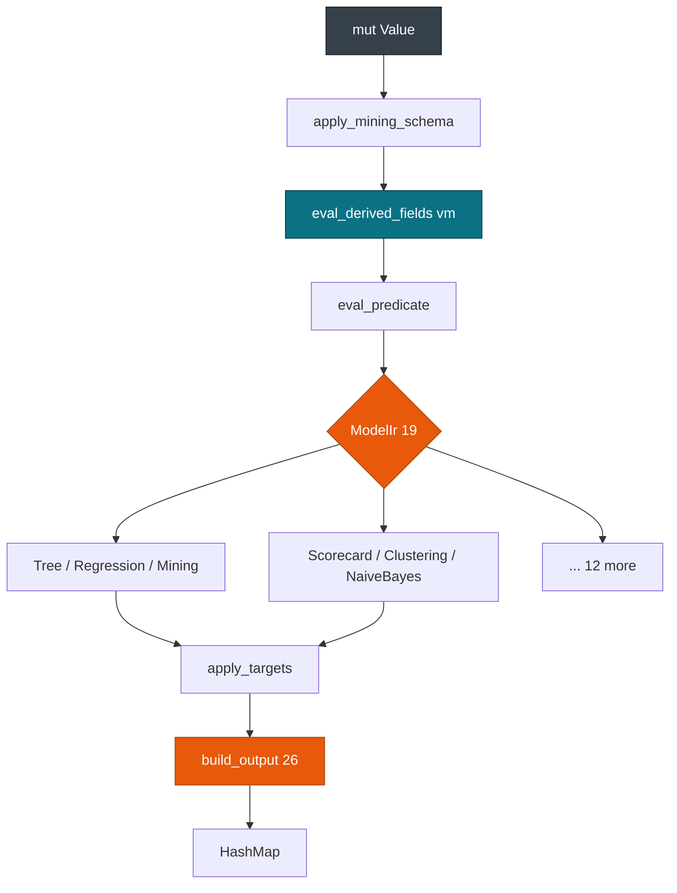

# Engine Dispatch

> This guide covers the pmmlruntime engine evaluation order for contributors debugging model scoring. For IR construction, see [IR & Lowering](./ir.md). For threading and batching, see [Execution Provider & SIMD](./provider.md).

Score `DecisionTreeIris.pmml` in 402 ns with `&mut [Value]` work and no allocation after lowering. One path covers 19 models: `Values -> MiningSchema -> Derived vm -> Predicate -> Model -> Targets -> Output`.

## Concepts

| Concept | Description |
| --- | --- |
| **Values** | `&mut [Value]` indexed by `FieldId`, initialized to `Missing`, sized by `with_value_buffer`. |
| **MiningSchema** | Per-field outlier, invalid, and missing treatments. |
| **Derived vm** | `Vec<DerivedFieldIr>` in topo order, with `bytecode: Vec<Op>` run by `vm`. |
| **Predicate** | `True`, `Simple`, `Set`, or `Compound`, evaluated without allocation. |
| **Model** | Enum dispatch over the 19 `ModelIr` arms, pure on slices. |
| **Targets and Output** | `apply_targets` rescales, then `build_output` maps 26 `ResultFeature` values, 4 of them unsupported. |

## Score any model with the same call

```rust
use pmmlruntime::{PmmlEnv, Session, SessionOptions, Value};
use pmmlruntime::session::batch::Batch;
use std::collections::HashMap;
let env = PmmlEnv::new();
let bytes = std::fs::read("bench/pmml/DecisionTreeIris.pmml")?;
let sess = Session::from_bytes(&env, &bytes, SessionOptions::default())?;
let mut row = HashMap::new();
row.insert("Petal.Length".into(), Value::Continuous(1.4));
let out = sess.run(&row as &dyn Batch)?.into_single().unwrap();
println!("{}", out.get("predictedValue").unwrap());
# Ok::<(), Box<dyn std::error::Error>>(())
```

You built an `Arc<Ir>` in 68 µs and scored in 402 ns. Swap `DecisionTreeIris.pmml` for `GradientBoosterTest.pmml` and the `ModelIr` arm changes while `Session::run` stays identical.

## How it works

Each row reaches `eval_row` in `providers/cpu.rs`. It builds a `&mut [Value]` buffer with `with_value_buffer`, materializes the row into that buffer, then calls the engine in a fixed order. Nothing allocates after `Ir` is published, and the same slice plus the same `BatchCtx` serve every `ModelIr` variant.

## Dispatch pipeline

Derived fields run before the model so they can feed a `Predicate` and the `MiningModel` segments.



| Step | What it does | Source |
| --- | --- | --- |
| `apply_mining_schema` | Rewrites `Missing` per `FieldMeta` | `engine/mining_schema.rs:1` |
| `eval_derived_fields` | Walks the topo-sorted `DerivedFieldIr` list through `vm::eval` | `engine/transform/vm.rs:1` |
| `eval_predicate` | Tests `True`, `Simple`, `Set`, and `Compound` | `engine/predicate.rs:1` |
| `evaluate_model` | Dispatches the `ModelIr` enum, pure on `&[Value]` | `engine/models/mod.rs:1` |
| `apply_targets` | Clamps, then `factor * value + constant`, then casts | `engine/targets.rs:1` |
| `build_output` | Maps the prediction and probabilities into a `HashMap` | `engine/output.rs:1` |

Keep the order. `MiningSchema` runs before derived fields, and `Targets` runs before `Output`.

> **Note:** Unknown fields are ignored, and an out-of-bounds `FieldId` never panics.

## Inputs, outputs, and params

Three groups of metadata decide what a model accepts and what it returns.

| Group | PMML source | Where it lives | What it does |
| --- | --- | --- | --- |
| **Inputs** | `DataField` plus `MiningField` | `mining_schema: MiningSchemaIr` on each `ModelIr` variant | Lists `active_fields` and `target_field`, and rewrites `Missing` before the VM through `missingValueReplacement` and `outlierTreatment` |
| **Outputs** | `Output` and `OutputField` | `output: Vec<OutputFieldIr>` on each variant | Produces `predictedValue`, `probability(label)`, and `transformedValue`; 26 `ResultFeature` values, 4 unsupported |
| **Params** | `Targets` and `Target` | `targets: Vec<TargetIr>` on each variant | Applies `clamp`, then `factor * value + constant`, then the cast; the first target handles `Missing` |

The treatments are folded into `FieldMeta` during lowering, so the engine reads one struct per active field. Inspect the three groups at startup to validate your `HashMap` or `RecordBatch` before the first `run`.

```rust
use pmmlruntime::{PmmlEnv, Session, SessionOptions};
use pmmlruntime::ir::ModelIr;

let env = PmmlEnv::new();
let bytes = std::fs::read("bench/pmml/DecisionTreeIris.pmml")?;
let sess = Session::from_bytes(&env, &bytes, SessionOptions::default())?;

println!("data dictionary: {} fields", sess.ir.data_dictionary.len());
match &sess.ir.model {
    ModelIr::Tree(t) => println!("active {:?} output {} targets {}", t.mining_schema.active_fields, t.output.len(), t.targets.len()),
    ModelIr::Mining(m) => println!("active {:?} segments {}", m.mining_schema.active_fields, m.segmentation.segments.len()),
    ModelIr::Regression(r) => println!("active {:?} tables {}", r.mining_schema.active_fields, r.regression_tables.len()),
    _ => println!("model {:?}", std::mem::discriminant(&sess.ir.model)),
}
# Ok::<(), Box<dyn std::error::Error>>(())
```

> **Attention:** Never reorder `Targets` and `Output`. PMML mandates `Targets` first.

## Type checks per row

Types come from the PMML, not from Rust generics. `DataField/@dataType` and `@opType` land in `FieldMeta` during lowering, and `materialize_row` fills `values[fid]` with the matching `Value` variant. A mismatch turns into `Missing` through `JumpIfMissing` unless `invalidValueTreatment` says otherwise.

| `DataType` | `Value` | Rust type | Example PMML | Scoring |
| --- | --- | --- | --- | --- |
| `double`, `float` | `Continuous(f64)` | `f64` | `<DataField name="x" dataType="double"/>` | `Continuous(1.4)` |
| `integer` | `Continuous(f64)`, then `castInteger` | `f64` cast to `i64` | `<DataField name="count" dataType="integer"/>` | `castInteger="round"` |
| `string` | `Discrete(SymbolId)` | `SymbolId` | `<DataField name="label" dataType="string"/>` | `Discrete(SymbolId(5))` |
| `date`, `dateTime`, `time` | `Continuous(f64)` days | `f64` through `chrono` | `<DataField name="ts" dataType="date"/>` | `dateDaysSinceYear` returns `Continuous` |

Columnar batches follow the same split: a `Float64Array` becomes `Continuous`, a `StringArray` becomes `Discrete`, and a null becomes `Missing`. Behind the `simd` feature, `engine/simd.rs:1` applies `wide::f64x4` to `Regression` batches of 4 rows or more.

```rust
use arrow::array::{Float64Array, StringArray};
use arrow::datatypes::{DataType, Field, Schema};
use arrow::record_batch::RecordBatch;
use std::sync::Arc;
use pmmlruntime::session::batch::Batch;

let schema = Arc::new(Schema::new(vec![
    Field::new("Petal.Length", DataType::Float64, true),
    Field::new("species", DataType::Utf8, true),
]));
let rb = RecordBatch::try_new(schema.clone(), vec![
    Arc::new(Float64Array::from(vec![Some(1.4), None])) as _,
    Arc::new(StringArray::from(vec![Some("setosa"), None])) as _,
])?;
# Ok::<(), Box<dyn std::error::Error>>(())
```

> **Tip:** Keep `RecordBatch` for bulk batches and `HashMap` for single rows. Both reach `sess.run(&batch as &dyn Batch)` and share the `Targets` and `Output` handling.

## VM and builtins

`DerivedFieldIr` bytecode runs through `vm::eval` at `engine/transform/vm.rs:1`. Each `Op` reads the stack or `values[FieldId]`.

| Op | Effect |
| --- | --- |
| `PushField` | Push `values[fid]` |
| `PushConst` | Push a constant |
| `CallBuiltin(n)` | Pop `n` arguments, call `builtin.rs` |
| `JumpIfMissing` | Jump when the top of stack is `Missing` |

The VM assumes a topo-sorted `Vec<Op>`, and `JumpIfMissing` is the only branch that inspects `Missing`.

`builtin.rs` maps more than 80 PMML function names to `BuiltinId` at `engine/transform/builtin.rs:1`, drawing on `statrs`, `libm`, and `chrono`:

```rust
// sketch at engine/transform/builtin.rs
match id {
    BuiltinId::Exp => Value::Continuous(libm::exp(x)),
    BuiltinId::Uppercase => discrete_uppercase(sid),
    BuiltinId::IsMissing => Value::Continuous(if v.is_missing() { 1.0 } else { 0.0 }),
    _ => Value::Missing,
}
```

## Patterns in the fixtures

Two shapes cover most of the 52 fixtures in `bench/pmml/`.

| Pattern | Inputs | Model | Params (Targets) | Outputs | Fixture |
| --- | --- | --- | --- | --- | --- |
| **Iris** | `Petal.Length double`, `Petal.Width double` | `TreeIr` | none | `predictedValue`, `probability(setosa)` | `DecisionTreeIris.pmml`, 402 ns |
| **Scorecard** | `double` inputs plus categoricals | `ScorecardIr` | `factor`, `constant` | `predictedValue`, `reasonCode` | `ComplexPartialScoreTest.pmml` |

```rust
use pmmlruntime::{PmmlEnv, Session, SessionOptions, Value};
use pmmlruntime::session::batch::Batch;
use std::collections::HashMap;

let env = PmmlEnv::new();
let bytes = std::fs::read("bench/pmml/DecisionTreeIris.pmml")?;
let sess = Session::from_bytes(&env, &bytes, SessionOptions::default())?;
let mut row = HashMap::new();
row.insert("Petal.Length".into(), Value::Continuous(1.4));
let out = sess.run(&row as &dyn Batch)?.into_single().unwrap();
assert!(out.contains_key("probability(setosa)"));
# Ok::<(), Box<dyn std::error::Error>>(())
```

A scorecard fixture uses the same call with a different `MiningSchema` and `Output`; `ComplexPartialScoreTest.pmml` and `CharacteristicReasonCodeTest.pmml` cover the reason-code path.

## Model dispatch and output

`evaluate_model` matches the `ModelIr` enum at `engine/models/mod.rs:1`. A tree walks a flat `Vec<NodeIr>` with the root at index 0, a regression accumulates `coefficient * value^exponent` per table, and a mining model combines segments by `sum`, `average`, `majorityVote`, or `modelChain`.

`Targets` runs after scoring. The first `TargetIr` handles `Missing`; a `Continuous` value goes through `clamp`, then `factor * value + constant`, then the cast. See `engine/targets.rs:1`.

`Output` builds the `HashMap` that carries `predictedValue`. All 26 `ResultFeature` values map to a key, and the 4 unsupported ones (`standardError`, `standardDeviation`, `confidenceIntervalLower`, `confidenceIntervalUpper`) resolve to `Missing` unless strict mode returns `UnsupportedMarkup`. See `engine/output.rs:1`.

## Next Steps

- [IR & Lowering](./ir.md): how `DerivedFieldIr` `Vec<Op>` and `ModelIr` are produced.
- [Execution Provider & SIMD](./provider.md): `CpuProvider` `eval_row` against `eval_batch`, and the buffers.
- [Architecture Overview](./architecture.md): the crate DAG and the cold and hot flows.
- [API Reference](../api.md): the public `engine` surface and the feature flags.

*Next: [Execution Provider & SIMD](./provider.md) → · Previous: [IR & Lowering](./ir.md)*
