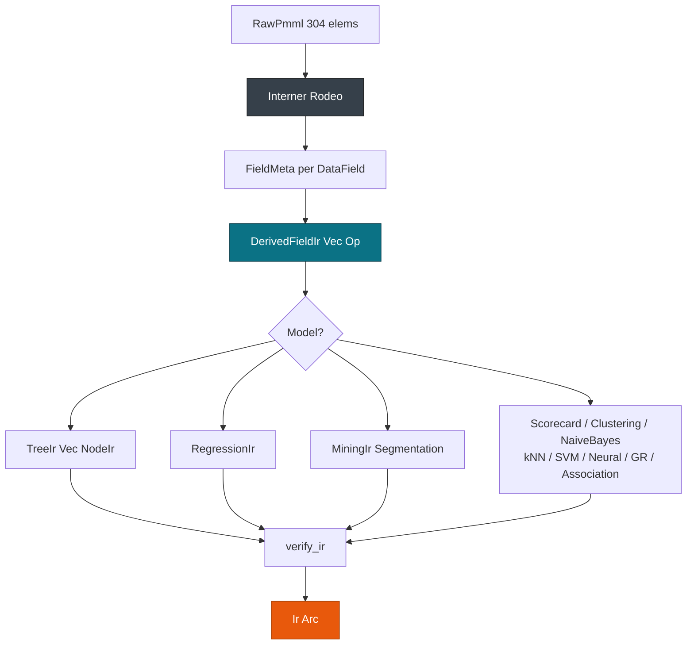

# IR & Lowering

> This guide covers the pmmlruntime intermediate representation and the lowering pipeline for contributors adding models or builtins. For the crate map, see [Architecture Overview](./architecture.md). For engine evaluation, see [Engine Dispatch](./engine.md).

Lower `DecisionTreeIris.pmml` from 304 XML strings into a flat `Ir` that scores in 402 ns. The same pass handles `GradientBoosterTest.pmml`. The pipeline runs `RawPmml -> Interner -> FieldMeta -> DerivedFieldIr -> ModelIr -> verify_ir`.

## Concepts

| Concept | Description |
| --- | --- |
| **RawPmml** | Owned `String`/`Vec` from `xml::unmarshal`, 304 `pmml.xsd` elements. Dropped after `lower`. |
| **Interner** | Cold `lasso::Rodeo` that assigns dense `FieldId` and `SymbolId` once. |
| **FieldMeta** | One `DataField` merged with its `MiningField` treatments. |
| **DerivedFieldIr** | `field_id`, `name`, `data_type`, `op_type`, and `bytecode: Vec<Op>`, evaluated in topo order by `engine::transform::vm`. |
| **ModelIr** | Enum with 19 variants produced by `lower`. |
| **verify_ir** | Invariant checks that run after lowering. |

## Lowering pipeline

Lowering runs inside `Session::from_bytes` after `xml::unmarshal`. `verify_raw` rejects `ModelComposition` and `CenterFields`, `lower` consumes `RawPmml` and returns `Ir`, and `verify_ir` checks density and DAG order. See `crates/pmmlruntime/src/ir/lower.rs:1` and `crates/pmmlruntime/src/ir/verify.rs:1`.

`RawPmml` keeps XML strings so the `quick-xml 0.37` hardening (depth 512, 100 MB cap, DTD ignored) stays cheap. Lowering interns names through `get_or_intern_field`, which is what makes `values[FieldId]` work on the hot path.



| Stage | Action | File |
| --- | --- | --- |
| `verify_raw` | Reject unsupported markup | `ir/verify.rs:10` |
| `intern` | `Rodeo` assigns dense `FieldId` and `SymbolId` | `ir/intern.rs:1` |
| `lower fields` | Merge `DataDictionary` and `MiningSchema` | `ir/ir.rs:80` |
| `lower derived` | `Apply` to `Vec<Op>`, then topo sort | `ir/lower.rs:120` |
| `lower model` | 19 arms, flat node vectors | `ir/ir.rs:200` |
| `verify_ir` | Density and DAG checks | `ir/verify.rs:60` |

The order matters. Interning runs before derived lowering because `PushField` needs an id, and the topo sort runs before `verify_ir` because the VM assumes a sorted DAG.

> **Note:** `RawPmml` is cold only and never reaches `engine`.

## What `Ir` carries

`Ir` keeps only what scoring needs, which is why `RawPmml` can be dropped right after `lower`.

| `Ir` field | Captures | Read by |
| --- | --- | --- |
| `data_dictionary` | Every `DataField` as `FieldMeta`, with `DataType`, `OpType`, and treatments folded in | `with_value_buffer` sizing, `apply_mining_schema` |
| `field_names` | `FieldId` to `String` snapshot taken at lowering time | `Session::field_id`, diagnostics |
| `symbol_names` | `SymbolId` to `String` snapshot for categories and scores | `build_output` when it prints a `Discrete` result |
| `derived_fields` | Topo-sorted `DerivedFieldIr` bytecode | `eval_derived_fields` on the hot path |
| `model` | One `ModelIr` variant with its `mining_schema`, `targets`, and `output` | `evaluate_model`, `apply_targets`, `build_output` |
| `extensions` | Vendor `Extension` payloads, stored but not evaluated | audit only |
| `element_coverage` | `pmml.xsd` element count addressed by lowering, 304 of 304 | audit only |

```rust
use pmmlruntime::{PmmlEnv, Session, SessionOptions};
use pmmlruntime::ir::ModelIr;

let env = PmmlEnv::new();
let bytes = std::fs::read("bench/pmml/DecisionTreeIris.pmml")?;
let sess = Session::from_bytes(&env, &bytes, SessionOptions::default())?;

println!("data dictionary: {} fields", sess.ir.data_dictionary.len());
println!("derived: {} total: {}", sess.ir.derived_fields.len(), sess.ir.num_fields());
match &sess.ir.model {
    ModelIr::Tree(t) => println!(
        "active {:?} target {:?} output {} targets {}",
        t.mining_schema.active_fields, t.mining_schema.target_field, t.output.len(), t.targets.len()
    ),
    ModelIr::Regression(r) => println!("tables {}", r.regression_tables.len()),
    _ => println!("model {:?}", std::mem::discriminant(&sess.ir.model)),
}
# Ok::<(), Box<dyn std::error::Error>>(())
```

## Interning with Rodeo

`Rodeo` runs only on the cold path. `get_or_intern` returns ids starting at 0, so `values[fid.as_usize()]` is one bounds check and `symbol_names_vec[sid]` reads a symbol back without hashing. Once `Ir` is built, `Rodeo` is dropped and the two `HashMap` snapshots remain. See `ir/intern.rs:1`.

```rust
use lasso::Rodeo;
let mut rodeo = Rodeo::default();
let fid = rodeo.get_or_intern("Petal.Length");
let sid = rodeo.get_or_intern("setosa");
```

> **Note:** `Rodeo` is cold only. To add a field, re-lower the PMML instead of patching an id.

## Adding fields and symbols

| Task | Change | What catches a mistake |
| --- | --- | --- |
| Add a continuous field | Add `<DataField name="extra" dataType="double" optype="continuous"/>` and reference it from `MiningSchema` | `verify_ir` rejects an `active_fields` entry with no matching `field_names` entry |
| Add a category | Add `<Value value="new_label"/>` inside the `DataField` | The next `lower` interns it; an unknown string still becomes `Missing` at scoring time |
| Add a derived field | Add `<DerivedField name="ratio">` under `TransformationDictionary` or `LocalTransformations` | `lower` builds the `Vec<Op>`, topo sorts it, and `verify_ir` checks the DAG |
| Pin a type | Nothing, `FieldMeta` records `DataType` and `OpType` at `lower` time | A mismatch turns into `Missing` through the `invalidValueTreatment` rule |

The derived-field path has a dedicated fixture:

```rust
use pmmlruntime::{PmmlEnv, Session, SessionOptions};

let env = PmmlEnv::new();
let bytes = std::fs::read("bench/pmml/TransformationDictionaryTest.pmml")?;
let sess = Session::from_bytes(&env, &bytes, SessionOptions::default())?;
println!("derived fields: {}", sess.ir.derived_fields.len());
# Ok::<(), Box<dyn std::error::Error>>(())
```

> **Attention:** Never hand-edit `Ir.field_names` to inject a field id. Re-parse and re-lower; `verify_ir` catches the gap.

## Invariants `verify_ir` enforces

- Every `FieldId` in `mining_schema.active_fields`, `target_field`, or a `DerivedFieldIr` appears in `Ir.field_names`.
- `symbol_names` and `symbol_names_vec` agree, with the vector dense up to `max_id + 1`.
- The `DerivedFieldIr` DAG is topo sorted and free of cycles.
- `Value::Missing` is explicit, and `Op::JumpIfMissing` is the only branch on it.
- `UnsupportedMarkup` is reported only for `ModelComposition` and `CenterFields`.
- `max_field_id` matches the `Session` sizing, and an out-of-bounds `FieldId` never panics. See `ir/verify.rs:1`.

> **Attention:** Break these and `cargo test --test hardening` plus `cargo fuzz` will fail. Extend the tests when you add a `ModelIr` variant.

## Extension points

A model, a builtin, or an output feature slots in without touching the hot buffers.


- New `BuiltinId`: add the variant to `ir::BuiltinId`, map the PMML name in `engine::transform::builtin.rs`, and dispatch in `eval_builtin` with `statrs`, `libm`, or `chrono`.
- New `ResultFeature`: extend `base::ResultFeature::FromStr`, then match it in `engine/output.rs`.
- New model: add the `ModelIr` arm in `engine/models/mod.rs` and the provider dispatch in `providers/cpu.rs:eval_row`.

```rust
// builtin dispatch sketch at engine/transform/builtin.rs
match builtin {
    BuiltinId::Exp => libm::exp(x),
    BuiltinId::NormContinuous => norm_continuous(x, orig, norm),
    _ => Value::Missing,
}
```

Add the variant on the cold path and the arm on the hot path. Keeping `Op::CallBuiltin` means `vm.rs` needs no change.

## Next Steps

- [Architecture Overview](./architecture.md): the crate DAG `base -> xml -> ir -> engine -> session`.
- [Engine Dispatch](./engine.md): `vm DAG -> Predicate -> Model 19 -> Targets -> Output`.
- [Execution Provider & SIMD](./provider.md): `with_value_buffer` and the 256-row threshold.
- [API Reference](../api.md): `pub mod base/xml/ir/engine/session/ffi/python`.

*Next: [Engine Dispatch](./engine.md) → · Previous: [Architecture Overview](./architecture.md)*
