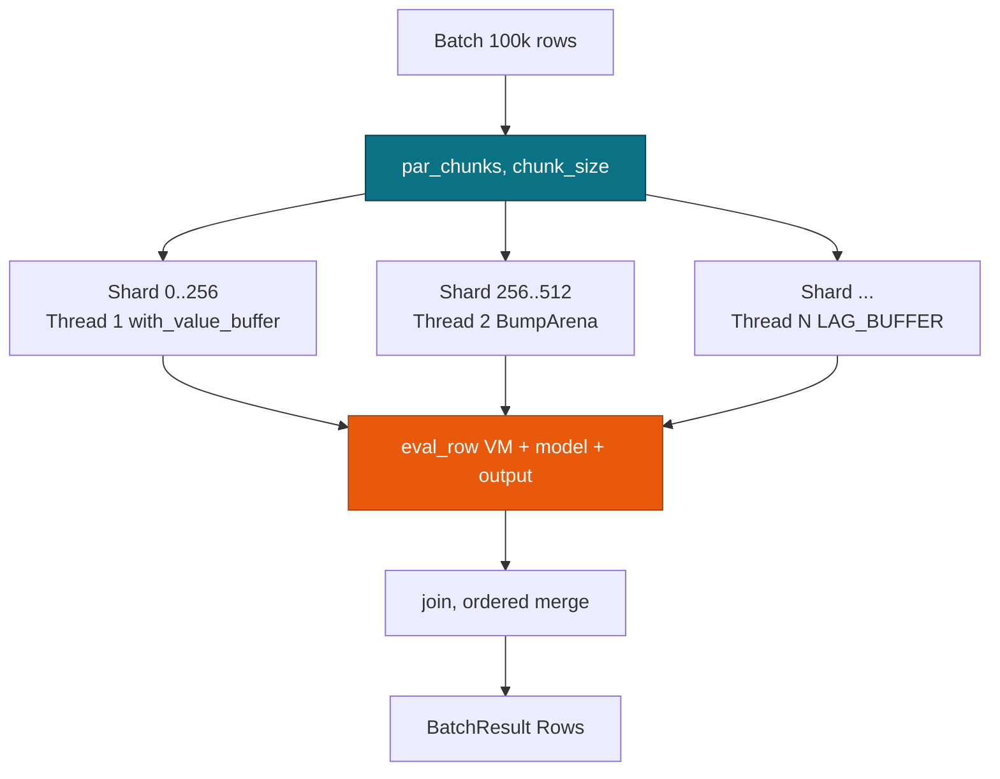
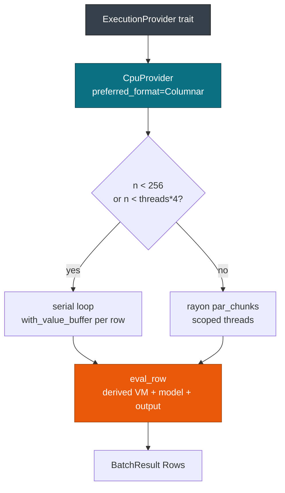
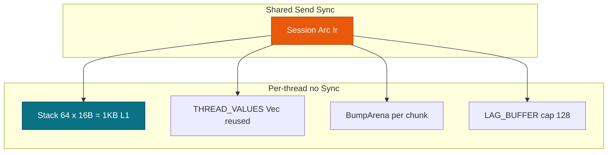

# Execution Provider & SIMD

> This guide covers the pmmlruntime execution provider and memory strategy for batch scoring. For engine dispatch, see [Engine Dispatch](./engine.md). For IR, see [IR & Lowering](./ir.md).

Score one row in 402 ns and 100k rows at 61 ns per row on the same `Session`. `CpuProvider` picks serial or `rayon` at 256 rows and reuses thread-local buffers. The threshold logic and `STACK_VALUES_THRESHOLD=64` both live in this part of the crate.

## Concepts

| Concept | Description |
| --- | --- |
| **ExecutionProvider** | Trait with `name`, `preferred_format`, `eval_row`, and `eval_batch`. One implementation ships today. |
| **CpuProvider** | Unified `providers/cpu.rs`, which runs serially or through `rayon::par_chunks`. |
| **with_value_buffer** | Hands out a `&mut [Value]` sized `needed`, from a stack array of 64 or a thread-local `Vec`. |
| **STACK_VALUES_THRESHOLD** | 64 slots at 16 bytes each, a 1 KB frame that covers 90% of fixtures. |
| **Batch sharding** | Below 256 rows, or below `threads * 4`, the batch runs on the caller thread. |

## How it works

`ExecutionProvider` at `crates/pmmlruntime/src/session/providers/mod.rs:1` declares the four methods. `CpuProvider` at `crates/pmmlruntime/src/session/providers/cpu.rs:1` implements them with an `OnceLock<HashMap>` of cached lookups.

```rust
use pmmlruntime::{PmmlEnv, Session, SessionOptions, Value};
use pmmlruntime::session::batch::Batch;
use std::collections::HashMap;

let env = PmmlEnv::new();
let bytes = std::fs::read("bench/pmml/DecisionTreeIris.pmml")?;
let sess = Session::from_bytes(&env, &bytes, SessionOptions::default())?;

let mut input = HashMap::new();
input.insert("Petal.Length".into(), Value::Continuous(1.4));
let out = sess.run(&input as &dyn Batch)?.into_single().unwrap();
println!("{:?}", out.get("predictedValue"));

// The same session shards a 100k-row batch without a second call shape
// let batch: Vec<HashMap<String, Value>> = vec![input; 100_000];
// let rows = sess.run(&batch as &dyn Batch)?.into_rows();
# Ok::<(), Box<dyn std::error::Error>>(())
```

One `run` drove `eval_row` for the single row and `eval_batch` for the large batch. The provider chose the serial path first and `par_chunks(256)` second. See `session/session.rs:70` and `providers/cpu.rs:80`.

> **Tip:** `rayon` uses the global pool today. A pool scoped to one `PmmlEnv` is not wired yet.

## Execution paths

Nine model families share one provider. The family decides the evaluator; the batch size decides the strategy.

| Model family | `ModelIr` variant | Batch strategy |
| --- | --- | --- |
| Tree | `TreeIr`, flat `Vec<NodeIr>` with the root at index 0 | serial below 256 rows, `par_chunks(256)` above |
| Regression | `RegressionIr`, one `RegressionTableIr` per target category | `simd` `f64x4` for a columnar batch of 4 rows or more |
| Mining ensemble | `MiningIr` with `sum`, `average`, `majorityVote`, or `modelChain` | shard per segment, then per row |
| Scorecard | `ScorecardIr` | serial below 256 rows |
| Clustering | `ClusteringIr` | columnar through `col_map` |
| NaiveBayes | `NaiveBayesIr` | serial |
| kNN | `NearestNeighborIr` | parallel distance search |
| SVM | `SupportVectorMachineIr` | serial kernel evaluation |
| Neural | `NeuralNetworkIr` | serial layers through `libm` |

`providers/cpu.rs:eval_row` dispatches on the `ModelIr` enum, so a new family slots in without touching the sharding logic. Tree evaluation stays branchless, Regression uses `wide::f64x4` when the feature is on, and Mining shards per segment.

> **Note:** `preferred_format` returns `Columnar` for every family today. A row-major `HashMap` batch still works, but it pays for a hash lookup per field per row instead of reading a column. Adding a family means a new `ModelIr` arm in `ir/ir.rs` and a handler in `engine/models/mod.rs`.

## How rayon shards a batch

| Concern | Behaviour |
| --- | --- |
| Threshold | `n < 256` or `n < num_threads * 4` runs serially; otherwise `par_chunks(chunk_size)` with `chunk_size = 256.max(n / num_threads)` |
| Spawn cost | Around 100 µs, against roughly `400 ns × 256` rows of work, which is why small batches stay serial |
| Pool | The global `rayon` pool sized by `rayon::current_num_threads()`. `RAYON_NUM_THREADS` caps it |
| Per-shard state | `&mut [Value]` from `with_value_buffer`, one `BumpArena` per chunk, and a thread-local `LAG_BUFFER` capped at 128 |
| Merge | `BatchResult::Rows(Vec<HashMap<String, Value>>)` keeps input order after the join |



Each shard owns its `&mut [Value]`, its `BumpArena`, and its `LAG_BUFFER`. `Arc<Ir>` is `Send + Sync`, and no shard needs `&mut Session`.

```rust
use pmmlruntime::{PmmlEnv, Session, SessionOptions};
use pmmlruntime::session::batch::Batch;
use arrow::array::Float64Array;
use arrow::datatypes::{DataType, Field, Schema};
use arrow::record_batch::RecordBatch;
use std::sync::Arc;

let env = PmmlEnv::new();
let sess = Session::from_bytes(&env, &std::fs::read("bench/pmml/DecisionTreeIris.pmml")?, SessionOptions::default())?;

let schema = Arc::new(Schema::new(vec![Field::new("Petal.Length", DataType::Float64, true)]));
let rb = RecordBatch::try_new(schema, vec![Arc::new(Float64Array::from(vec![1.4; 100_000])) as _])?;
let rows = sess.run(&rb as &dyn Batch)?.into_rows();
assert_eq!(rows.len(), 100_000);
# Ok::<(), Box<dyn std::error::Error>>(())
```

You scored 100k columnar rows without touching `engine`. The threshold sits in `providers/cpu.rs:82`, and `chunk_size` is computed at `providers/cpu.rs:178`.

> **Attention:** Do not set `RAYON_NUM_THREADS=1` in production to force serial batches. Leave the pool at `current_num_threads()` and let the 256-row threshold decide.

## Unified CPU sharding



| Path | When it runs | Cost | Code |
| --- | --- | --- | --- |
| Serial | `n < 256` or `n < threads * 4` | 402 ns for one row | `providers/cpu.rs:60` |
| Parallel | 256 rows or more | 61 ns/row on 100k columnar rows | `providers/cpu.rs:90` |

`eval_batch` returns an empty `Rows` vector for an empty batch. Otherwise it computes `needed = max(max_field_id, num_fields+4).max(16)` once and shares `Arc<Ir>` across shards. Merging `cpu_serial.rs` and `cpu_batched.rs` into `providers/cpu.rs` left one provider with one threshold.

## Concurrency and memory

`Session` is `Send + Sync` because `Ir` is an immutable `Arc`. `run(&self)` never takes `&mut`, and each thread materializes its own `Value` slice.



`with_value_buffer` at `session/session.rs:64` picks the path: a 1 KB stack array with no `RefCell` borrow, or a `thread_local! THREAD_VALUES: RefCell<Vec<Value>>` at `session/session.rs:20` that grows and never shrinks. `BumpArena` at `base/arena.rs:1` is `Send` and moves into each chunk. `LAG_BUFFER` stays thread-local.

Why 64? Iris needs 3 slots, Diabetes 8, and Shopping 22. A 64-slot array leaves 42 slots of headroom, keeps `max_field_id` under 32 for 90% of `bench/pmml`, and saves about 30 ns against a `RefCell` borrow. Larger models spill to the heap buffer instead of allocating a `Vec` per row, which saves more than 1 µs on those fixtures.

> **Attention:** `THREAD_VALUES` never shrinks. Do not clear it between `run` calls.

## Performance profile

Targets against measured `release` numbers on an i7-12700:

| Path | Target | Measured | Technique |
| --- | --- | --- | --- |
| Cold `from_bytes`, Iris 2.9 KB | 80 µs or less | 68 µs | `quick-xml`, `lower`, `verify` |
| Single `run` | 800 ns or less | 402 ns | stack `Value[64]`, branchless tree |
| Batch 1k row-major | 350 µs or less | 336 µs | serial loop |
| Batch 1k columnar | 250 µs or less | 249 µs | `col_map`, no `HashMap` |
| Batch 100k columnar | 61 ns/row | 61 ns/row, 16.5M rows/s | `par_chunks(256)` plus thread-local buffers |

`STACK_VALUES_THRESHOLD=64` keeps 1 KB on the caller frame. Without the stack path, a single row costs about 1.2 µs instead of 402 ns. Arrow wins at 100k rows because it reuses one `col_map`; `HashMap` wins for a single row because building an Arrow batch costs more than 1 µs.

> **Tip:** Keep `RecordBatch` for bulk and `HashMap` for single rows. Both reach `sess.run(&batch as &dyn Batch)`.

## Next Steps

- [Architecture Overview](./architecture.md): the crate DAG and the cold and hot flows.
- [IR & Lowering](./ir.md): the `Rodeo` ids and `Vec<Op>` bytecode that the provider evaluates.
- [Engine Dispatch](./engine.md): `Values -> MiningSchema -> vm -> Predicate -> Model`.
- [API Reference](../api.md): `Session::from_bytes`, `Batch`, and the feature flags.

*Next: [API Reference](../api.md) → · Previous: [Engine Dispatch](./engine.md)*
