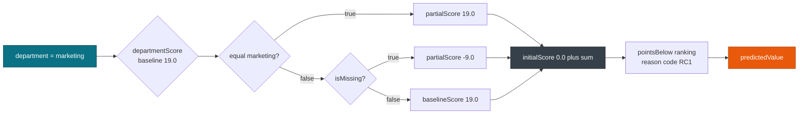
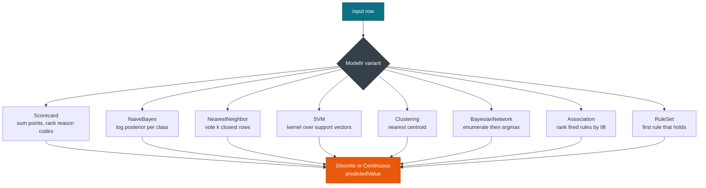

# Classification & clustering

> This guide covers **Scorecard**, **NaiveBayesModel**, **NearestNeighborModel**, **SupportVectorMachineModel**, **ClusteringModel**, **BayesianNetworkModel**, **AssociationModel**, and **RuleSetModel** scoring. For the element matrix, see [Overview](./overview.md).

Eight element types reach the same `run` call: risk tables, Bayes posteriors, neighbor votes, margins, centroids, belief nets, itemsets, and ordered rules. Each one is a variant of **ModelIr**, so the session API stays the same while the decision rule changes.

## Concepts

| Element | IR type | What decides the output |
| --- | --- | --- |
| `Scorecard` | `ScorecardIr` | Sum of `initialScore` and the first matching `partialScore` per characteristic, plus reason code ranking. |
| `NaiveBayesModel` | `NaiveBayesIr` | Log posterior per class from `PairCounts` and `TargetValueStats`, suppressed below `threshold`. |
| `NearestNeighborModel` | `NearestNeighborIr` | Vote or average over the `number_of_neighbors` closest `instances`. |
| `SupportVectorMachineModel` | `SupportVectorMachineIr` | Kernel dot product over `support_vectors` weighted by `coefficients`. |
| `ClusteringModel` | `ClusteringIr` | Nearest `clusters` entry under `comparison_measure`, such as squared Euclidean. |
| `BayesianNetworkModel` | `BayesianNetworkIr` | Posterior argmax over the enumerable assignments of `nodes`. |
| `AssociationModel` | `AssociationIr` | Fired `rules` ranked by lift, exposed through `entityId` and `confidence`. |
| `RuleSetModel` | `RuleSetIr` | First `rules` entry whose predicate holds, falling back to `default_score`. |

## Scorecard

`Scorecard` sums points. Each `Characteristic` has a baseline score, and each `Attribute` inside it contributes a `partialScore` when its predicate holds. `useReasonCodes` adds the ranking that explains the score, and `reasonCodeAlgorithm` picks `pointsAbove` or `pointsBelow`.

```xml
<Scorecard initialScore="0.0" useReasonCodes="true" reasonCodeAlgorithm="pointsBelow">
  <Characteristics>
    <Characteristic name="departmentScore" reasonCode="RC1" baselineScore="19.0">
      <Attribute partialScore="-9.0"><SimplePredicate field="department" operator="isMissing"/></Attribute>
      <Attribute partialScore="19.0"><SimplePredicate field="department" operator="equal" value="marketing"/></Attribute>
      <Attribute partialScore="3.0"><SimplePredicate field="department" operator="equal" value="engineering"/></Attribute>
    </Characteristic>
  </Characteristics>
</Scorecard>
```

```rust
use pmmlruntime::{PmmlEnv, Session, SessionOptions};
use pmmlruntime::session::batch::Batch;
use pmmlruntime::Value;
use std::collections::HashMap;
let env = PmmlEnv::new();
let bytes = std::fs::read("bench/pmml/ComplexPartialScoreTest.pmml")?;
let sess = Session::from_bytes(&env, &bytes, SessionOptions::default())?;
let mut input = HashMap::new();
input.insert("department".into(), Value::Discrete(sess.symbol_id("marketing").unwrap()));
let out = sess.run(&input as &dyn Batch)?.into_single().unwrap();
```

`ComplexPartialScoreTest.pmml` carries two characteristics, `departmentScore` (RC1, baseline 19.0) and `ageScore` (RC2, baseline 18.0), plus `initialScore` 0.0 and `pointsBelow` ranking.



## Naive Bayes

`NaiveBayesModel` multiplies per class likelihoods. Discrete inputs use `PairCounts`; continuous inputs use `TargetValueStats`. When the best posterior falls below `threshold`, the model returns `Missing`.

```xml
<NaiveBayesModel threshold="0.0" functionName="classification">
  <BayesInputs>
    <BayesInput fieldName="x1"><TargetValueStats>
      <TargetValueStat value="0"/><TargetValueStat value="1"/>
    </TargetValueStats></BayesInput>
    <BayesInput fieldName="x2"><PairCounts><TargetValueCounts>
      <TargetValueCount value="0" count="1"/><TargetValueCount value="1" count="10"/>
    </TargetValueCounts></PairCounts></BayesInput>
  </BayesInputs>
  <BayesOutput><TargetValueCounts>
    <TargetValueCount value="0"/><TargetValueCount value="1"/>
  </TargetValueCounts></BayesOutput>
</NaiveBayesModel>
```

That is `BayesInputTest.pmml`, where `x1` is continuous, `x2` is categorical, and the target `y` takes the values 0 and 1. Exporting a `GaussianNB` model through `sklearn2pmml` produces the same element:

```python
from sklearn.naive_bayes import GaussianNB
from sklearn.datasets import load_iris
from sklearn2pmml.pipeline import PMMLPipeline
from sklearn2pmml import sklearn2pmml
iris = load_iris()
pipeline = PMMLPipeline([("classifier", GaussianNB())])
pipeline.fit(iris.data[:, 2:4], iris.target)
sklearn2pmml(pipeline, "BayesInputTest.pmml", with_repr=True)
```

## Nearest neighbors

`NearestNeighborModel` compares the input against the `instances` table, keeps the closest `number_of_neighbors` rows under `comparison_measure`, and votes or averages. `instance_ids` keeps the row identity. The tests use `MixedNeighborhoodTest.pmml`, `TieBreakTest.pmml`, and `ClusteringNeighborhoodTest.pmml` for mixed value types, ties, and neighborhood aggregation.

## Support vector machines

`SupportVectorMachineModel` builds a dense input from `vector_fields`, looks each support vector up in `vector_instances`, and applies the kernel. `VectorInstanceTest.pmml` is an XOR model with `RadialBasisKernelType` at `gamma="1.0"`, four vectors (`mv0` to `mv3`), and coefficients `-1.0`, `1.0`, `1.0`, `-1.0`.

```xml
<SupportVectorMachineModel functionName="regression" svmRepresentation="SupportVectors">
  <RadialBasisKernelType gamma="1.0"/>
  <VectorDictionary numberOfVectors="4">
    <VectorFields><FieldRef field="x1"/><FieldRef field="x2"/></VectorFields>
    <VectorInstance id="mv0"><REAL-SparseArray n="2"/></VectorInstance>
  </VectorDictionary>
  <SupportVector vectorId="mv0"/><Coefficients><Coefficient value="-1.0"/></Coefficients>
</SupportVectorMachineModel>
```

A radial basis `SVC` exported with `sklearn2pmml` produces the same element, and `AlternateBinaryTargetCategoryTest.pmml` covers the classification path where two target categories map to one decision.

## Clustering

`ClusteringModel` assigns the input to the closest entry in `clusters`. `model_class` distinguishes `centerBased` from `distributionBased`, `comparison_measure` selects the distance, and the result is the cluster name as `Discrete`. `RankingTest.pmml` exercises the ranking output that accompanies the assignment.

## Bayesian networks

`BayesianNetworkModel` builds evidence from the `MiningSchema`, re-evaluates the parent `DerivedField` expressions, and enumerates the unobserved nodes. The engine stops enumerating past 1,000,000 combinations and returns `Missing`, so keep the unobserved set small. `is_scorable` on the IR reflects the `isScorable` attribute.

## Association rules and rule sets

`AssociationModel` fires the rules whose antecedent itemset contains the input item, then ranks them. `AssociationOutputTest.pmml` declares 5 transactions, 6 items, 6 itemsets, and 5 rules with `minimumSupport="0.6"` and `minimumConfidence="0.5"`, and it outputs `entityId`, `antecedent`, `consequent`, `support`, `confidence`, and `lift`.

`RuleSetModel` evaluates simple rules in document order and returns the first `score` that fires. `SimpleRuleTest.pmml` uses `defaultScore="drugY"` over the field set `BP`, `K`, `Age`, `Na`, and `Cholesterol`; `CompoundRuleTest.pmml` covers nested `And`, `Or`, and `Xor` predicates.



## Session options for these elements

| Field | Default | Change it when | Effect |
| --- | --- | --- | --- |
| `verify_raw` | `true` | You score untrusted PMML | Rejects `ModelComposition` before lowering |
| `verify_ir` | `true` | Never | Rejects unsupported attribute combinations |
| `max_xml_size` | `100 MB` | A k-NN `InlineTable` or association model grows past the cap | Returns `XmlSize` above the limit |
| `max_depth` | `512` | You want a tighter limit | Returns a depth error |
| `thread_values_capacity` | `64` | The model adds many derived fields | Sets the thread local value buffer |

> **Attention:** `BayesianNetworkModel` is the only element in this group whose cost grows with the input. Cap the unobserved node count, or the engine returns `Missing` once enumeration passes 1,000,000 combinations.

## Tuning before export

```python
from sklearn.naive_bayes import GaussianNB
from sklearn.datasets import load_iris
from sklearn.model_selection import GridSearchCV
from sklearn2pmml.pipeline import PMMLPipeline
from sklearn2pmml import sklearn2pmml
iris = load_iris()
pipeline = PMMLPipeline([("classifier", GaussianNB())])
param_grid = {"classifier__var_smoothing": [1e-9, 1e-8]}
grid = GridSearchCV(pipeline, param_grid, cv=3)
grid.fit(iris.data[:, 2:4], iris.target)
sklearn2pmml(grid.best_estimator_, "Bayes_best.pmml", with_repr=True)
```

```python
import optuna
from sklearn.neighbors import KNeighborsClassifier
from sklearn.datasets import load_iris
from sklearn.model_selection import cross_val_score
from sklearn2pmml.pipeline import PMMLPipeline
from sklearn2pmml import sklearn2pmml
iris = load_iris()
def objective(trial):
    k = trial.suggest_int("n_neighbors", 1, 10)
    pipe = PMMLPipeline([("classifier", KNeighborsClassifier(n_neighbors=k))])
    return cross_val_score(pipe, iris.data[:, 2:4], iris.target, cv=3).mean()
study = optuna.create_study(direction="maximize")
study.optimize(objective, n_trials=20)
best = KNeighborsClassifier(n_neighbors=study.best_params["n_neighbors"])
pipe = PMMLPipeline([("classifier", best)])
pipe.fit(iris.data[:, 2:4], iris.target)
sklearn2pmml(pipe, "KNN_optuna.pmml", with_repr=True)
```

## Next Steps

* [Overview: 19 model types](./overview.md): the element matrix and the shared scoring path.
* [Trees & ensembles](./trees.md): compare the vote of a forest with the thresholds here.
* [Neural, anomaly, baseline & time series](./neural.md): the kernel, sequence, and wrapper elements.
* [Correctness & fixtures](../evaluation/correctness.md): reproduce `BayesInputTest`, `VectorInstanceTest`, and `RankingTest` with `cargo test`.

*Next: [Neural, Anomaly, Baseline & TimeSeries](./neural.md) → · Previous: [Regression](./regression.md)*
