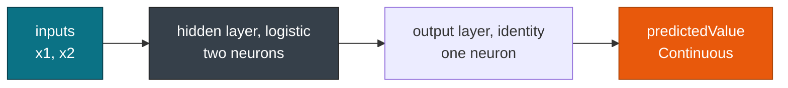
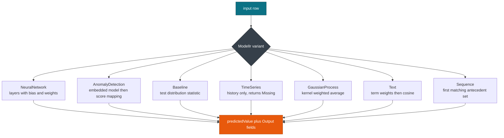

# Neural, anomaly, baseline & time series

> This guide covers **NeuralNetwork**, **AnomalyDetectionModel**, **BaselineModel**, **TimeSeriesModel**, **GaussianProcessModel**, **TextModel**, and **SequenceModel** scoring. For the element matrix, see [Overview](./overview.md).

The seven elements here cover layered nets, wrapper models, change detection, time series history, kernel regressors, text, and sequences. Every evaluator under `engine/models/` is a pure function over `(&Ir, &[Value])`, so preprocessing and output handling stay the same across all of them.

## Concepts

| Element | IR type | What decides the output |
| --- | --- | --- |
| `NeuralNetwork` | `NeuralNetworkIr` | Per layer sum of `bias` and weighted inputs, passed through `activation_function`. |
| `AnomalyDetectionModel` | `AnomalyDetectionIr` | Embedded model score mapped through `algorithm_type`, such as `iforest`. |
| `BaselineModel` | `BaselineIr` | `test_distributions` statistic, such as `zValue` or `CUSUM`. |
| `TimeSeriesModel` | `TimeSeriesIr` | History is lowered into the IR; scoring returns `Missing`. |
| `GaussianProcessModel` | `GaussianProcessIr` | Kernel weighting over the training instances. |
| `TextModel` | `TextIr` | Term frequency over `dictionary`, weighted and compared against `corpus` by cosine. |
| `SequenceModel` | `SequenceIr` | First sequence rule whose antecedent set contains the input. |

## Neural networks

`NeuralNetwork` seeds its inputs from the value slice, computes `bias + Σ weight * previous` per layer, and applies the activation function. The output layer's first neuron becomes the `Continuous` prediction. `SimpleNeuralNetwork.pmml` uses `numberOfLayers="2"`, a logistic hidden layer with two neurons, and an identity output neuron:

```xml
<NeuralNetwork functionName="regression" numberOfLayers="2">
  <NeuralInputs>
    <NeuralInput id="0"><FieldRef field="x1"/></NeuralInput>
    <NeuralInput id="1"><FieldRef field="x2"/></NeuralInput>
  </NeuralInputs>
  <NeuralLayer activationFunction="logistic" numberOfNeurons="2">
    <Neuron id="hidden1" bias="0.0"><Con from="0" weight="1.0"/><Con from="1" weight="1.0"/></Neuron>
  </NeuralLayer>
  <NeuralLayer activationFunction="identity">
    <Neuron id="output" bias="0.0"><Con from="hidden1" weight="1.0"/></Neuron>
  </NeuralLayer>
</NeuralNetwork>
```

The same element comes out of R `neuralnet` through `r2pmml`:

```r
library(neuralnet)
library(pmml)
model <- neuralnet(y ~ x1 + x2, data = train, hidden = c(2), act.fct = "logistic")
pmml(model, file = "SimpleNeuralNetwork.pmml")
```



The IR keeps `neural_inputs`, `neural_layers`, and `activation_function`, so a layer count change is a lowering difference rather than a code change.

## Anomaly detection

`AnomalyDetectionModel` wraps another model and maps its score to an anomaly value. `algorithm_type` selects the mapping: `iforest` uses the average path length over the embedded forest, and `clusterMeanDist` uses the mean distance to cluster centers. `sample_data_size` feeds the normalization, and the embedded model is available as `AnomalyDetectionIr.model`.

`AnomalyDetectionTest.pmml` is an `iforest` wrapper with `sampleDataSize="5"`, and it returns a `Continuous` anomaly score built from the embedded model output.

## Baseline

The engine computes a test statistic for the input field and compares it with the distribution stored in `test_distributions`. The statistic is `zValue`, `CUSUM`, `scalarProduct`, or a chi-square comparison over a count table. `BaselineTest.pmml` uses `testStatistic="zValue"`.

## Time series

`TimeSeriesModel` lowers the history, the smoothing components, and any ARIMA, GARCH, spectral, or state space blocks into the IR. Scoring returns `Missing` because the engine does not extrapolate a series. `TimeSeriesTest.pmml` uses `bestFit="ExponentialSmoothing"`, and `is_scorable` on the IR reflects the `isScorable` attribute.

> **Warning:** A `TimeSeriesModel` lowers and verifies but does not produce a prediction. Read the history from the IR if you need it, and score with the model that produced the series instead.

## Gaussian processes

`GaussianProcessModel` computes a kernel value between the input and every training instance, then predicts the weighted average or vote. Kernels include `RadialBasis`, `ARDSquaredExponential`, and `AbsoluteExponential`; the chosen kernel is kept as `GaussianProcessIr.kernel`, and the instance fields as `instance_fields`. `GaussianProcessTest.pmml` uses a radial basis kernel.

## Text models

`TextModel` tokenizes the input with `dictionary`, weights each term by `localTermWeights` and `globalTermWeights`, and compares the result against every `corpus` document with cosine similarity. The highest scoring document id becomes the `Discrete` prediction. `TextTest.pmml` declares three terms and two documents:

```xml
<TextModel functionName="classification" numberOfTerms="3" numberOfDocuments="2">
  <TextDictionary><Array n="3" type="string">hello world sports</Array></TextDictionary>
  <TextCorpus>
    <TextDocument id="doc1" name="doc1" length="2" file="doc1.txt"/>
    <TextDocument id="doc2" name="doc2" length="2" file="doc2.txt"/>
  </TextCorpus>
  <DocumentTermMatrix><Matrix kind="any" nbRows="2" nbCols="3">
    <Array n="6" type="real">1 0 1 0 1 1</Array>
  </Matrix></DocumentTermMatrix>
  <TextModelNormalization localTermWeights="termFrequency"
    globalTermWeights="inverseDocumentFrequency" documentNormalization="cosine"/>
  <TextModelSimiliarity similarityType="cosine"/>
</TextModel>
```

`TextTest.pmml` also declares the target `class` with the values `sports` and `politics`. The IR keeps `dictionary` and `corpus`, so you can inspect the term space without re-parsing the file.

## Sequences

`SequenceModel` scans sequence rules for one whose antecedent set contains the input item, then returns the consequent's first item. `SequenceIr` records `sets`, `follow_sets`, `number_of_sets`, and `support` per sequence, and `SequenceSimpleTest.pmml` exercises the single set case.

## How the seven dispatch



## Session options for these elements

| Field | Default | Change it when | Effect |
| --- | --- | --- | --- |
| `verify_raw` | `true` | You score untrusted PMML | Rejects `ModelComposition` before lowering |
| `verify_ir` | `true` | Never | Rejects unsupported attribute combinations |
| `max_xml_size` | `100 MB` | A `DocumentTermMatrix` or instance table grows past the cap | Returns `XmlSize` above the limit |
| `max_depth` | `512` | You want a tighter limit | Returns a depth error |
| `thread_values_capacity` | `64` | A `GaussianProcessModel` adds many derived fields | Sets the thread local value buffer |

## Tuning before export

```python
from sklearn.neural_network import MLPClassifier
from sklearn.datasets import load_iris
from sklearn.model_selection import GridSearchCV
from sklearn2pmml.pipeline import PMMLPipeline
iris = load_iris()
pipeline = PMMLPipeline([("classifier", MLPClassifier(max_iter=500))])
param_grid = {
    "classifier__hidden_layer_sizes": [(5,), (10,)],
    "classifier__alpha": [0.0001, 0.001],
}
grid = GridSearchCV(pipeline, param_grid, cv=3)
grid.fit(iris.data, iris.target)
# Export the winning net as NeuralNetwork through R neuralnet and r2pmml
```

```python
import optuna
from sklearn.gaussian_process import GaussianProcessClassifier
from sklearn.gaussian_process.kernels import RBF
from sklearn.model_selection import cross_val_score
def objective(trial):
    gamma = trial.suggest_float("gamma", 0.1, 10.0, log=True)
    kernel = 1.0 * RBF(length_scale=gamma)
    clf = GaussianProcessClassifier(kernel=kernel)
    return cross_val_score(clf, X, y, cv=3).mean()
study = optuna.create_study(direction="maximize")
study.optimize(objective, n_trials=20)
# Export the winning gamma as a RadialBasis kernel in GaussianProcessModel
```

> **Tip:** Keep one `PmmlEnv` per process and one `Session` per PMML file. A `GaussianProcessModel` with many training instances benefits most from a warm session, because the instance table is read at lowering time.

## Next Steps

* [Overview: 19 model types](./overview.md): the element matrix and the shared scoring path.
* [Classification & clustering](./classification.md): scorecards, Bayes, distance, and rule elements.
* [Trees & ensembles](./trees.md): compare the layered net with a boosted chain.
* [Correctness & fixtures](../evaluation/correctness.md): reproduce `SimpleNeuralNetwork`, `TextTest`, and `TimeSeriesTest` with `cargo test`.

*Next: [Derived Fields & Inline Transforms](../transforms/derived.md) → · Previous: [Classification & Clustering](./classification.md)*
