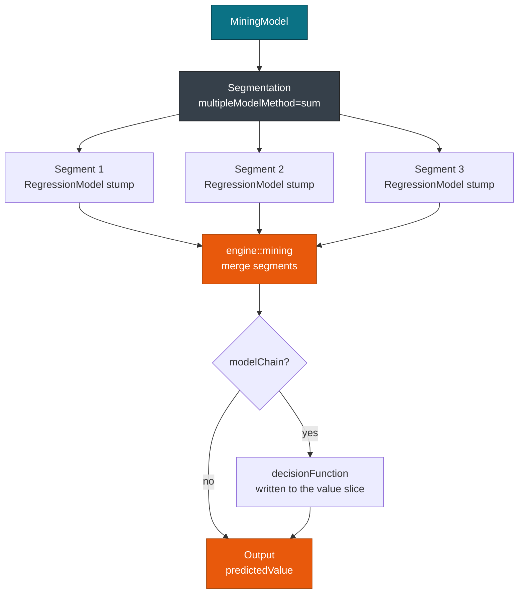

# Overview: 19 model types

> This guide covers the 19 PMML 4.4 model elements that pmmlruntime scores. For a first score, see [Quickstart](../getting-started/quickstart.md). For input handling, see [MiningSchema, DataDictionary & Output](../concepts/schema.md).

Every element in this chapter is scored through one call. You load a file with `Session::from_bytes`, then pass a `HashMap` or a `RecordBatch` to `run`. The engine dispatches on the lowered **ModelIr** enum, so your scoring code never branches on the model kind.

## Concepts

| Concept | Description |
| --- | --- |
| **ModelIr** | Enum with 19 variants, one per PMML element, produced by `ir::lower`. |
| **MiningSchema** | Active inputs and target for the model, with missing, invalid, and outlier treatments. |
| **Fixture** | A `bench/pmml/*.pmml` file that the test suite scores against JPMML output. |

The repository ships 52 fixtures, one per element plus edge cases for missing values, model chains, and no true child strategies. Run them all with `cargo test --test all_fixtures`.

> **Warning:** Verification rejects only `ModelComposition` and `CenterFields`. All 19 elements below lower and score.

## Score any element in 8 lines

The same eight lines score a single tree, a boosted ensemble, or a scorecard:

```rust
use pmmlruntime::{PmmlEnv, Session, SessionOptions};
use pmmlruntime::ir::ModelIr;
use pmmlruntime::session::batch::Batch;
use pmmlruntime::Value;
use std::collections::HashMap;

let env = PmmlEnv::new();
let bytes = std::fs::read("bench/pmml/DecisionTreeIris.pmml")?;
let sess = Session::from_bytes(&env, &bytes, SessionOptions::default())?;

let mut row = HashMap::new();
row.insert("Petal.Length".into(), Value::Continuous(1.4));
let out = sess.run(&row as &dyn Batch)?.into_single().unwrap();

match &sess.ir.model {
    ModelIr::Tree(t) => println!("TreeModel with {} nodes", t.nodes.len()),
    ModelIr::Mining(m) => println!("MiningModel with {} segments", m.segmentation.segments.len()),
    other => println!("{other:?}"),
}
println!("{:?}", out.get("predictedValue"));
```

The Python binding exposes the same session through `InferenceSession`:

```python
import pmmlruntime

sess = pmmlruntime.InferenceSession("bench/pmml/DecisionTreeIris.pmml")
print(sess.get_inputs())
out = sess.run(None, {"Petal.Length": 1.4, "Petal.Width": 0.2})
print(out[0]["predictedValue"], out[0]["probability(setosa)"])
```

> **Info:** Keep `PmmlEnv::new()` process global and cache one `Session` per PMML file. Cold load is 68 µs for `DecisionTreeIris.pmml`; a hot single row is 402 ns.

## Model elements

| PMML element | IR variant | Evaluator | Fixture | PMML knobs | Typical output |
| --- | --- | --- | --- | --- | --- |
| `TreeModel` | `Tree(TreeIr)` | `tree.rs` | `DecisionTreeIris.pmml` | `missingValueStrategy`, `noTrueChildStrategy` | `Discrete` plus `probability(*)` |
| `RegressionModel` | `Regression(RegressionIr)` | `regression.rs` | `RegressionOutputTest.pmml` | `normalizationMethod`, `exponent`, `targetCategory` | `Continuous` plus `Output` fields |
| `MiningModel` | `Mining(MiningIr)` | `mining.rs` | `GradientBoosterTest.pmml` | `multipleModelMethod`, `Segment/@weight` | `predictedValue` from the merged segments |
| `Scorecard` | `Scorecard(ScorecardIr)` | `scorecard.rs` | `ComplexPartialScoreTest.pmml` | `initialScore`, `baselineScore`, `useReasonCodes` | `Continuous` plus reason codes |
| `ClusteringModel` | `Clustering(ClusteringIr)` | `clustering.rs` | `RankingTest.pmml` | `modelClass`, `comparisonMeasure` | `Discrete` cluster name |
| `NaiveBayesModel` | `NaiveBayes(NaiveBayesIr)` | `naive_bayes.rs` | `BayesInputTest.pmml` | `threshold`, `PairCounts` | `Discrete` plus per class `probability` |
| `NearestNeighborModel` | `NearestNeighbor(NearestNeighborIr)` | `nearest_neighbor.rs` | `MixedNeighborhoodTest.pmml` | `numberOfNeighbors`, `comparisonMeasure` | `Discrete` or `entityId` |
| `SupportVectorMachineModel` | `SupportVectorMachine(SupportVectorMachineIr)` | `support_vector_machine.rs` | `VectorInstanceTest.pmml` | `gamma`, `svmRepresentation` | `Continuous` margin or `Discrete` |
| `NeuralNetwork` | `NeuralNetwork(NeuralNetworkIr)` | `neural_network.rs` | `SimpleNeuralNetwork.pmml` | `activationFunction`, `numberOfLayers` | `Continuous` from the last neuron |
| `GeneralRegressionModel` | `GeneralRegression(GeneralRegressionIr)` | `general_regression.rs` | `ContrastMatrixTest.pmml` | `modelType`, `targetReferenceCategory` | `Discrete` after softmax |
| `AssociationModel` | `Association(AssociationIr)` | `association.rs` | `AssociationOutputTest.pmml` | `minimumSupport`, `numberOfRules` | `Collection` plus `affinity` |
| `RuleSetModel` | `RuleSet(RuleSetIr)` | `rule_set.rs` | `SimpleRuleTest.pmml` | `defaultScore`, `CompoundPredicate` | `Discrete` or `Missing` |
| `AnomalyDetectionModel` | `AnomalyDetection(AnomalyDetectionIr)` | `anomaly_detection.rs` | `AnomalyDetectionTest.pmml` | `algorithmType`, `sampleDataSize` | `Continuous` anomaly score |
| `BaselineModel` | `Baseline(BaselineIr)` | `baseline.rs` | `BaselineTest.pmml` | `testStatistic`, `TestDistributions` | `Continuous` statistic |
| `TimeSeriesModel` | `TimeSeries(TimeSeriesIr)` | `time_series.rs` | `TimeSeriesTest.pmml` | `bestFit`, `alpha` | `Missing`, history kept in the IR |
| `GaussianProcessModel` | `GaussianProcess(GaussianProcessIr)` | `gaussian_process.rs` | `GaussianProcessTest.pmml` | kernel type, `gamma` | `Continuous` weighted average |
| `TextModel` | `Text(TextIr)` | `text.rs` | `TextTest.pmml` | `numberOfTerms`, `globalTermWeights` | `Discrete` document id |
| `SequenceModel` | `Sequence(SequenceIr)` | `sequence.rs` | `SequenceSimpleTest.pmml` | `SequenceRule`, `numberOfSets` | `Discrete` consequent |
| `BayesianNetworkModel` | `BayesianNetwork(BayesianNetworkIr)` | `bayesian_network.rs` | `BayesianSimpleTest.pmml` | `DiscreteNode`, `ContinuousNode`, `isScorable` | `Discrete` posterior argmax |

Every fixture in that column lives in [`bench/pmml/`](https://github.com/pab1s/pmmlruntime/tree/main/bench/pmml).

## Where each element is scored

The 19 elements group by scoring shape. Input handling is the same everywhere; the output differs.

| Group | Elements | Guide |
| --- | --- | --- |
| Trees and ensembles | `TreeModel`, `MiningModel` | [Trees & ensembles](./trees.md) |
| Regression | `RegressionModel`, `GeneralRegressionModel` | [Regression & general regression](./regression.md) |
| Tables, distance, and margin models | `Scorecard`, `NaiveBayesModel`, `NearestNeighborModel`, `SupportVectorMachineModel`, `AssociationModel`, `RuleSetModel` | [Classification & clustering](./classification.md) |
| Sequences, kernels, and wrappers | `NeuralNetwork`, `TimeSeriesModel`, `GaussianProcessModel`, `TextModel`, `SequenceModel`, `AnomalyDetectionModel`, `BaselineModel` | [Neural, anomaly, baseline & time series](./neural.md) |

## Ensemble nesting

Most PMML in the wild wraps trees in a `MiningModel`. The evaluator reads `Segmentation.segments` and combines them with `multiple_model_method`.



`GradientBoosterTest.pmml` shows the pattern in miniature. Three `RegressionModel` stumps over `x` (coefficients 2, 1, and 0.5) sum to a `decisionFunction` of 1.75 at `x = 0.5`, and the outer `RegressionModel` is a classification table pair for `event` and `no event` that consumes that function. See [Trees & ensembles](./trees.md).

## Row and batch scoring

| Input | Layout | Cost on i7-12650H |
| --- | --- | --- |
| `HashMap<String, Value>` | Row major, one row | 402 ns |
| `Vec<HashMap<String, Value>>` | Row major, sharded above 256 rows | 592 ns per row at 100 rows |
| `RecordBatch` | Columnar | 61 ns per row at 100k rows |

You pick `HashMap` for latency and `RecordBatch` for throughput. See [Batch API](../batch/batch.md).

## Next Steps

* [Trees & ensembles](./trees.md): traversal cost, segmentation methods, and the `GradientBoosterTest` chain.
* [Regression & general regression](./regression.md): the nine normalization methods and `PPMatrix` contrasts.
* [Neural, anomaly, baseline & time series](./neural.md): the nine kernel, sequence, and wrapper elements.
* [Correctness & fixtures](../evaluation/correctness.md): reproduce all 52 fixtures and compare against JPMML.

*Next: [Trees & Ensembles](./trees.md) → · Previous: [Introduction](../README.md)*
