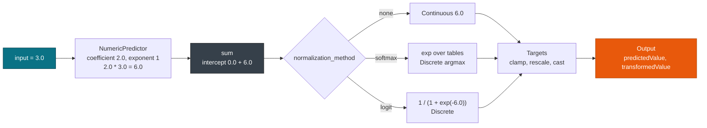

# Regression & general regression

> This guide covers **RegressionModel** and **GeneralRegressionModel** scoring with pmmlruntime. For the other elements, see [Overview](./overview.md). For value and field types, see [Values, Fields & Types](../concepts/values.md).

Linear, logistic, and general linear models all reach the same `run` call. pmmlruntime lowers both elements per the [RegressionModel](https://dmg.org/pmml/v4-4-1/RegressionModel.html) and [GeneralRegressionModel](https://dmg.org/pmml/v4-4-1/GeneralRegression.html) schemas and applies the normalization each table declares.

## Concepts

| Concept | Description |
| --- | --- |
| **RegressionIr** | Lowered `RegressionModel`: `regression_tables`, `normalization_method`, `targets`, and `output`. |
| **RegressionTable** | One table per target category, holding an `intercept` and its predictors. |
| **Normalization** | One of nine methods applied to the linear sum: `none`, `simpleMax`, `softmax`, `logit`, `probit`, `cloglog`, `exp`, `loglog`, `cauchit`. |
| **Contrast matrix** | A `FactorList` matrix, such as `Simple` or `Helmert`, that turns a factor into covariates for `GeneralRegressionModel`. |
| **TargetIr** | Post-processing with `min` and `max` clamping, `rescale_factor`, `rescale_constant`, and integer casting. |

## How a table becomes a score

The evaluator sums `intercept` plus the active predictors. A `NumericPredictor` contributes `coefficient * field^exponent`, which keeps polynomial features out of the transform layer. A `CategoricalPredictor` contributes its coefficient when the discrete input equals `value`. The sum then passes through `normalization_method`.



`Targets` runs after the model and before `Output`. It clamps a `Continuous` score between `min` and `max`, then applies `value * rescale_factor + rescale_constant`, then casts to an integer with `round`, `ceiling`, or `floor`.

## Export

`RegressionOutputTest.pmml` shows a table plus a transformed output. This excerpt keeps the normalization points and the decision field:

```xml
<RegressionModel functionName="regression" targetFieldName="result">
  <MiningSchema>
    <MiningField name="input"/>
    <MiningField name="result" usageType="predicted"/>
  </MiningSchema>
  <RegressionTable intercept="0.0">
    <NumericPredictor name="input" exponent="1" coefficient="2.0"/>
  </RegressionTable>
  <Output>
    <OutputField name="FinalResult" feature="transformedValue">
      <Apply function="round"><NormContinuous field="RawResult">
        <LinearNorm orig="-100.0" norm="-21.4"/>
        <LinearNorm orig="-10.0" norm="-21.4"/>
        <LinearNorm orig="10.5" norm="42.97"/>
        <LinearNorm orig="100.0" norm="42.97"/>
      </NormContinuous></Apply>
    </OutputField>
    <OutputField name="BusinessDecision" feature="decision">
      <Decisions businessProblem="Should the outstanding amount be collected?">
        <Decision value="waive"/>
        <Decision value="refer"/>
      </Decisions>
    </OutputField>
  </Output>
</RegressionModel>
```

A trained sklearn model emits the same element:

```python
from sklearn.linear_model import LinearRegression
from sklearn2pmml.pipeline import PMMLPipeline
from sklearn2pmml import sklearn2pmml
import numpy as np
X = np.array([[1.0], [2.0], [3.0]])
y = np.array([2.0, 4.0, 6.0])
pipeline = PMMLPipeline([("regressor", LinearRegression())])
pipeline.fit(X, y)
sklearn2pmml(pipeline, "LinearRegression.pmml", with_repr=True)
```

Score either file:

```rust
use pmmlruntime::{PmmlEnv, Session, SessionOptions};
use pmmlruntime::session::batch::Batch;
use pmmlruntime::Value;
use std::collections::HashMap;
let env = PmmlEnv::new();
let bytes = std::fs::read("bench/pmml/RegressionOutputTest.pmml")?;
let sess = Session::from_bytes(&env, &bytes, SessionOptions::default())?;
let mut input = HashMap::new();
input.insert("input".into(), Value::Continuous(3.0));
let out = sess.run(&input as &dyn Batch)?.into_single().unwrap();
println!("{:?}", out.get("FinalResult"));
```

## What the model keeps

| PMML attribute | IR field | Example from `RegressionOutputTest.pmml` |
| --- | --- | --- |
| `normalizationMethod` | `RegressionIr.normalization_method` | `none`, so the raw sum is the score |
| `RegressionTable` list | `RegressionIr.regression_tables` | one table, one `NumericPredictor` |
| `Output` fields | `RegressionIr.output` | `RawResult`, `FinalResult`, `BusinessDecision` |
| `Targets` | `RegressionIr.targets` | clamp, rescale, cast |
| `MiningField` list | `RegressionIr.mining_schema` | `input` active, `result` predicted |

For a multinomial model the engine evaluates one table per `targetCategory` and picks the largest normalized value, which is how a `softmax` `RegressionModel` returns a `Discrete` label.

## General regression models

`GeneralRegressionModel` handles categorical factors and their interactions. Three blocks cooperate:

* `FactorList` gives each factor a contrast matrix, such as `Simple` or `Helmert`.
* `PPMatrix` maps a predictor, or a category of one, to a `parameterName`.
* `ParamMatrix` gives each `parameterName` a `beta` per target category.

The engine builds `x` from the contrast rows and the covariates, computes `eta = Σ beta * x` for every category except `targetReferenceCategory`, and applies `softmax` with the reference category at `eta = 0`.

`ContrastMatrixTest.pmml` is a multinomial logistic model for `salCat` (`Low`, `High`) with `High` as the reference. Predictors are `gender`, `educ`, `jobcat`, and `salbegin`, including an `educ by gender(1) by salbegin` interaction. Parameters such as `P0000001` carry a `beta` near 17.06 for `Low`. The model declares two probability outputs:

```rust
use pmmlruntime::{PmmlEnv, Session, SessionOptions};
use pmmlruntime::session::batch::Batch;
use pmmlruntime::Value;
use std::collections::HashMap;
let env = PmmlEnv::new();
let bytes = std::fs::read("bench/pmml/ContrastMatrixTest.pmml")?;
let sess = Session::from_bytes(&env, &bytes, SessionOptions::default())?;
let mut input = HashMap::new();
input.insert("gender".into(), Value::Discrete(sess.symbol_id("f").unwrap()));
input.insert("educ".into(), Value::Continuous(12.0));
let out = sess.run(&input as &dyn Batch)?.into_single().unwrap();
println!("{:?} {:?}", out.get("Probability_Low"), out.get("Probability_High"));
```

> **Warning:** A category that no `PPMatrix` cell maps contributes nothing, so an empty `ParamMatrix` lowers to a reference-only model. `EmptyPPMatrixTest.pmml` pins that behavior.

| `GeneralRegressionModel` attribute | IR field | Effect |
| --- | --- | --- |
| `modelType` | `GeneralRegressionIr.model_type` | `regression`, `generalLinear`, or `multinomialLogistic` |
| `targetReferenceCategory` | `GeneralRegressionIr.target_reference_category` | Category fixed at `eta = 0` |
| `PPMatrix` | `GeneralRegressionIr.pp_matrix` | Parameter to predictor mapping |
| `ParamMatrix` | `GeneralRegressionIr.param_matrix` | Beta per parameter and target category |
| `FactorList` | `GeneralRegressionIr.factors` | Contrast rows per factor, plus `covariates` for continuous predictors |

## Session options for regression

| Field | Default | Change it when | Effect |
| --- | --- | --- | --- |
| `verify_raw` | `true` | You score untrusted PMML | Rejects `ModelComposition` before lowering |
| `verify_ir` | `true` | Never | Rejects an unsupported link function |
| `max_xml_size` | `100 MB` | A large `ParamMatrix` approaches the cap | Returns `XmlSize` above the limit |
| `max_depth` | `512` | You want a tighter limit | Returns a depth error |
| `thread_values_capacity` | `64` | The model adds many derived fields | Sets the thread local value buffer |

## Choosing regularization before export

Three snippets cover the common searches, all producing a file you score with the code above:

```python
from sklearn.datasets import load_iris
from sklearn.linear_model import LogisticRegression
from sklearn.model_selection import GridSearchCV
from sklearn2pmml.pipeline import PMMLPipeline
from sklearn2pmml import sklearn2pmml
iris = load_iris()
pipeline = PMMLPipeline([("classifier", LogisticRegression(max_iter=200))])
param_grid = {"classifier__C": [0.1, 1.0, 10.0]}
grid = GridSearchCV(pipeline, param_grid, cv=3)
grid.fit(iris.data, iris.target)
sklearn2pmml(grid.best_estimator_, "Logistic_best.pmml", with_repr=True)
```

```python
import optuna
from sklearn.linear_model import Ridge
from sklearn.model_selection import cross_val_score
from sklearn2pmml.pipeline import PMMLPipeline
from sklearn2pmml import sklearn2pmml
def objective(trial):
    alpha = trial.suggest_float("alpha", 1e-3, 10.0, log=True)
    pipe = PMMLPipeline([("regressor", Ridge(alpha=alpha))])
    return cross_val_score(pipe, X, y, cv=3).mean()
study = optuna.create_study(direction="maximize")
study.optimize(objective, n_trials=30)
best_pipe = PMMLPipeline([("regressor", Ridge(alpha=study.best_params["alpha"]))])
best_pipe.fit(X, y)
sklearn2pmml(best_pipe, "Ridge_optuna.pmml", with_repr=True)
```

> **Tip:** `NormalizationMethod` and `Targets` interact. Raise `rescale_factor` only after you check that `min` and `max` clamp in the range you expect, because the clamp runs first.

## Next Steps

* [Overview: 19 model types](./overview.md): the element matrix and the shared scoring path.
* [Trees & ensembles](./trees.md): how `RegressionModel` stumps sum inside a `MiningModel`.
* [MiningSchema, DataDictionary & Output](../concepts/schema.md): how `Targets` and `Output` fields reach the result map.
* [Correctness & fixtures](../evaluation/correctness.md): reproduce `RegressionOutputTest` and `ContrastMatrixTest` with `cargo test`.

*Next: [Classification & Clustering](./classification.md) → · Previous: [Trees & Ensembles](./trees.md)*
