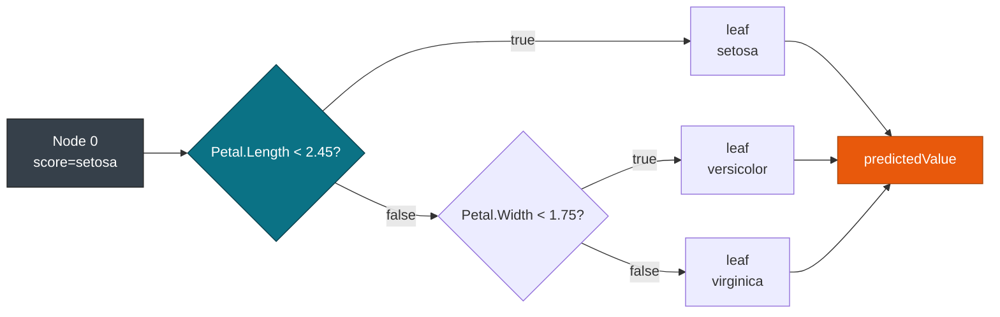
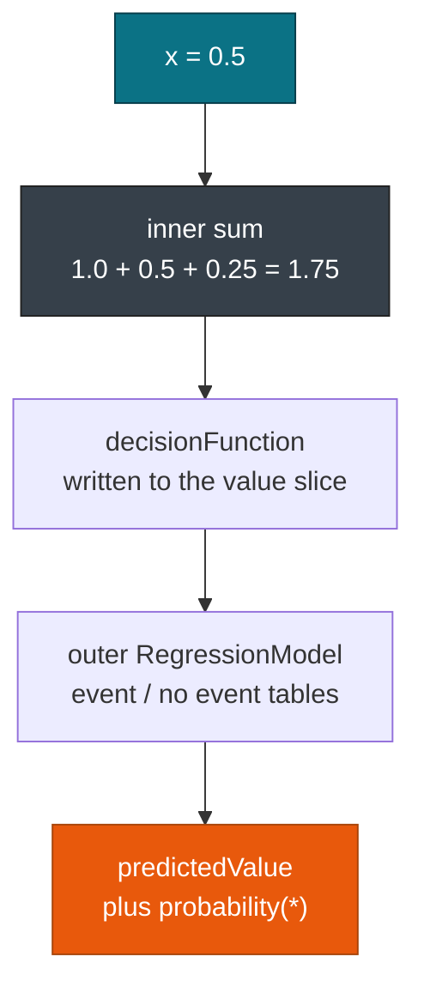

# Trees & ensembles

> This guide covers **TreeModel** and **MiningModel** scoring with pmmlruntime. For the other elements, see [Overview](./overview.md). For transforms that run before the tree, see [Derived Fields & Inline Transforms](../transforms/derived.md).

A single decision tree and a thousand stump ensemble go through the same `run` call. pmmlruntime lowers both elements per the [TreeModel](https://dmg.org/pmml/v4-4-1/TreeModel.html) and [MiningModel](https://dmg.org/pmml/v4-4-1/MiningModel.html) schemas, so your scoring code does not change between them.

## Concepts

| Concept | Description |
| --- | --- |
| **TreeIr** | Lowered `TreeModel`: `nodes: Vec<NodeIr>` with the root at index 0, plus the missing value and no true child strategies. |
| **NodeIr** | One node with `predicate`, `score`, `children`, `default_child`, and `score_distributions`. |
| **MiningIr** | Lowered `MiningModel`: `segmentation` with `multiple_model_method` and a list of segments. |
| **SegmentIr** | One segment: a predicate plus a nested model. |

## How a tree is scored

`TreeModel` lowers to a flat vector with the root at index 0, so the evaluator never recurses. Each `NodeIr` holds a predicate, a score, and child indices. The engine tests children in order and follows the first predicate that holds.



`DecisionTreeIris.pmml` holds five nodes in that shape and scores in 402 ns per row, against 4.5 µs for JPMML on the same hardware. The gap comes from the flat layout, a stack allocated value buffer, and no recursion.

When no predicate holds, `noTrueChildStrategy` decides what happens. `returnLastPrediction` keeps the parent score, `returnNullPrediction` returns `Missing`, and `defaultChild` follows the named child. A `Missing` input follows `missingValueStrategy`, which `verify_ir` checks against the fixture that exercises it.

## Export a tree

Two routes produce the same element. Hand-authored PMML is the shortest way to see the layout:

```xml
<TreeModel functionName="classification"
  missingValueStrategy="nullPrediction"
  noTrueChildStrategy="returnLastPrediction">
  <MiningSchema>
    <MiningField name="Species" usageType="target"/>
    <MiningField name="Petal.Length"/>
  </MiningSchema>
  <Node id="1" score="setosa"><True/>
    <Node id="2" score="setosa">
      <SimplePredicate field="Petal.Length" operator="lessThan" value="2.45"/>
    </Node>
    <Node id="3" score="versicolor">
      <SimplePredicate field="Petal.Length" operator="greaterOrEqual" value="2.45"/>
    </Node>
  </Node>
</TreeModel>
```

A trained sklearn tree emits the same element through `sklearn2pmml`:

```python
from sklearn.datasets import load_iris
from sklearn.tree import DecisionTreeClassifier
from sklearn2pmml.pipeline import PMMLPipeline
from sklearn2pmml import sklearn2pmml
iris = load_iris()
pipeline = PMMLPipeline([("classifier", DecisionTreeClassifier(max_depth=3))])
pipeline.fit(iris.data[:, 2:4], iris.target)
sklearn2pmml(pipeline, "DecisionTreeIris.pmml", with_repr=True)
```

You score either file with eight lines:

```rust
use pmmlruntime::{PmmlEnv, Session, SessionOptions};
use pmmlruntime::session::batch::Batch;
use pmmlruntime::Value;
use std::collections::HashMap;
let env = PmmlEnv::new();
let bytes = std::fs::read("bench/pmml/DecisionTreeIris.pmml")?;
let sess = Session::from_bytes(&env, &bytes, SessionOptions::default())?;
let mut input = HashMap::new();
input.insert("Petal.Length".into(), Value::Continuous(1.4));
let out = sess.run(&input as &dyn Batch)?;
```

## What the tree keeps

| PMML attribute | IR field | Example from `DecisionTreeIris.pmml` |
| --- | --- | --- |
| `missingValueStrategy` | `TreeIr.missing_value_strategy` | `nullPrediction` |
| `noTrueChildStrategy` | `TreeIr.no_true_child_strategy` | `returnLastPrediction` |
| `Node` tree | `TreeIr.nodes` | root at index 0, children as indices |
| `MiningField` list | `TreeIr.mining_schema` | `Species` target plus the petal fields |
| `ScoreDistribution` | `NodeIr.score_distributions` | feeds `probability(setosa)` |
| `Targets` | `TreeIr.targets` | rescale and cast after scoring |

## Segmentation methods

`MiningModel` merges segments with one method, read from `multiple_model_method`:

| `multipleModelMethod` | Merge rule | Typical producer |
| --- | --- | --- |
| `sum` | Adds segment scores | LightGBM and XGBoost stumps |
| `average` | Averages segment scores | Averaged regression ensembles |
| `majorityVote` | Counts segment classes | `RandomForestClassifier` |
| `modelChain` | Feeds an earlier score into the next segment | Boosted chains and stacking |

`GradientBoosterTest.pmml` is the smallest useful chain. Three `RegressionModel` stumps over `x` with coefficients 2, 1, and 0.5 sit inside a `sum` segmentation. At `x = 0.5` the sum is 1.75, written as the `decisionFunction`. The outer `RegressionModel` is a classification pair for `event` and `no event` that reads that function. Hot scoring takes 438 ns per row against 12.3 µs for JPMML.



Exporting an ensemble takes one `PMMLPipeline`:

```python
from sklearn.ensemble import RandomForestClassifier
from sklearn2pmml.pipeline import PMMLPipeline
from sklearn2pmml import sklearn2pmml
from sklearn.datasets import load_iris
iris = load_iris()
pipeline = PMMLPipeline([("classifier", RandomForestClassifier(n_estimators=10))])
pipeline.fit(iris.data[:, 2:4], iris.target)
sklearn2pmml(pipeline, "RandomForestIris.pmml", with_repr=True)
# majorityVote over 10 TreeModel segments
```

> **Note:** `missingPredictionTreatment` decides what a segment does when its predicate is `Missing`, and `verify_ir` rejects the segment shapes that PMML leaves undefined.

## Session options for trees

| Field | Default | Change it when | Effect |
| --- | --- | --- | --- |
| `verify_raw` | `true` | You score untrusted PMML | Rejects `ModelComposition` before lowering |
| `verify_ir` | `true` | Never | Rejects `weightedConfidence` after lowering |
| `max_xml_size` | `100 MB` | You load a 1000 tree forest | Returns `XmlSize` above the cap |
| `max_depth` | `512` | You want a tighter limit on crafted files | Returns a depth error |
| `thread_values_capacity` | `64` | `modelChain` adds many derived fields | Sets the thread local value buffer |

Keep `SessionOptions::default()` for ordinary trees. See [Session, Env & Lifecycle](../concepts/session.md).

## Choosing depth and ensemble size

Tune before export, then score the file you tuned:

```python
from sklearn.datasets import load_iris
from sklearn.tree import DecisionTreeClassifier
from sklearn.model_selection import GridSearchCV
from sklearn2pmml.pipeline import PMMLPipeline
from sklearn2pmml import sklearn2pmml
iris = load_iris()
pipeline = PMMLPipeline([("classifier", DecisionTreeClassifier(random_state=1))])
param_grid = {"classifier__max_depth": [2, 3, 5]}
grid = GridSearchCV(pipeline, param_grid, cv=3)
grid.fit(iris.data[:, 2:4], iris.target)
sklearn2pmml(grid.best_estimator_, "DecisionTreeIris_best.pmml", with_repr=True)
```

```python
import optuna
from sklearn.ensemble import RandomForestClassifier
from sklearn.model_selection import cross_val_score
from sklearn2pmml.pipeline import PMMLPipeline
from sklearn2pmml import sklearn2pmml
from sklearn.datasets import load_iris
iris = load_iris()
def objective(trial):
    n = trial.suggest_int("n_estimators", 10, 100)
    clf = RandomForestClassifier(n_estimators=n, random_state=1)
    pipe = PMMLPipeline([("classifier", clf)])
    return cross_val_score(pipe, iris.data[:, 2:4], iris.target, cv=3).mean()
study = optuna.create_study(direction="maximize")
study.optimize(objective, n_trials=20)
```

## Next Steps

* [Overview: 19 model types](./overview.md): the element matrix and the shared scoring path.
* [Regression & general regression](./regression.md): the stumps that sit inside boosted ensembles.
* [MiningSchema, DataDictionary & Output](../concepts/schema.md): missing value and outlier handling before predicates run.
* [Correctness & fixtures](../evaluation/correctness.md): reproduce `DecisionTreeIris` and `GradientBoosterTest` with `cargo test`.

*Next: [Regression & General Regression](./regression.md) → · Previous: [Overview](./overview.md)*
