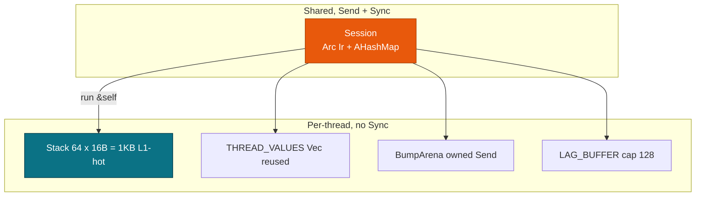

# Concurrency & Memory

> **Info:** This page covers concurrent scoring for services that share a session across threads. For the XML guards, see [Security & Hardening](./security.md). For lifecycle details, see [Session, Env & Lifecycle](../concepts/session.md).

**Session** is `Send + Sync` and `run(&self)` never takes `&mut`. You build `Arc<Ir>` once on the cold path and reuse it from every thread, each with its own `Value` slice.

## Concepts

| Concept | Description |
| --- | --- |
| **Session Send+Sync** | Holds `Arc<Ir>` plus `AHashMap<String, FieldId>` and cached `output_fields`; never mutates. |
| **STACK_VALUES_THRESHOLD = 64** | Stack array `64 × 16B = 1KB`, L1-hot for 90% of fixtures; larger models spill to the heap. |
| **THREAD_VALUES** | `thread_local! RefCell<Vec<Value>>`, reused and never shrunk, re-initialized on reuse. |
| **THREAD_ARENA / BumpArena** | Owned `bumpalo::Bump` moved into `rayon` chunks; `Send` but not `Sync`, reset per chunk. |
| **LAG_BUFFER** | `thread_local` `HashMap<FieldId, VecDeque>` capped at 128 entries; isolated per thread and batch. |
| **CpuProvider shard** | Serial below 256 rows or below `threads*4`, else `rayon par_chunks(256)`. |

`with_value_buffer` gives each thread its own `&mut [Value]`. You compute `max_field_id = max(FieldId)+1` clamped to 16, then `needed = max(max_field_id, num_fields+4).max(16)`, and dispatch on `needed <= 64`.

```rust
use pmmlruntime::{PmmlEnv, Session, SessionOptions, Value};
use pmmlruntime::session::batch::Batch;
use std::collections::HashMap;

let env = PmmlEnv::new();
let sess = Session::from_bytes(&env, &std::fs::read("bench/pmml/DecisionTreeIris.pmml")?, SessionOptions::default())?;
let mut input = HashMap::new();
input.insert("Petal.Length".into(), Value::Continuous(1.4));
input.insert("Petal.Width".into(), Value::Continuous(0.2));
let out = sess.run(&input as &dyn Batch)?.into_single().unwrap();
# Ok::<(), Box<dyn std::error::Error>>(())
```

The call above used the stack path, so it allocated nothing: `run(&self)` borrowed `Arc<Ir>` and built `BatchCtx` on the caller frame. The heap path borrows `THREAD_VALUES` per thread, grows it only when needed, and re-initializes the prefix to `Value::Missing`.

Shared state is small and immutable. `Session` and `Arc<Ir>` are the only objects more than one thread touches.



`run` never contends on `&mut`. Each thread runs `materialize_row` through `col_map` or a `HashMap`, then `eval_derived_fields` on its private `Missing`-initialized slice.

`CpuProvider` shards on its own: a batch below 256 rows, or below `threads*4`, stays serial; anything larger runs `rayon::par_chunks(256)`. The threshold avoids roughly 100 µs of spawn cost against 402 ns of single-row work. The pool is the `rayon` global pool, and per-`PmmlEnv` pools are planned.

> **Note:** `BumpArena` is `miri`-clean and never leaks. Each chunk calls `reset` before and after `with_bump`, which keeps the capacity for the next batch.

> **Warning:** Never cache `&mut [Value]` or `BatchCtx` outside `run`. Every call re-initializes the slice to `Missing` and rebuilds `col_map` from the `RecordBatch` schema.

## One env, many sessions

Reuse one `PmmlEnv` across many `Session` values. The env is cheap to clone because cloning bumps an `Arc`, and each model keeps its own `Arc<Ir>`.

| Item | Type | Cost |
| --- | --- | --- |
| **Env** | `PmmlEnv::new()` or `with_name("prod")` | 1 atomic increment per clone |
| **Session** | `Session::from_bytes(&env, bytes, opts)` | One cold load per model |
| **Label** | `PmmlEnv::with_name("prod-v2")` plus `sess.ir.model` | No hot cost |
| **Isolation** | Per-thread `Value` slice and `BumpArena` | Reset per batch |

```rust
use pmmlruntime::{PmmlEnv, Session, SessionOptions};
let env = PmmlEnv::new(); // parent, Arc inner
let iris = Session::from_bytes(&env, &std::fs::read("bench/pmml/DecisionTreeIris.pmml")?, SessionOptions::default())?;
let audit = Session::from_bytes(&env, &std::fs::read("bench/pmml/LinearRegression.pmml")?, SessionOptions::default())?;
let env2 = env.clone(); // atomic increment, no lock
println!("iris fields: {} audit fields: {}", iris.num_active_fields(), audit.num_active_fields());
# Ok::<(), Box<dyn std::error::Error>>(())
```

## Execution strategies

| Strategy | Code | Use it when | Overhead |
| --- | --- | --- | --- |
| **Sequential** | `for row in rows { sess.run(&row) }` | Fewer than 100 rows | No spawn cost |
| **Thread per worker** | `Arc<Session>` plus `thread::spawn` | You already have a pool | About 100 µs per spawn |
| **Columnar sharding** | `RecordBatch` through `par_chunks(256)` | More than 1k rows | 61 ns per row |

### Sequential

Score fewer than 100 rows on the calling thread when you want no spawn cost at all.

```rust
use pmmlruntime::{PmmlEnv, Session, SessionOptions, Value};
use pmmlruntime::session::batch::Batch;
use std::collections::HashMap;
let env = PmmlEnv::new();
let sess = Session::from_bytes(&env, &std::fs::read("bench/pmml/DecisionTreeIris.pmml")?, SessionOptions::default())?;
for _ in 0..100 {
    let mut row = HashMap::new();
    row.insert("Petal.Length".into(), Value::Continuous(1.4));
    let _ = sess.run(&row as &dyn Batch)?;
}
# Ok::<(), Box<dyn std::error::Error>>(())
```

This loop uses the stack `Value[64]` and never touches `THREAD_VALUES` beyond initialization.

### Thread per worker

Share one `Arc<Session>` when a pool already exists.

```rust
use pmmlruntime::{PmmlEnv, Session, SessionOptions, Value};
use pmmlruntime::session::batch::Batch;
use std::{collections::HashMap, sync::Arc, thread};
let env = PmmlEnv::new();
let sess = Arc::new(Session::from_bytes(&env, &std::fs::read("bench/pmml/DecisionTreeIris.pmml")?, SessionOptions::default())?);
let handles: Vec<_> = (0..8).map(|_| {
    let s = sess.clone();
    thread::spawn(move || {
        let mut row = HashMap::new();
        row.insert("Petal.Length".into(), Value::Continuous(1.4));
        s.run(&row as &dyn Batch).unwrap()
    })
}).collect();
for h in handles { h.join().unwrap(); }
# Ok::<(), Box<dyn std::error::Error>>(())
```

Eight threads scored against a single `Arc<Ir>`, and `with_value_buffer` handed each one a private `&mut [Value]` with no contention.

### Columnar sharding

For more than 1k rows, pass a `RecordBatch` and let `rayon` split it.

```rust
use arrow::array::Float64Array;
use arrow::datatypes::{DataType, Field, Schema};
use arrow::record_batch::RecordBatch;
use pmmlruntime::session::batch::Batch;
use std::sync::Arc;
let schema = Arc::new(Schema::new(vec![
    Field::new("Petal.Length", DataType::Float64, true),
    Field::new("Petal.Width", DataType::Float64, true),
]));
let batch = RecordBatch::try_new(schema.clone(), vec![
    Arc::new(Float64Array::from(vec![1.4; 100_000])) as _,
    Arc::new(Float64Array::from(vec![0.2; 100_000])) as _,
])?;
// CpuProvider shards this batch, since the row count is above 256
let rows = sess.run(&batch as &dyn Batch)?;
assert_eq!(rows.len(), 100_000);
# Ok::<(), Box<dyn std::error::Error>>(())
```

One hundred thousand rows scored at 61 ns per row, each chunk carrying its own `BumpArena`. Pick sequential below 100 rows, threads when a pool exists, and columnar sharding above 1k rows.

> **Note:** The threshold of `rows < 256` or `rows < threads*4` avoids about 100 µs of spawn cost against 402 ns of single-row latency. Batches below it run serially on the caller thread.

## Memory knobs

| Knob | Default | When to change it | Effect |
| --- | --- | --- | --- |
| **STACK_VALUES_THRESHOLD** | `64 × 16B = 1 KB` | Models with more than 64 fields | More stack, less heap |
| **THREAD_VALUES init** | `max(FieldId)+1`, clamped to 16 | Never, it sizes itself | Re-initialized on reuse, never shrinks |
| **BumpArena per chunk** | One `bumpalo::Bump` per `par_chunks` | No knob, reset per chunk | Retains capacity |
| **LAG_BUFFER cap** | 128 `VecDeque` entries per `FieldId` | Lower to 64 on edge targets | Prevents unbounded growth |
| **rayon shard size** | 256 rows | Lower for latency, raise for throughput | Trades spawn cost |

Watch `THREAD_VALUES` growth once after deploy, then leave it alone.

> **Warning:** Never cache `&mut [Value]` outside `run`.

## Next Steps

- [Security & Hardening](./security.md): enforce 100 MB and depth 512 before `Session::from_bytes`.
- [Observability & Troubleshooting](./troubleshooting.md): handle `Missing` and the batch threshold.
- [Batch API: One Method, Two Layouts](../batch/batch.md): choose `HashMap` or `RecordBatch`.
- [Architecture Overview](../internals/architecture.md): see the unified `Cpu` provider and `BumpArena`.

*Next: [Observability & Troubleshooting](./troubleshooting.md) → · Previous: [Security & Hardening](./security.md)*
