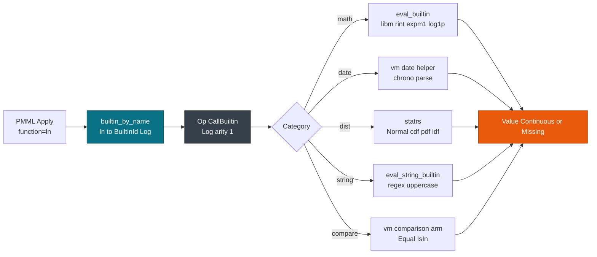

# Builtins & Functions (80+)

> This guide covers the **BuiltinId** registry behind `Apply`. For the DAG it runs in, see [Derived Fields & Inline Transforms](./derived.md). For branching, see [Predicates & MiningSchema Eval](./predicates.md). For model entry, see [Overview: 19 Model Types](../models/overview.md).

`Apply/@function` becomes a **BuiltinId** once at load time, so scoring never parses a name. `builtin_by_name` resolves the string cold, `Op::CallBuiltin` carries the id and arity, and the VM dispatches to `eval_builtin` or `eval_string_builtin`.

## Concepts

| Concept | Description |
| --- | --- |
| **BuiltinId** | Enum with over 80 variants, including `Add`, `Log`, `Uppercase`, `NormalCdf`, `DateDaysSinceYear`, and `IsIn`. |
| **builtin_by_name** | Cold `&str -> Option<BuiltinId>` map with aliases such as `+` to `Add`, `ln` to `Log`, and `upperCase` to `Uppercase`. |
| **eval_builtin** | Numeric dispatch over `&[f64]` using `libm` and `statrs`. A `None` result becomes `Missing`. |
| **eval_string_builtin** | String dispatch over `&[String]` for `concat`, `substring`, `replace`, and `formatNumber`. |

The registry covers arithmetic, trigonometry, aggregates, `chrono` dates, `statrs` distributions, `regex` text, and comparisons. `builtin_by_name` matches exact names and a fixed alias list, so `upperCase` and `uppercase` both resolve while an unknown name returns `None`. An unknown function lowers to `Missing` and never fails `Session::from_bytes`.



## Function registry

Every table below gives the Rust variant, the PMML function name, its arity, and an example.

### Math (`libm`)

| Function | PMML name | Arity | Example |
| --- | --- | --- | --- |
| `Add` | `add`, `+` | variadic | `add(1,2,3)=6.0` |
| `Log`/`Ln` | `log`, `ln` | 1 | `ln(e)=1.0` |
| `Pow` | `pow` | 2 | `pow(2,10)=1024` |
| `Hypot` | `hypot` | 2 | `hypot(3,4)=5.0` |
| `Rint`/`Expm1`/`Ln1p` | `rint`, `expm1`, `ln1p` | 1 | `libm::rint(2.5)=2.0` |

### Trigonometry and aggregates

| Function | PMML name | Arity | Example |
| --- | --- | --- | --- |
| `Sin`/`Cos`/`Tan` | `sin`, `cos`, `tan` | 1 | `sin(pi/2)=1.0` |
| `Min`/`Max`/`Median` | `min`, `max`, `median` | variadic | `median(1,3,2)=2.0` |
| `AvgOp`/`StdDev` | `avg`, `stddev` | variadic | `avg(1,2,3)=2.0` |
| `ErfOp` | `erf` | 1 | `erf(1)=0.8427` |

### Strings (`regex`)

| Function | PMML name | Arity | Example |
| --- | --- | --- | --- |
| `Uppercase` | `uppercase`, `upperCase` | 1 | `uppercase("hello")="HELLO"` |
| `Substring` | `substring` | 3 | `substring("hello",2,3)="ell"` |
| `Replace` | `replace` | 3 | `replace("aab","a","c")="ccb"` |
| `TextIndex` | `textIndex` | 2 | `textIndex("hello","ell")=2` |

### Dates (`chrono`)

| Function | PMML name | Arity | Example |
| --- | --- | --- | --- |
| `DateDaysSinceYear` | `dateDaysSinceYear` | 2 | days since year |
| `DateDaysSince1960/70/80` | `dateDaysSince1960` | 1 | `2003-04-01` to days |
| `DateSecondsSinceMidnight` | `dateSecondsSinceMidnight` | 1 | `12:00:00` to 43200 |
| `DateTimeSecondsSince1960` | `dateTimeSecondsSince1960` | 1 | datetime to seconds |

A discrete `2003-04-01` decodes through the symbol map set by `vm_set_symbol_map`. An unparseable value returns `Missing`.

### Distributions (`statrs`)

| Function | PMML name | Arity | Example |
| --- | --- | --- | --- |
| `NormalCdf` | `normalCDF` | 3, `(x, mean, sd)` | `normalCDF(0,0,1)=0.5` |
| `StdNormalCdf` | `stdNormalCDF` | 1 | `stdNormalCDF(0)=0.5` |
| `NormalIdf` | `normalIDF` | 3 | quantile |
| `StdNormalIdf` | `stdNormalIDF` | 1 | standard quantile |

`eval_builtin` returns `None` for these four, so the VM evaluates them through `statrs::Normal` instead.

### Normalization

| Function | PMML name | Arity | Example |
| --- | --- | --- | --- |
| `NormContinuousOp` | `normContinuous` | 1 | `normContinuous(age)` interpolates through `Op::NormContinuous` |
| `NormDiscreteOp` | `normDiscrete` | 1 | `normDiscrete(color,red)` writes `1.0` or `0.0` |

Normalization lowers to dedicated `Op` variants rather than `CallBuiltin`, and `eval_builtin` returns `None` for both.

### Comparison and logic

| Function | PMML name | Arity | Example |
| --- | --- | --- | --- |
| `Equal`/`NotEqual` | `equal`, `notEqual` | 2 | `Discrete` by `SymbolId`, `Continuous` within `1e-9` |
| `IsMissing` | `isMissing` | 1 | checks `Value::Missing` |
| `IsIn`/`IsNotIn` | `isIn`, `isNotIn` | variadic | membership in a set |
| `And`/`Or`/`Not` | `and`, `or`, `not` | variadic | returns `1.0` or `0.0` |

The VM comparison arm returns `1.0` or `0.0` as `Continuous`. See [Predicates & MiningSchema Eval](./predicates.md) for how those results drive branching.

```xml
<!-- PMML: Apply mixing math, string, date -->
<DerivedField name="score" optype="continuous" dataType="double">
  <Apply function="add">
    <Apply function="ln"><FieldRef field="age"/></Apply>
    <Apply function="hypot"><FieldRef field="x"/><FieldRef field="y"/></Apply>
  </Apply>
</DerivedField>
<DerivedField name="label" optype="categorical" dataType="string">
  <Apply function="uppercase"><FieldRef field="raw_label"/></Apply>
</DerivedField>
```

The first field nests `ln` and `hypot` into `CallBuiltin`; the second reaches the string path.

```rust
use pmmlruntime::ir::BuiltinId;
use pmmlruntime::engine::transform::builtin::{builtin_by_name, eval_builtin, eval_string_builtin};
use pmmlruntime::base::{FieldId, Value};
use pmmlruntime::ir::{DerivedFieldIr, Op};
use pmmlruntime::base::field::{DataType, OpType};

assert_eq!(builtin_by_name("+"), Some(BuiltinId::Add));
assert_eq!(eval_builtin(BuiltinId::Add, &[1.0, 2.0, 3.0]), Some(6.0));
assert_eq!(eval_string_builtin(BuiltinId::Uppercase, &["hello".into()]), Some("HELLO".into()));
let derived = DerivedFieldIr {
    field_id: FieldId(5), name: "score".into(), data_type: DataType::Double, op_type: OpType::Continuous,
    bytecode: vec![
        Op::PushField(FieldId(0)), Op::CallBuiltin(BuiltinId::Log, 1),
        Op::PushField(FieldId(1)), Op::PushField(FieldId(2)), Op::CallBuiltin(BuiltinId::Hypot, 2),
        Op::CallBuiltin(BuiltinId::Add, 2),
    ],
};
```

You resolved an alias and built `ln(age) + hypot(x, y)` bytecode by hand. See [`BuiltinId`](https://docs.rs/pmmlruntime/latest/pmmlruntime/ir/enum.BuiltinId.html).

## Looking up a function

| Lookup | Call | Result | Example |
| --- | --- | --- | --- |
| By exact name | `builtin_by_name("log")` | `Some(Log)` | `"+"` maps to `Add` |
| By alias | `builtin_by_name("ln")` | `Some(Log)` | `"upperCase"` maps to `Uppercase` |
| By prefix | `name.starts_with("date")` | the 10 date functions | `dateDaysSince*` |
| By output kind | `eval_builtin` against `eval_string_builtin` | numeric against string | `IsIn` is numeric |

Lookup happens once per `Apply`, and the hot path matches on the id.

```rust
use pmmlruntime::engine::transform::builtin::builtin_by_name;
use pmmlruntime::ir::BuiltinId;

let candidates = ["log", "ln", "log10", "hypot", "unknownFn"];
for name in candidates {
    match builtin_by_name(name) {
        Some(id) => println!("{name} -> {id:?}"),
        None => println!("{name} -> Missing"),
    }
}
assert_eq!(builtin_by_name("textIndex"), Some(BuiltinId::TextIndex));
assert_eq!(builtin_by_name("x-atan2"), Some(BuiltinId::Atan2));
assert_eq!(builtin_by_name("format_number"), Some(BuiltinId::FormatNumber));
```

Unknown names resolve to `None` and score as `Missing`. Keep this check in tests that accept vendor extensions.

## Evaluation rules

| Rule | Default | Effect | When to change it |
| --- | --- | --- | --- |
| Missing propagation | on | A `Missing` argument short-circuits to `Missing`. | Aggregates that ignore missing operands. |
| Unknown function | `Missing` | An unknown name scores as `Missing` rather than failing the load. | `ReturnInvalid` when you want a load-time error. |
| NaN handling | IEEE 754 | `approx_eq` treats `NaN == NaN`. | Never. |
| Alias resolution | exact names plus aliases | `upperCase` and `uppercase` both map to `Uppercase`. | Add an alias in `builtin_by_name`. |

Unknown functions never panic. They produce `Missing`, so a model with vendor extensions still scores.

> **Attention:** `x-atan2` maps to `Atan2`, `formatNumber` and `format_number` both map to `FormatNumber`, and `stdNormalCDF` and `stdNormalCdf` both map to `StdNormalCdf`.

> **Tip:** Reach for `libm::rint`, `expm1`, `log1p`, and `hypot` when you want IEEE 754 behavior rather than the standard library's approximations.

## Worked example: score and gate

```rust
use pmmlruntime::base::{FieldId, Value, field::{DataType, OpType}};
use pmmlruntime::ir::{DerivedFieldIr, Op, BuiltinId};
use pmmlruntime::engine::transform::vm::eval_derived_fields;

// threshold(y, v) = y > v ? y : 0, then a GreaterThan gate
let score = DerivedFieldIr {
    field_id: FieldId(10), name: "threshold_score".into(), data_type: DataType::Double, op_type: OpType::Continuous,
    bytecode: vec![
        Op::PushField(FieldId(0)), Op::PushConst(pmmlruntime::ir::SymbolIdOrContinuous::Continuous(0.7)),
        Op::CallBuiltin(BuiltinId::Threshold, 2),
    ],
};
let is_high = DerivedFieldIr {
    field_id: FieldId(11), name: "is_high".into(), data_type: DataType::Double, op_type: OpType::Continuous,
    bytecode: vec![
        Op::PushField(FieldId(10)), Op::PushConst(pmmlruntime::ir::SymbolIdOrContinuous::Continuous(0.0)),
        Op::CallBuiltin(BuiltinId::GreaterThan, 2),
    ],
};
let mut values = vec![Value::Missing; 12];
values[0] = Value::Continuous(0.9);
eval_derived_fields(&[score, is_high], &mut values).unwrap();
assert_eq!(values[11], Value::Continuous(1.0));
```

The first field applies `Threshold` and the second turns the result into a `1.0` or `0.0` gate. Swap `Threshold` for `NormalCdf` and the gate holds a `statrs` value instead.

## Structural transforms versus builtins

**Norm**, **Discretize**, and **MapValues** lower to dedicated `Op` variants. The VM calls `eval_norm_*` helpers for them, and `eval_builtin` returns `None` when you pass `NormContinuousOp` or `NormDiscreteOp` by hand.

> **Note:** The comparison builtins `equal`, `notEqual`, `lessThan`, `lessOrEqual`, `greaterThan`, `greaterOrEqual`, `isIn`, and `isNotIn` run through the VM comparison arm and return `1.0` or `0.0` as `Continuous`. Continuous equality uses an epsilon of `1e-9`.

## Adding a BuiltinId

1. Add the variant to `ir::BuiltinId` with a doc comment.
2. Map its PMML name in `builtin_by_name`, including any aliases.
3. Dispatch it in `eval_builtin` or `eval_string_builtin`, or in the VM arm when it needs `chrono` or `statrs`. Return `None` when the id does not belong to that path.

Run `cargo test` after the change. See [`BuiltinId`](https://docs.rs/pmmlruntime/latest/pmmlruntime/ir/enum.BuiltinId.html).

> **Tip:** Keep the `Op::CallBuiltin` boundary intact, so adding a function touches `builtin.rs` and leaves `vm.rs` alone.

## Next Steps

* [Derived Fields & Inline Transforms](./derived.md): the `Vec<Op>` DAG and `JumpIfMissing`.
* [Predicates & MiningSchema Eval](./predicates.md): `SimpleSet` and `Compound` predicates with `SmallVec`.
* [Values, Fields & Types](../concepts/values.md): the `SymbolId` map that date and text builtins read.
* [IR & Lowering](../internals/ir.md): where `apply` becomes `CallBuiltin`.

*Next: [Predicates & MiningSchema Eval](./predicates.md) → · Previous: [Derived Fields & Inline Transforms](./derived.md)*
