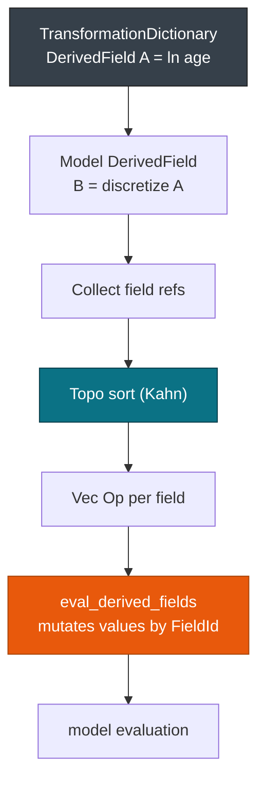

# Derived Fields & Inline Transforms

> This guide covers the **DerivedField** DAG and the bytecode VM that evaluates it. For the function registry, see [Builtins & Functions (80+)](./builtins.md). For branching, see [Predicates & MiningSchema Eval](./predicates.md). For how a model reaches the engine, see [Overview: 19 Model Types](../models/overview.md).

`ir::lower` turns each PMML `DerivedField` into a dense `Vec<Op>` that the engine runs per row. Expression logic stays out of the model evaluators, and `Missing` travels as a value instead of an `Option`.

## Concepts

| Concept | Description |
| --- | --- |
| **DerivedFieldIr** | Lowered `DerivedField` with `field_id`, `data_type`, `op_type`, and a `Vec<Op>` bytecode body. |
| **Op** | Bytecode understood by the VM: `PushField`, `PushConst`, `CallBuiltin`, `JumpIfMissing`, `MapValues`, `Discretize`, `NormContinuous`, `Lag`, `CallDefine`. |
| **DAG** | Topo-sorted list of derived fields, so dependencies evaluate before dependents. |
| **VM** | Stack machine with a `Vec<Value>` of capacity 8 that writes `values[field_id]` per field. |

## What lowering produces

`Session::from_bytes` runs `xml::unmarshal`, `verify_raw`, `ir::lower`, and `verify_ir`. Lowering does four things to the transform layer:

* Interns every field and symbol, so `TransformationDictionary` and model `LocalTransformations` share one `FieldId` space.
* Sorts derived fields with Kahn's algorithm, so scoring never walks a graph and never checks for cycles.
* Compiles each expression to `Vec<Op>`. A field defined once in the dictionary is read by any model segment as a plain `FieldId`.
* Writes results into a dense `&mut [Value]`, so the VM stays in L1 and allocates nothing per row.



The graph is resolved once at load. The hot path runs bytecode in dependency order and never re-reads it.

## Op bytecode

These are the variants defined in `crates/pmmlruntime/src/ir/ir.rs`.

| Op | Source | Notes |
| --- | --- | --- |
| `PushField` | `FieldRef` | Pushes `values[field]`. An out-of-bounds read pushes `Missing`. |
| `PushConst` | `Constant` | Continuous `f64`, discrete `SymbolId`, or `Missing`. |
| `CallBuiltin(BuiltinId, u8)` | `Apply` | Pops `arity` values and pushes the result. |
| `JumpIfMissing { target }` | `IF` guard | Jumps when the top of the stack is `Missing`. |
| `MapValues` | `MapValues` with one input | `Vec<(SymbolId, SymbolId)>` plus an optional default. |
| `MapValuesMulti` | `MapValues` with two or more inputs | Rows of `(Vec<SymbolId>, SymbolId)`. |
| `Discretize` | `Discretize` | Intervals evaluated top to bottom, with `mapMissingTo`. |
| `NormContinuous` | `NormContinuous` | Piecewise linear interpolation over `LinearNorm` points. |
| `NormDiscrete` | `NormDiscrete` | `field == value ? 1.0 : 0.0`. |
| `Lag` | Hand-built `DerivedFieldIr` | Value from `n` rows back, with a `LagAggregate` window. |
| `CallDefine` | `DefineFunction` | User-defined function called by name and arity. |

`Lag` and `CallDefine` have VM arms but no XML lowering today: `ir::lower` never emits them, so they run only when you build `DerivedFieldIr` yourself. `TextIndex` arrives as `CallBuiltin(TextIndex, 2)`, is one-based, and returns `0` when the substring is absent. See [Builtins & Functions (80+)](./builtins.md) for the function table.

## Supported transforms

| Transform | PMML element | Lowered form | Knobs |
| --- | --- | --- | --- |
| **Apply** | `<Apply function="ln">` | `Op::CallBuiltin` | `BuiltinId` and arity |
| **NormContinuous** | `<NormContinuous>` with `<LinearNorm>` | `Op::NormContinuous` | `orig`, `norm` |
| **NormDiscrete** | `<NormDiscrete value="red">` | `Op::NormDiscrete` | `value`, `field`, `mapMissingTo` |
| **MapValues** | `<MapValues>` with `<InlineTable>` | `Op::MapValues`, `Op::MapValuesMulti` | `defaultValue` |
| **Discretize** | `<Discretize>` with `<DiscretizeBin>` | `Op::Discretize` | `Interval`, `closure`, `mapMissingTo` |
| **Lag** | `Op` only | `Op::Lag` | `field`, `n`, `LagAggregate` |

## Loading and manual lowering

| Approach | Call | When to use it |
| --- | --- | --- |
| Standard | `Session::from_bytes(&env, &bytes, opts)` | One PMML file per model, production. |
| Manual IR | `ir::lower(RawPmml, Interner)` | Fuzzing and replay tests where you drive `LAG_BUFFER` yourself. |

Standard loading runs `unmarshal`, `verify_raw`, `lower`, and `verify_ir` before the session returns.

```rust
use pmmlruntime::{PmmlEnv, Session, SessionOptions, Value};
use pmmlruntime::session::batch::Batch;
use std::collections::HashMap;

let env = PmmlEnv::new();
let bytes = std::fs::read("bench/pmml/DecisionTreeIris.pmml")?;
let sess = Session::from_bytes(&env, &bytes, SessionOptions::default())?;
let mut input = HashMap::new();
input.insert("Petal.Length".into(), Value::Continuous(1.4));
let out = sess.run(&input as &dyn Batch)?.into_single().unwrap();
println!("{:?}", out.get("predictedValue"));
# Ok::<(), Box<dyn std::error::Error>>(())
```

You scored a tree without naming a single `Op`. Point the same code at `GradientBoosterTest.pmml` and nothing changes.

Manual lowering is for tests that need a known lag history:

```rust
use pmmlruntime::base::{FieldId, Value, field::{DataType, OpType}};
use pmmlruntime::ir::{DerivedFieldIr, Op, BuiltinId, LagAggregate};
use pmmlruntime::engine::transform::vm::{eval_derived_fields, lag_clear, lag_update};

lag_clear();
lag_update(FieldId(0), Value::Continuous(10.0));
let derived = DerivedFieldIr {
    field_id: FieldId(3), name: "log_age".into(), data_type: DataType::Double, op_type: OpType::Continuous,
    bytecode: vec![Op::PushField(FieldId(0)), Op::CallBuiltin(BuiltinId::Log, 1)],
};
let lagged = DerivedFieldIr {
    field_id: FieldId(4), name: "prev_age".into(), data_type: DataType::Double, op_type: OpType::Continuous,
    bytecode: vec![Op::Lag { field: FieldId(0), n: 1, aggregate: LagAggregate::None }],
};
let mut values = vec![Value::Missing; 5];
values[0] = Value::Continuous(10.0);
eval_derived_fields(&[derived, lagged], &mut values).unwrap();
# Ok::<(), Box<dyn std::error::Error>>(())
```

The second field reads the value you pushed, which is how `Lag` behaves for one row.

> **Tip:** Call `vm_set_symbol_map` once per thread before manual lowering. `CpuProvider` does this on the standard path, and the VM needs the map to turn a `SymbolId` back into text for string functions.

## How the VM executes

`eval_derived_fields` mutates your slice in place. Call it after `apply_mining_schema` and before model evaluation. It snapshots `values` for lag, then iterates `DerivedFieldIr` in DAG order.

Each `Op` runs on a reused stack of capacity 8. `PushField` bounds-checks `values[fid]`, `PushConst` pushes a constant, and `CallBuiltin` pops `arity` values and pushes the result. `JumpIfMissing` skips the else branch.

```xml
<!-- PMML: TransformationDictionary -->
<DerivedField name="log_age" optype="continuous" dataType="double">
  <Apply function="ln"><FieldRef field="age"/></Apply>
</DerivedField>
<DerivedField name="bucket" optype="categorical" dataType="string">
  <Discretize field="log_age" mapMissingTo="missing">
    <DiscretizeBin binValue="young"><Interval closure="closedOpen" leftMargin="0" rightMargin="3.0"/></DiscretizeBin>
    <DiscretizeBin binValue="old"><Interval closure="closedClosed" leftMargin="3.0" rightMargin="5.0"/></DiscretizeBin>
  </Discretize>
</DerivedField>
```

The first field lowers to `PushField` plus `CallBuiltin(Log)`, and the second to `Op::Discretize`. See [`eval_derived_fields`](https://docs.rs/pmmlruntime/latest/pmmlruntime/engine/transform/vm/fn.eval_derived_fields.html).

## Structural operations

**NormContinuous** interpolates over sorted `linear_norms` and clamps outside the range. **NormDiscrete** compares a field against one symbol and writes `1.0` or `0.0`, with `map_missing_to` for absent input.

**MapValues** scans the table for the first matching symbol and falls back to `default`. **Discretize** walks the `DiscretizeBin` rows in order and returns `bin_value` or the default.

> **Note:** `Lag` keeps a `thread_local!` `LAG_BUFFER` of `VecDeque` values capped at 128 entries per field. Call `lag_clear()` between sessions, or `Lag(field, 1)` reads the previous file's last row. `values` must be at least `max(FieldId) + 1` long: out-of-bounds writes are ignored and stack underflow pushes `Missing`.

> **Warning:** Keep `needed = max(max_field_id, num_fields + 4).max(16)` from `Session::from_ir`, and call `vm_set_symbol_map` once per thread when string functions or `CallDefine` run.

## Hierarchical derived fields

Chained fields need no manual ordering because `topo_sort` resolves dependencies.

```xml
<!-- PMML: three-level hierarchy -->
<TransformationDictionary>
  <DerivedField name="log_age" optype="continuous" dataType="double">
    <Apply function="ln"><FieldRef field="age"/></Apply>
  </DerivedField>
</TransformationDictionary>
<TreeModel functionName="classification">
  <LocalTransformations>
    <DerivedField name="bucket" optype="categorical" dataType="string">
      <Discretize field="log_age" mapMissingTo="missing">
        <DiscretizeBin binValue="young"><Interval closure="closedOpen" leftMargin="0" rightMargin="3"/></DiscretizeBin>
        <DiscretizeBin binValue="old"><Interval closure="closedClosed" leftMargin="3" rightMargin="5"/></DiscretizeBin>
      </Discretize>
    </DerivedField>
    <DerivedField name="is_old" optype="continuous" dataType="double">
      <NormDiscrete field="bucket" value="old"/>
    </DerivedField>
  </LocalTransformations>
</TreeModel>
```

`eval_derived_fields` walks `log_age`, then `bucket`, then `is_old`. Each result stays available through `values[FieldId]` for the fields that follow.

## Hot-path costs

Measured per field on an i7-12650H release build.

| Op | Cost | Notes |
| --- | --- | --- |
| `PushField` and `PushConst` | ~4 ns | bounds-checked read |
| `CallBuiltin` math | ~12 ns | `libm` jump table |
| `NormContinuous` | ~18 ns | linear scan and clamp |
| `NormDiscrete` or `Equal` | ~9 ns | `SymbolId` comparison |
| `MapValues` | ~45 ns | table scan with early exit |
| `Discretize` | ~35 ns | interval scan |
| `Lag(n=1)` | ~22 ns | `LAG_BUFFER` lookup |

A `log_age` plus `bucket` pair costs about 70 ns inside a 463 ns `TreeModel` run. Transforms run serially per row: `CpuProvider::eval_batch` shards rows with `par_chunks(256)`, which reaches 61 ns per row at 100k rows.

> **Note:** Reproduce with `cargo run --release --example bench_real -- bench/pmml/DecisionTreeIris.pmml --iterations 2000`.

## Next Steps

* [Builtins & Functions (80+)](./builtins.md): the function registry behind `CallBuiltin`.
* [Predicates & MiningSchema Eval](./predicates.md): branching with `True`, `Simple`, `SimpleSet`, and `Compound`.
* [Values, Fields & Types](../concepts/values.md): how `FieldId` and `SymbolId` index dense slices.
* [IR & Lowering](../internals/ir.md): the full pipeline from `RawPmml` to `Op` bytecode.

*Next: [Builtins & Functions](./builtins.md) → · Previous: [Session, Env & Lifecycle](../concepts/session.md)*
