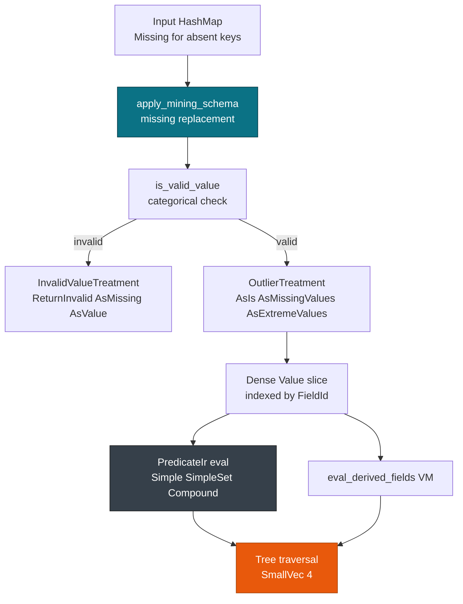

# Predicates & MiningSchema Eval

> This guide covers **PredicateIr** evaluation and the **MiningSchema** corrections that run before it. For the bytecode VM, see [Derived Fields & Inline Transforms](./derived.md). For the function registry, see [Builtins & Functions (80+)](./builtins.md). For model entry, see [Overview: 19 Model Types](../models/overview.md).

`TreeModel`, `RuleSet`, and `MiningModel` segments all branch through one predicate engine. `lower_predicate` turns each `RawPredicate` into a `PredicateIr`, and `apply_mining_schema` repairs the value slice before any predicate runs.

## Concepts

| Concept | Description |
| --- | --- |
| **PredicateIr** | Enum with `True`, `Simple {field, operator, value}`, `SimpleSet {field, is_in, array}`, and `Compound {operator, predicates}`. |
| **SimpleOperator** | `Equal`, `NotEqual`, `LessThan`, `LessOrEqual`, `GreaterThan`, `GreaterOrEqual`, `IsMissing`, `IsNotMissing`. |
| **CompoundOperator** | `And`, `Or`, `Xor`, `Surrogate`, over `SmallVec<[Box<PredicateIr>;4]>`. |
| **MiningSchemaIr** | Active inputs, the target, and the `FieldMeta` treatments that `apply_mining_schema` runs. |

`PredicateIr` indexes `values` by `FieldId` and bounds-checks each read. `Simple` compares `Continuous` values within `1e-9`, `SimpleSet` tests `isIn` membership, and `Compound` keeps up to four child predicates inline.

## Evaluation order

A row passes through three stages in a fixed order, and each stage assumes the previous one finished:

1. `apply_mining_schema` copies the sparse input into a dense `&mut [Value]` and applies the missing, invalid, and outlier treatments.
2. `eval_derived_fields` walks the `DerivedFieldIr` DAG and writes each result into `values[FieldId]`.
3. `eval_predicate` tests the predicates that select nodes, segments, and rules.

The order matters. Missing-value replacement happens before derived fields, so an expression can rely on a replacement value. Derived fields happen before predicates, so a tree split can test a computed column.



Predicates stay cheap on purpose. `eval_predicate` carries `#[inline(always)]`, and `Compound` recurses over `SmallVec<[Box<PredicateIr>; 4]>`, so arities of one to four never allocate. `Missing` is an explicit value and only `IsMissing` returns `true` for it, so absent input fails closed instead of taking an arbitrary branch.

## Predicate shapes

**True** always matches and appears on default segments. **Simple** tests one field against one value. With `Missing` input the comparison and equality operators return `false`, `IsMissing` returns `true`, and `IsNotMissing` returns `false`. A `Discrete` value never matches a continuous comparison, and the reverse holds too.

**SimpleSet** scans the interned array for a matching member and returns `false` for `Missing` input, while `is_in` separates `isIn` from `isNotIn`. **Compound** combines children with `And`, `Or`, or `Xor`, while `Surrogate` skips fields that are `Missing` and evaluates the first predicate that has data.

```xml
<!-- PMML: predicates in a TreeModel -->
<TreeModel functionName="classification">
  <Node score="setosa">
    <True/>
    <Node score="versicolor">
      <SimplePredicate field="Petal.Length" operator="lessThan" value="2.45"/>
    </Node>
    <Node score="virginica">
      <CompoundPredicate booleanOperator="and">
        <SimplePredicate field="Petal.Length" operator="greaterOrEqual" value="2.45"/>
        <SimpleSetPredicate field="Species" booleanOperator="isIn">
          <Array type="string">versicolor virginica</Array>
        </SimpleSetPredicate>
      </CompoundPredicate>
    </Node>
  </Node>
</TreeModel>
```

The snippet lowers to `True` on the root, a `Simple` comparison on the first split, and a `Compound` of `Simple` plus `SimpleSet` on the second.

```rust
use pmmlruntime::base::{FieldId, Value};
use pmmlruntime::ir::{PredicateIr, SimpleOperator, SymbolIdOrContinuous, CompoundOperator};
use pmmlruntime::engine::predicate::eval_predicate;
use smallvec::SmallVec;

let pred = PredicateIr::Simple {
    field: FieldId(1), operator: SimpleOperator::LessThan,
    value: SymbolIdOrContinuous::Continuous(2.45),
};
assert!(eval_predicate(&pred, &[Value::Continuous(1.4)]));
assert!(!eval_predicate(&pred, &[Value::Missing]));

let p1 = Box::new(PredicateIr::Simple { field: FieldId(0), operator: SimpleOperator::LessThan, value: SymbolIdOrContinuous::Continuous(1.0) });
let surrogate = PredicateIr::Compound { operator: CompoundOperator::Surrogate, predicates: SmallVec::from_vec(vec![p1, Box::new(PredicateIr::True)]) };
```

The first assertion shows the comparison, and the second shows that `Missing` fails it. See [`eval_predicate`](https://docs.rs/pmmlruntime/latest/pmmlruntime/engine/predicate/fn.eval_predicate.html).

## MiningSchema corrections

`apply_mining_schema` builds a `FieldMeta` lookup once per call and walks the active fields, so the work is `O(active_fields)` with one small hash table.

1. **Missing**: `missingValueTreatment` decides the outcome. `ReturnInvalid` reports an error, `AsIs` keeps `Missing`, and `AsValue` writes `missingValueReplacement` parsed as `f64`.
2. **Validity**: `is_valid_value` checks the declared `OpType`. `invalidValueTreatment` maps a mismatch to `ReturnInvalid`, `AsIs`, `AsMissing`, or `invalidValueReplacement`.
3. **Outlier**: a valid `Continuous` value outside `lowValue` and `highValue` follows `outlierTreatment`. `AsMissingValues` replaces it with `Missing`, `AsExtremeValues` clamps it to the nearer bound, and `AsIs` keeps it.

```rust
use pmmlruntime::base::{FieldId, Value, field::{DataType, OpType}};
use pmmlruntime::ir::{FieldMeta, MiningSchemaIr, OutlierTreatment, InvalidValueTreatment, MissingValueTreatment};
use pmmlruntime::engine::mining_schema::apply_mining_schema;
use std::collections::HashMap;

let fid = FieldId(0);
let schema = MiningSchemaIr {
    active_fields: vec![fid], target_field: None,
    field_metas: vec![FieldMeta {
        field_id: fid, name: "age".into(), data_type: DataType::Double, op_type: OpType::Continuous,
        values: vec![], invalid_value_treatment: InvalidValueTreatment::ReturnInvalid,
        invalid_value_replacement: None, missing_value_replacement: Some("50".into()),
        missing_value_treatment: MissingValueTreatment::AsIs,
        outlier_treatment: OutlierTreatment::AsMissingValues, low_value: Some(0.0), high_value: Some(120.0),
    }],
    missing_value_replacement: None,
};
let input = HashMap::new(); // age absent, so the replacement applies
let mut values = vec![Value::Missing];
apply_mining_schema(&schema, &input, &mut values).unwrap();
assert_eq!(values[0], Value::Continuous(50.0));
```

The absent field becomes `50.0` before any predicate sees it.

> **Note:** Predicates are pure and never panic. An out-of-bounds `FieldId` yields `Missing`, which only `IsMissing` matches. Equality on `Continuous` tolerates `1e-9`.

> **Warning:** The global `missingValueReplacement` field exists for parity and applies to the first field only. Prefer per-field `FieldMeta::missing_value_replacement`.

> **Tip:** Log the predicate tree at startup by walking `SmallVec<[Box<PredicateIr>;4]>`, for example `match sess.ir.model { ModelIr::Tree(t) => t.nodes[0].predicate }`. That tells you where `Surrogate` sits before you ever score a row.

## How the stages line up

| Stage | Input | Predicate effect | MiningSchema effect |
| --- | --- | --- | --- |
| Missing input | `Value::Missing` | `Simple(Equal)` returns `false`, `IsMissing` returns `true` | `missingValueReplacement` or `ReturnInvalid` |
| Invalid categorical | `Continuous` on a categorical field | `SimpleSet` returns `false` | `InvalidValueTreatment::AsMissing` writes `Missing` |
| Outlier | `Continuous(999)` above `highValue` of `120` | `LessThan 120` fails if the value survives | `AsMissingValues` writes `Missing`, `AsExtremeValues` clamps to `120` |
| Valid input | `Continuous(1.4)` | `LessThan 2.45` returns `true` | `AsIs` keeps the value |

Reversing the order breaks both stages: `IsMissing` would see unreplaced missing values, and `Surrogate` would pick the wrong child.

```rust
use pmmlruntime::base::{FieldId, Value};
use pmmlruntime::ir::{PredicateIr, SimpleOperator, SymbolIdOrContinuous};
use pmmlruntime::engine::predicate::eval_predicate;

let is_missing = PredicateIr::Simple { field: FieldId(0), operator: SimpleOperator::IsMissing, value: SymbolIdOrContinuous::Continuous(0.0) };
let is_valid = PredicateIr::Simple { field: FieldId(0), operator: SimpleOperator::GreaterOrEqual, value: SymbolIdOrContinuous::Continuous(0.0) };
assert!(eval_predicate(&is_missing, &[Value::Missing]));
assert!(!eval_predicate(&is_valid, &[Value::Missing]));
assert!(eval_predicate(&is_valid, &[Value::Continuous(10.0)]));
```

The three assertions pin the behavior of `IsMissing` and `GreaterOrEqual` on absent input.

## Predicate attributes

These PMML attributes shape branching. `lower` preserves them, and the engine interprets them at scoring time.

| Attribute | PMML placement | Purpose | Example |
| --- | --- | --- | --- |
| `surrogate` | `CompoundPredicate booleanOperator="surrogate"` | Skip `Missing` fields and evaluate the first predicate with data | `Surrogate[ field0 < 1.0, True ]` |
| `defaultChild` | `Node defaultChild="N2"` | Fallback child when no predicate matches | `defaultChild` on the root |
| `isMissing` | `SimplePredicate operator="isMissing"` | Branch on absent data | `IsMissing` matches only `Missing` |
| `noTrueChildStrategy` | `TreeModel noTrueChildStrategy` | Behavior when no child predicate matches | `returnNullPrediction` |

See [MiningSchema, DataDictionary & Output](../concepts/schema.md) for the surrounding schema and output contract.

## Missing and outlier examples

### Outliers as missing input

Routing outliers to `Missing` lets `IsMissing` and `Surrogate` handle them with the same logic as absent data.

```rust
use pmmlruntime::base::{FieldId, Value, field::{DataType, OpType}};
use pmmlruntime::ir::{FieldMeta, MiningSchemaIr, OutlierTreatment, InvalidValueTreatment, MissingValueTreatment, PredicateIr, SimpleOperator, SymbolIdOrContinuous};
use pmmlruntime::engine::{mining_schema::apply_mining_schema, predicate::eval_predicate};
use std::collections::HashMap;

let fid = FieldId(0);
let schema = MiningSchemaIr {
    active_fields: vec![fid], target_field: None,
    field_metas: vec![FieldMeta {
        field_id: fid, name: "age".into(), data_type: DataType::Double, op_type: OpType::Continuous,
        values: vec![], invalid_value_treatment: InvalidValueTreatment::AsMissing,
        invalid_value_replacement: None, missing_value_replacement: None,
        missing_value_treatment: MissingValueTreatment::AsIs,
        outlier_treatment: OutlierTreatment::AsMissingValues, low_value: Some(0.0), high_value: Some(120.0),
    }],
    missing_value_replacement: None,
};
let mut values = vec![Value::Continuous(999.0)];
apply_mining_schema(&schema, &HashMap::new(), &mut values).unwrap();
assert_eq!(values[0], Value::Missing);
let is_missing = PredicateIr::Simple { field: fid, operator: SimpleOperator::IsMissing, value: SymbolIdOrContinuous::Continuous(0.0) };
assert!(eval_predicate(&is_missing, &values));
```

`999` becomes `Missing` through `AsMissingValues`, and `IsMissing` then matches it.

### Surrogate fallback

`Surrogate` tries each child in order and returns the first result that has data.

```rust
use pmmlruntime::base::{FieldId, Value};
use pmmlruntime::ir::{PredicateIr, SimpleOperator, SymbolIdOrContinuous, CompoundOperator};
use pmmlruntime::engine::predicate::eval_predicate;
use smallvec::SmallVec;

let p0 = Box::new(PredicateIr::Simple { field: FieldId(0), operator: SimpleOperator::LessThan, value: SymbolIdOrContinuous::Continuous(2.45) });
let p1 = Box::new(PredicateIr::Simple { field: FieldId(1), operator: SimpleOperator::LessThan, value: SymbolIdOrContinuous::Continuous(1.0) });
let surrogate = PredicateIr::Compound { operator: CompoundOperator::Surrogate, predicates: SmallVec::from_vec(vec![p0, p1]) };
assert!(eval_predicate(&surrogate, &[Value::Missing, Value::Continuous(0.5)]));
assert!(!eval_predicate(&surrogate, &[Value::Missing, Value::Continuous(2.0)]));
assert!(eval_predicate(&surrogate, &[Value::Continuous(1.0), Value::Continuous(2.0)]));
```

With the first field missing, the second decides. With both present, the first decides. Keeping the children in a four-slot `SmallVec` means `Surrogate` never allocates.

## Next Steps

* [Derived Fields & Inline Transforms](./derived.md): run `eval_derived_fields` after `apply_mining_schema`.
* [Builtins & Functions (80+)](./builtins.md): call `builtin_by_name` for `Apply` nodes that take predicate results.
* [MiningSchema, DataDictionary & Output](../concepts/schema.md): declare `DataDictionary` value lists and output features.
* [IR & Lowering](../internals/ir.md): where `lower_predicate` splits arrays and interns symbols.

*Next: [IR & Lowering](../internals/ir.md) → · Previous: [Builtins & Functions](./builtins.md)*
